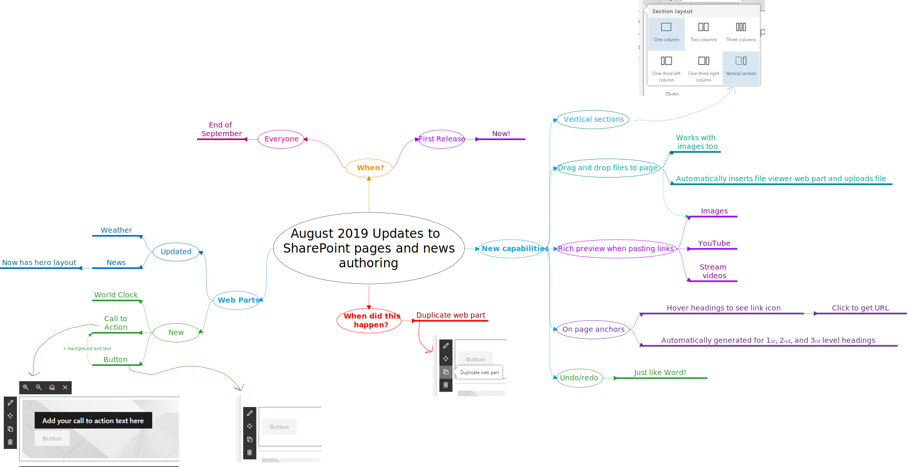

## Introduction

I use mind maps to understand things. I do this _a lot_. They’re a great way to summarize things in a simple picture.

My goal is to take major SharePoint/Office 365 announcements, videos, and other relevant pieces of information which may require too much time for busy people to read and watch, and to boil it down to the essential.

This one highlights what’s new in August 2019 with SharePoint pages and news authoring.

Just click on the mind map to see a larger image.

## Conclusion

Let me know if this was useful for you. Also, if I missed something, let me know.

## Sources

- [https://www.microsoft.com/microsoft-365/roadmap?filters=&searchterms=53194](https://www.microsoft.com/microsoft-365/roadmap?filters=&searchterms=53194)
- [https://www.microsoft.com/microsoft-365/roadmap?filters=&searchterms=53221](https://www.microsoft.com/microsoft-365/roadmap?filters=&searchterms=53221)
- [https://www.microsoft.com/microsoft-365/roadmap?filters=&searchterms=53228](https://www.microsoft.com/microsoft-365/roadmap?filters=&searchterms=53228)
- [https://www.microsoft.com/microsoft-365/roadmap?filters=&searchterms=53222](https://www.microsoft.com/microsoft-365/roadmap?filters=&searchterms=53222)
- [https://www.microsoft.com/microsoft-365/roadmap?filters=&searchterms=53195](https://www.microsoft.com/microsoft-365/roadmap?filters=&searchterms=53195)
- [https://www.microsoft.com/microsoft-365/roadmap?filters=&searchterms=53198](https://www.microsoft.com/microsoft-365/roadmap?filters=&searchterms=53198)
- [https://www.microsoft.com/microsoft-365/roadmap?filters=&searchterms=53192](https://www.microsoft.com/microsoft-365/roadmap?filters=&searchterms=53192)
- [https://techcommunity.microsoft.com/t5/Microsoft-SharePoint-Blog/August-2019-Updates-to-SharePoint-page-and-news-authoring/ba-p/801482](https://techcommunity.microsoft.com/t5/Microsoft-SharePoint-Blog/August-2019-Updates-to-SharePoint-page-and-news-authoring/ba-p/801482)
