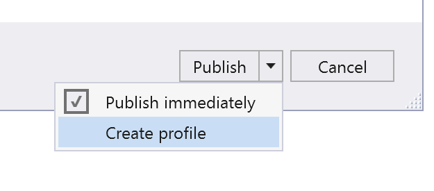
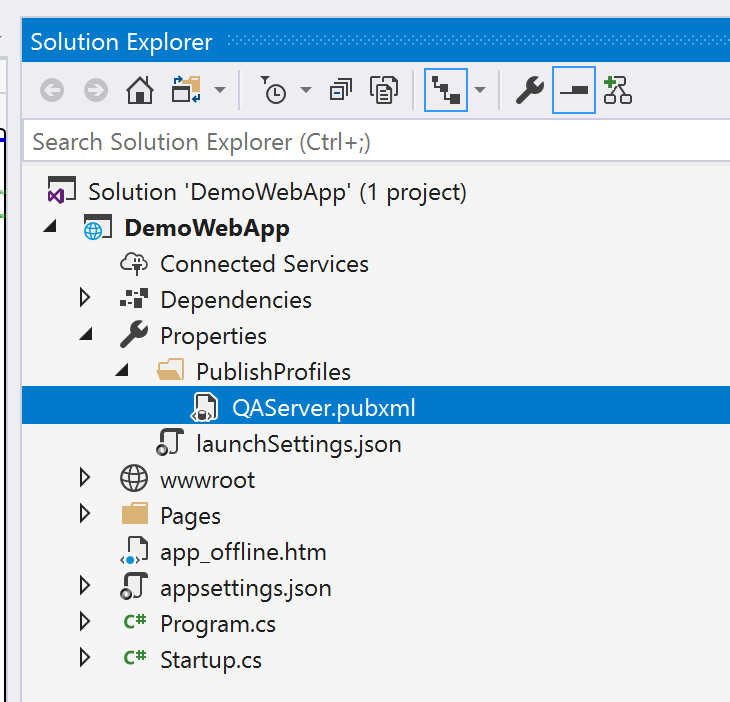

## Introduction

If you’ve ever used Visual Studio’s Web Deploy feature to deploy using a file share, you may have experienced issues where some files cannot be overwritten because they are in use. You may not already know this: ASP.NET Core has a built-in mechanism to take applications offline and display a message. This article describes how you can use Visual Studio’s Web Deploy feature to automatically take your web application offline while you deploy a new version, and restore it back online when deployment is complete using (pretty much) all out-of-the-box features of Visual Studio and ASP.NET Core.

## Using Web Deploy

If you haven’t used it yet, the Web Deploy feature in Visual Studio pretty much does exactly what its name implies: it deploys a web application.

> **NOTE:** It has been around for a while, and the “code” I’ll use in this article may work with earlier versions of Visual Studio, but I used Visual Studio 2017 to write this article.

To use Web Deploy: **1.** From the **Solution Explorer** within Visual Studio, right-click on your web application project. **2.** From the context-menu, select **Publish…**


**3.** From the **Pick a Publish Target** dialog, pick **Folder**


**4.** In the **Choose a folder** field, enter the path to your web application folder. For example, I’ll use: **\\whousesfilesharesanymore\\websites\\demowebapp**

1. Select the drop-down option next to the **Publish** button and select **Create Profile**.



**6.** Visual Studio will create a profile called **FolderProfile** and open the **Publish** page for you. **7.** Use the chevron next to the **Actions** link and select **Rename Profile**


**8.** Rename the profile to whatever you like. In this example, we’ll pretend that I’m deploying to my QA server, so I’ll use **QAServer** as the name. **9.** If you wish, you can set up more options by clicking on **Configure…** . For the purpose of this demo, I’ll just click on **Publish** to launch the Web Deploy feature. Assuming everything went well, your web application gets deployed to your web server without any issues. Except if you try to re-deploy your web application to a web server that has active sessions; then it says that it can’t overwrite some files because they are in use. Fortunately, that’s why ASP.NET Core has **app\_offline.htm**.

## Using app\_offline.htm

Since 2012, we have been able to [take web applications offline when deploying](https://docs.microsoft.com/en-us/iis/publish/deploying-application-packages/taking-an-application-offline-before-publishing) them. The mechanism is simple: ASP.NET looks for a file called **app\_offline.htm** in the web application’s root folder. If it sees such a file, it automatically starts redirecting all connections to the app\_offline.htm page and shuts down all connections that may hold a lock on your files.

> **NOTE:** The **app\_offline.htm** should be in the **root** of your web application folder, _not_ the wwwroot.

If you put HTML in you app\_offline.htm page, the message will be displayed to your visitors as long as the app\_offline.htm page is in the web application folder.


Fortunately, your **pubxml** (most likely) has a tag just for tag:

<SiteUrlToLaunchAfterPublish />

If you’re lucky, you might even see the **app\_offline.htm** temporarily before your custom target removes the file and the page automatically refreshes itself to show the application online!

<SiteUrlToLaunchAfterPublish><http://yoururlgoeshere><SiteUrlToLaunchAfterPublish/>

## Conclusion

Honestly, you probably wouldn’t have to do this if you deployed your web app to Azure, use IIS deployment, or use CI/CD to automatically deploy after a successful build but if your client/employer is still using file shares to deploy web applications, this article should help you. I hope this helps someone! Let me know in the comments. Here is a sample app\_offline.htm that I use:

```html
<!DOCTYPE html>
<html>
<head>
    <meta charset="utf-8" />
    <title></title>
    <style>
        h1 {
            font-size: 36px;
            margin: 0;
            font-family: Open Sans,sans-serif;
            color: #3b4151;
        }
        body {
            font-family: Open Sans,sans-serif;
            color: #3b4151;
        }
    </style>
    <META HTTP-EQUIV="refresh" CONTENT="5; URL=/">
</head>
<body>
    <h1>This application is currently under maintenance</h1>
    <p>Please try again in a few minutes.</p>
</body>
</html>
```

Nothing special, except that on line 19, I add a **META HTTP-EQUIP=”refresh”** tag to refresh the page every 5 seconds. That way, the page reloads automatically when the site goes back online. If you want to restore the application online again, go to your web application’s folder and remove (or rename) the **app\_offline.htm**.

## Debugging with app\_offline.htm

There’s just one problem: if you add a **app\_offline.htm** file in your Visual Studio project, you won’t be able to debug it, because ASP.NET will do what it is supposed to do and report the application as _offline_. Visual Studio will report that the web request failed with a status code **503, Service Unavailable**.  Fortunately, ASP.NET is very literal about what file it looks for. If you just rename the file **\_app\_offline.htm** or **app\_online.htm** or **offliney\_mcofflineface.htm**, ASP.NET will ignore it — anything but **app\_offline.htm**. So now all you need to do is to keep **\_app\_offline.htm** in your Visual Studio project and rename it to **app\_offline.htm** before you deploy it. Fortunately, there’s a way to do this automatically using **Web Deploy**!

## Automatically renaming \_app\_offline.htm when deploying using Web Deploy

Lucky for us, Visual Studio’s web deploy profiles follow the MSBuild syntax and can be customized easily. You can find your web deploy profile in Visual Studio’s **Solution Explorer** under your web project’s **properties >** **PublishProfiles** folder.



If you open the file by double-clicking on it, you should see something that looks like this:

```xml
<?xml version="1.0" encoding="utf-8"?>
<!--
This file is used by the publish/package process of your Web project. You can customize the behavior of this process
by editing this MSBuild file. In order to learn more about this please visit https://go.microsoft.com/fwlink/?LinkID=208121. 
-->
<Project ToolsVersion="4.0" xmlns="http://schemas.microsoft.com/developer/msbuild/2003">
  <PropertyGroup>
    <WebPublishMethod>FileSystem</WebPublishMethod>
    <PublishProvider>FileSystem</PublishProvider>
    <LastUsedBuildConfiguration>Release</LastUsedBuildConfiguration>
    <LastUsedPlatform>Any CPU</LastUsedPlatform>
    <SiteUrlToLaunchAfterPublish />
    <LaunchSiteAfterPublish>True</LaunchSiteAfterPublish>
    <ExcludeApp_Data>False</ExcludeApp_Data>
    <ProjectGuid>3a09d6fb-7f5f-4dd8-b712-3e495c6c4936</ProjectGuid>
    <publishUrl>\\whousesfilesharesanymore\websites\demowebapp</publishUrl>
    <DeleteExistingFiles>False</DeleteExistingFiles>
    <TargetFramework>netcoreapp2.1</TargetFramework>
    <SelfContained>false</SelfContained>
    <_IsPortable>true</_IsPortable>
  </PropertyGroup>
</Project>
```

That’s something we can work with! MSBuild allows you to add custom actions (or _targets_) that can be triggered via events. For example, to create a new custom target called **TakeOffline** and display a message saying “Taking application offline” you would insert the following element in your **pubxml** file, just before the closing **Project** tag:

```xml
<?xml version="1.0" encoding="utf-8"?>
<!--
This file is used by the publish/package process of your Web project. You can customize the behavior of this process
by editing this MSBuild file. In order to learn more about this please visit https://go.microsoft.com/fwlink/?LinkID=208121. 
-->
<Project ToolsVersion="4.0" xmlns="http://schemas.microsoft.com/developer/msbuild/2003">
  <PropertyGroup>
    <WebPublishMethod>FileSystem</WebPublishMethod>
    <PublishProvider>FileSystem</PublishProvider>
    <LastUsedBuildConfiguration>Release</LastUsedBuildConfiguration>
    <LastUsedPlatform>Any CPU</LastUsedPlatform>
    <SiteUrlToLaunchAfterPublish />
    <LaunchSiteAfterPublish>True</LaunchSiteAfterPublish>
    <ExcludeApp_Data>False</ExcludeApp_Data>
    <ProjectGuid>3a09d6fb-7f5f-4dd8-b712-3e495c6c4936</ProjectGuid>
    <publishUrl>\\whousesfilesharesanymore\websites\demowebapp</publishUrl>
    <DeleteExistingFiles>False</DeleteExistingFiles>
    <TargetFramework>netcoreapp2.1</TargetFramework>
    <SelfContained>false</SelfContained>
    <_IsPortable>true</_IsPortable>
  </PropertyGroup>
  <!-- BEGIN: Add this -->
  <Target Name="TakeOffline" AfterTargets="BeforePublish" >
    <Message Text="Taking application offline" Importance="high" />
  </Target>
  <!-- END: Add this -->
  </Project>
```

In the code above, the **Importance** is set to **high** to make the message appear in Visual Studio’s output window during the web publish. The custom target we created is set to be triggered after the **BeforePublish** event. To make the custom target rename the file, you can simply add a **Copy** command that copies the file called **\_app\_offline.htm** (located in your web project’s root folder) and rename it to **app\_offline.htm** in the **$(publishUrl)** folder (your destination folder).

```xml
<?xml version="1.0" encoding="utf-8"?>
<!--
This file is used by the publish/package process of your Web project. You can customize the behavior of this process
by editing this MSBuild file. In order to learn more about this please visit https://go.microsoft.com/fwlink/?LinkID=208121. 
-->
<Project ToolsVersion="4.0" xmlns="http://schemas.microsoft.com/developer/msbuild/2003">
  <PropertyGroup>
    <WebPublishMethod>FileSystem</WebPublishMethod>
    <PublishProvider>FileSystem</PublishProvider>
    <LastUsedBuildConfiguration>Release</LastUsedBuildConfiguration>
    <LastUsedPlatform>Any CPU</LastUsedPlatform>
    <SiteUrlToLaunchAfterPublish />
    <LaunchSiteAfterPublish>True</LaunchSiteAfterPublish>
    <ExcludeApp_Data>False</ExcludeApp_Data>
    <ProjectGuid>3a09d6fb-7f5f-4dd8-b712-3e495c6c4936</ProjectGuid>
    <publishUrl>\\whousesfilesharesanymore\websites\demowebapp</publishUrl>
    <DeleteExistingFiles>False</DeleteExistingFiles>
    <TargetFramework>netcoreapp2.1</TargetFramework>
    <SelfContained>false</SelfContained>
    <_IsPortable>true</_IsPortable>
  </PropertyGroup>
  
  <Target Name="TakeOffline" AfterTargets="BeforePublish" >
    <Message Text="Taking application offline" Importance="high" />
    <!-- BEGIN: Add this -->
    <Copy SourceFiles="_app_offline.htm" DestinationFiles="$(publishUrl)\app_offline.htm" />
    <!-- END: Add this -->
  </Target>
  
  </Project>
```

Save your **pubxml** file and publish your web app by right-clicking your web application’s project in Visual Studio’s **Solution Explorer** then select **Publish…** and click the **Publish** button. Great! Now your web application goes offline, displays a custom message to tell your users not to panic, and gets automatically deployed… …but it doesn’t come back online when done… because ASP.NET still see an **app\_offline.htm** file in your web application’s folder! Let’s fix that!

## Automatically removing app\_offline.htm after deployment is complete using Web Deploy

We can simply add another custom action, this one triggered by **AfterPublish** which deletes the file:

```xml
<?xml version="1.0" encoding="utf-8"?>
<!--
This file is used by the publish/package process of your Web project. You can customize the behavior of this process
by editing this MSBuild file. In order to learn more about this please visit https://go.microsoft.com/fwlink/?LinkID=208121. 
-->
<Project ToolsVersion="4.0" xmlns="http://schemas.microsoft.com/developer/msbuild/2003">
  <PropertyGroup>
    <WebPublishMethod>FileSystem</WebPublishMethod>
    <PublishProvider>FileSystem</PublishProvider>
    <LastUsedBuildConfiguration>Release</LastUsedBuildConfiguration>
    <LastUsedPlatform>Any CPU</LastUsedPlatform>
    <SiteUrlToLaunchAfterPublish />
    <LaunchSiteAfterPublish>True</LaunchSiteAfterPublish>
    <ExcludeApp_Data>False</ExcludeApp_Data>
    <ProjectGuid>3a09d6fb-7f5f-4dd8-b712-3e495c6c4936</ProjectGuid>
    <publishUrl>\\whousesfilesharesanymore\websites\demowebapp</publishUrl>
    <DeleteExistingFiles>False</DeleteExistingFiles>
    <TargetFramework>netcoreapp2.1</TargetFramework>
    <SelfContained>false</SelfContained>
    <_IsPortable>true</_IsPortable>
  </PropertyGroup>
  
  <Target Name="TakeOffline" AfterTargets="BeforePublish" >
    <Message Text="Taking application offline" Importance="high" />
    <Copy SourceFiles="_app_offline.htm" DestinationFiles="$(publishUrl)\app_offline.htm" />
  </Target>
 
 <!-- BEGIN: Add this -->
  <Target Name="RestoreOnline" AfterTargets="AfterPublish" >
    <Message Text="Restoring application online" Importance="high" />
    <Delete Files="$(publishUrl)\app_offline.htm" />
  </Target>
<!-- END: Add this -->
  
  </Project>
```

Just insert the above code before the **Project** close tag in your **pubxml**, save and re-deploy. This time the message will automatically go away once the project has been published.

## Bonus Feature: Launch the site automatically after deployment

In case I haven’t said it before: I’m the world’s laziest developer. Case in point: I hate navigating to the web application’s web site when web deployment is complete. Fortunately, your **pubxml** (most likely) has a tag just for tag:

```xml
<SiteUrlToLaunchAfterPublish />
```


If you’re lucky, you might even see the **app\_offline.htm** temporarily before your custom target removes the file and the page automatically refreshes itself to show the application online!

```xml

<SiteUrlToLaunchAfterPublish><http://yoururlgoeshere><SiteUrlToLaunchAfterPublish/>
```


## Conclusion

Honestly, you probably wouldn’t have to do this if you deployed your web app to Azure, use IIS deployment, or use CI/CD to automatically deploy after a successful build but if your client/employer is still using file shares to deploy web applications, this article should help you. I hope this helps someone! Let me know in the comments.
