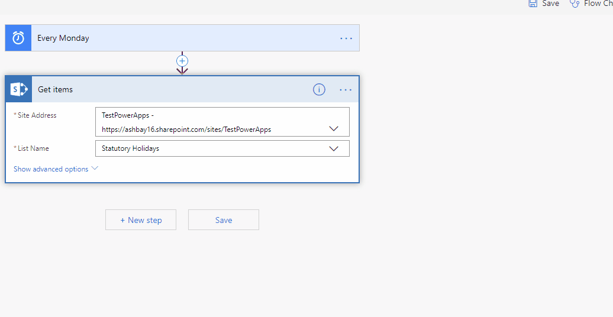
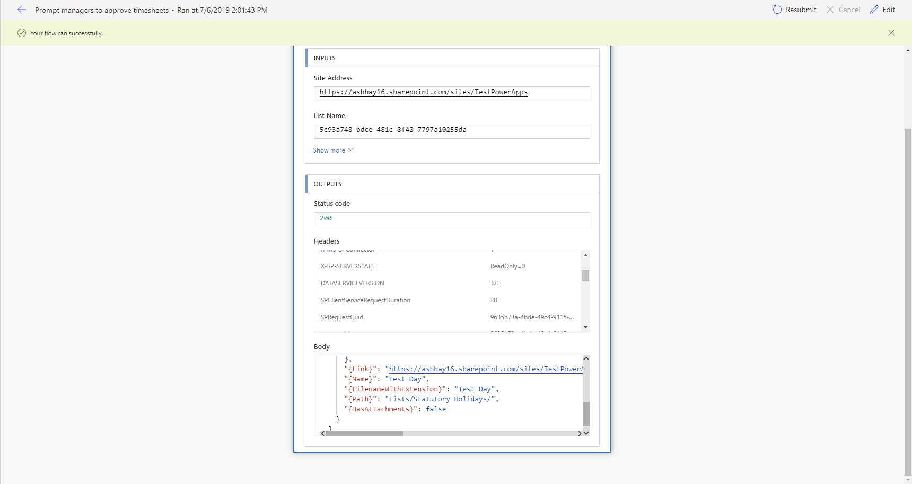

## Introduction

In my last two posts, I covered [how to use the SharePoint Get items action in Flow](https://tahoeninjas.blog/2019/07/03/using-the-sharepoint-getitems-action-in-flow/) and [how to tell if the SharePoint Get items action returned items (by counting them)](https://tahoeninjas.blog/2019/07/04/how-to-count-number-of-items-returned-by-sharepoint-getitems-action-in-flow/).

I really wanted to provide a real-life sample how one would use the two concepts together in Flow.

Since we just had a national holiday and I completely forgot about it (got ready to go to work and everything), I thought I’d create a sample flow that automatically runs on a schedule and prompts users to do something, except when today’s date is a holiday.

The workflow logic looks a little like this:

```flowchart
st=>start: Start (every n days)
e=>end: End
op2=>operation: Get today's date
op3=>operation: Find statutory holidays
with today's date
op4=>operation: Today is not a holiday
sub1=>subroutine: (Do something)
cond=>condition: Is today a holiday?
(Did you find any items)
io=>operation: Today is a holiday
(Do nothing)
st->op2->op3->cond
cond(yes)->io->e
cond(no)->op4->sub1->e
```

Let’s get started by creating the environment we need for this workflow.

## Creating a list of statutory holidays

In this example, we’ll create a SharePoint list which will contain an entry for every statutory holiday. We’ll use a list because it allows our HR folks to maintain it without needing a special app. We can also show the list on our SharePoint site so all employees can see what days are statutory holidays.

You can also use your own database, or an API, or even a static Excel spreadsheet if you want, but I wanted to use a SharePoint list to show how to use the SharePoint Get items action in Flow.

To create the list, follow these steps:

1. From a SharePoint site, go to **Site contents** via the local navigation or the **Settings** option.
2. In the **Site contents**, select **\+ New** then choose **List** from the drop-down menu.
3. In the **Create list** pane, enter **Statutory Holidays** as the list’s **Name**. Check or uncheck **Show in site navigation** depending if you want your users to see the list or not.
4. Select **Create** to create the list
5. In your newly created list, select **\+ Add column** then select **Date** from the drop-down list.
6. In the **Create a column** pane, enter **Date** for the column **Name**. Set **Include time** to **No** and select **Require that this column contains information** to **Yes** under **More options**. This list doesn’t make much sense if you don’t require a date for each stat holiday.
7. Select **Save** to create the column.

> If you need to support statutory holidays for multiple states/provinces/countries, feel free to add more columns to your list to support your needs. I wanted to keep this list as simple as possible.

Why didn’t I use a calendar list? I didn’t want to add the extra columns that come with a calendar list. If you really want a calendar view, just add it as a custom view for your list.

Use your list’s **Quick edit** to enter your statutory holidays. I use [this site](https://www.statutoryholidays.com/) to get the list of statutory holidays for every year.

When you’re done, you should have a list that looks like this:  


Now let’s create a scheduled flow that uses the list!

## Creating a scheduled flow

1. From [https://flow.microsoft.com](https://flow.microsoft.com/), go to **My flows** to view your list of flows.
2. From the **\+ New** menu, select **Scheduled–from blank**
3. In the **Build a scheduled flow** window, give your flow a descriptive **Flow name**. I named mine **Prompt managers to approve timesheets**.
4. Under **Run this flow**, select the schedule that suits your needs. I want mine to go once a week on Mondays, so I selected **1 week** under **Repeat every**, then selected **M** under **On these days** and unselected every other day.  
    .
5. Select **Create** to create your workflow.

Your workflow will be created and open in the workflow editor. I renamed the **Recurrence** action to **Every Monday** because I always want my workflows to be easy to understand without having to expand every action.  


Unfortunately, Flow won’t let you save until you add another action.

Funny, cause that’s exactly what we’ll do next!

## Connecting to the Statutory Holiday SharePoint list

Before we can access the Statutory Holidays list in SharePoint, we need to add a connection to SharePoint by following these steps:

1. From within your flow editor, select **+New step** at the bottom of the flow.
2. In the **Choose an action** prompt, type **Get items** in the **Search connectors and actions**. Search is case insensitive.
3. Select the **Get items** action with a SharePoint logo from the list of **Actions** that appears. If the search query returns too many actions and you can’t find the SharePoint **Get items**, you can filter out all other connectors by clicking on **SharePoint** just below the search bar.
4. As soon as you select **Get items**, the **Choose an action** box will transform into the **Get items** box.
5. If you haven’t created a connection to SharePoint yet, you’ll be prompted to **Sign in to create a connection to SharePoint**. Click **Sign in** to sign in with the account that you wish to use to access SharePoint.  

    > The account you use here specifies who will access SharePoint. Make sure that you use an account that can see the site and the list where you want to get items from. It is a good idea to use a _service account_ that isn’t using your own credentials to connect.

6. Once connected, enter URL to the site that contains your list under **Site address**. If you experience problems typing or pasting the URL, try selecting **Enter a custom value** from the drop-down; it will turn the drop-down box into a text box.
7. If the site URL you entered is valid and the credentials you supplied are correct, you should be able to pick the **Statutory Holidays** list from the **List Name** drop down.  
    

## Adding a filter to retrieve today’s statutory holidays

If you ran the flow now, it would retrieve every statutory holiday in the list.

We want SharePoint to return only statutory holidays on the days the flow runs. To do this, we’ll add an ODATA filter by following these steps:

1. In the new **Get items** action you just created, select **Show advanced options**
2. In the **Filter Query** field, enter `Date eq datetime''`.
3. Place your cursor between the two single quotes you just typed and select **Add dynamic content**
4. Select the **Expression** tab
5. Scroll to the **Date and time** category and select **See more**, then select **formateDateTime(timestamp, format)** to insert it in the expression field.
6. Making sure your cursor is between the two parentheses of the `formatDateTime` function, find the `utcNow()` function in the **Date and time** category.
7. After `utcNow()` but before the last `)`, type `', 'yyyy-MM-ddT00:00:00')` and select **OK** to insert the expression.
8. In the **Top Count** field, enter **1** — we only need to know if there is a statutory holiday or not, so we don’t need to return more than one.
9. In the **Limit Columns by View**, select **All Items**. This will ensure that we only return the **Title** and **Date** columns, instead of returning every single column in the list.  
      
    If you want to test your flow, save it and use **Test** in the upper right corner. You can add a temporary list item in your statutory holidays list with today’s date to see that SharePoint returned something.  
    

If everything goes well, your flow is now able to retrieve statutory holidays from the SharePoint list every time your flow runs.

Now let’s add logic to detect whether something was returned or not…

But before we do, let’s rename the **Get items** action to **Retrieve statutory holidays for today’s date** to make it easier to read. Hey, my blog, my naming conventions 🙂

## Count how many statutory holidays were returned for today’s date

As I explained in my [previous post](https://tahoeninjas.blog/2019/07/04/how-to-count-number-of-items-returned-by-sharepoint-getitems-action-in-flow/), I like using variables to make my flows easier to debug and easier to understand. We’ll store the number of items returned in a variable called **Number of statutory holidays**.

Since this is the first time we set the variable, we’ll use **Initalize variable** using the following steps:

1. In the flow editor, select **+New step**
2. From the **Choose an action** box, type **variable** in the search box.
3. From the list of suggested actions, select **Initialize variable**.  
    4.An **Initialize variable** box will replace the **Choose an action** box. Give your variable a descriptive **Name**. For example: **Number of statutory holidays**.
4. In the **Type** field, select **Integer** — because we’ll be storing the _number_ of items returned.
5. We’ll write the expression to calculate the number of items returned the **Value** field. If the dynamic content pane doesn’t show, select **Add dynamic content**, the select **Expression**.
6. Look for the **length(collection)** function in the **Collection** category and select it to insert it in the expression box. The length function is specifically designed to calculate how long a collection of items is — and that’s what the Get items action returns: a collection of items.
7. Make sure your cursor is positioned between the two parantheses **()** in the `length` function. Select the **Dynamic content** tab and look for the **value** dynamic content for the **Retrieve statutory holidays for today** action.
8. Flow will automatically insert `body('Retrieve_statutory_holidays_for_today''s_date')?['value']` inside your `length()` function. The final expression should be:

        length(body('Retrieve_statutory_holidays_for_today''s_date')?['value'])

9. Select **OK** to insert the value.  
    

Save and test your flow. Mine returned 1 item:  


## Testing if any items were returned

Now that you have a variable that contains the number of statutory holidays, you can use it anywhere you want.

Let’s create a conditional branch to do something if today is not a statutory holiday:

1. In the flow editor, select **+New step**
2. From the **Choose an action** box, select **Control** then **Condition**.
3. A **Condition** box will replace the **Choose an action** box. Give your condition a descriptive name. For example: **Is today a statutory holiday**.
4. If the **Choose a value** box, use **Add dynamic content** to select the variable you created earlier.
5. In the next field, select **is greater than**
6. In the next field (**Choose a value**) enter **0**.  
    

Save and test your flow. If everything worked well, the **Expression value** from your condition should return `true` if SharePoint found items, and `false` if nothing was found. My test returned `true`.


That’s it! Now you can insert actions under **If no** to do something when today isn’t a statutory holiday.

You could even add something under **If yes** to delay the flow until next day, but that’s another post.

## Conclusion

You can use **Scheduled flows** to run every _n_ days and easily query a SharePoint list containing statutory holidays to skip running when the current date is a statutory holiday.

Note that in today’s sample, I didn’t deal with _timezones_ by setting the start time of my workflow so that it is later than midnight in UTC time. If you run your workflow across multiple timezones, you should keep this into consideration.

I hope this helps you create workflows that know when to take it easy.

Because everyone deserves a vacation once in a while!

### Photo credits

Image by [Free-Photos](https://pixabay.com/users/Free-Photos-242387/?utm_source=link-attribution&utm_medium=referral&utm_campaign=image&utm_content=839831) from [Pixabay](https://pixabay.com/?utm_source=link-attribution&utm_medium=referral&utm_campaign=image&utm_content=839831)
