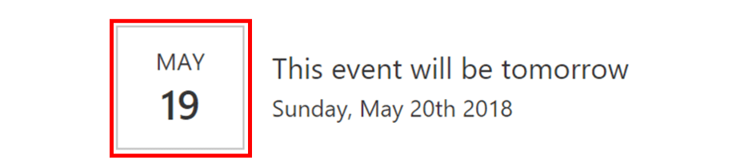
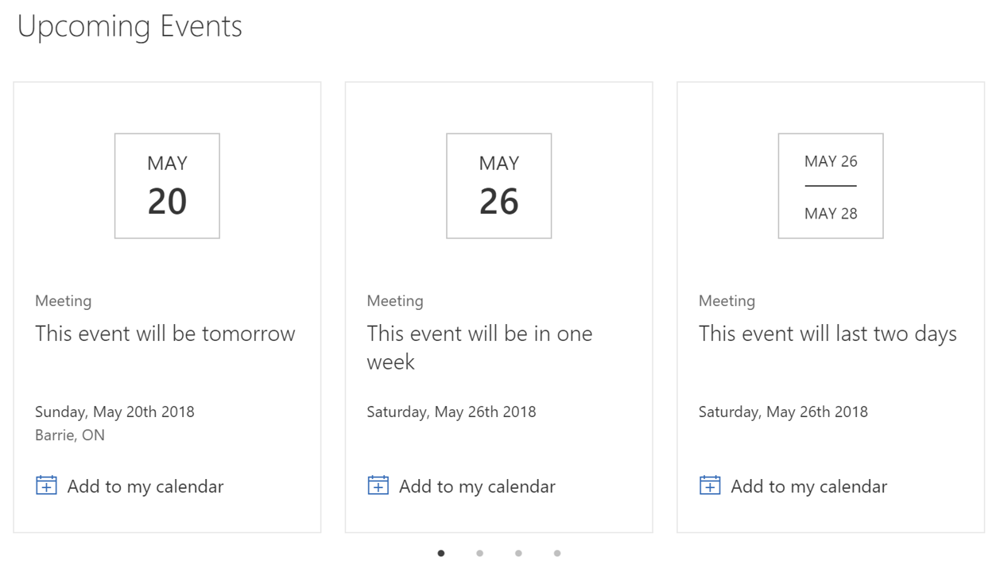

## Introduction

One of the premises of SPFx is that, with it, third-party developers have the same set of tools that the SharePoint team has. So, if you like the look of an out-of-the-box web part you can, in theory, reproduce the same look and feel yourself.

A friend of mine needed to display a list of upcoming events, but the events are coming from a WordPress site that uses the [WP Fullcalendar](https://github.com/wp-plugins/wp-fullcalendar/blob/master/wp-fullcalendar.php) widget. They also really liked the look of events in SharePoint.

So, I thought: why not try re-creating the out-of-the-box SharePoint events web part, but instead of reading events from a SharePoint list (or group calendar), it would read from WordPress?

Since I was taking the challenge, I decided to also try to do these extra features:

- Read events from multiple event providers, including RSS, iCal, and WordPress.
- Support additional event providers without having to re-design the entire web part
- Make the web part responsive, just like the SharePoint events web part, with a narrow view and a wide view.
- Support “Add to my calendar”
- Make it possible to add more web parts, for example, the Event Search web part, reusing as many of the components as possible.

This article will explain the various components of this web part. Because I tend to ramble on and on, I’ll then explain how to write every component of the web part in separate articles so that you can read as much (or as little) as you want.

And if you _really_ don’t want to read the articles, you can always [get the code](https://github.com/hugoabernier/react-calendar-feed). I won’t be offended if you do.

## Configuration

If you download the web part and run

gulp serve

you’ll see the web part in your web part catalog.

> **Note:** when I designed this web part, I created an SVG icon for it. At the time of this writing, there was an issue with using custom base64-encoded SVG icons. If your icon doesn’t look like the one in the picture above, don’t worry.

When you add the web part, you’ll be prompted to configure it:

Selecting the **Configure** button (or selecting **Edit web part** in the web part’s “toolbox”) will launch the web part’s property pane.

In the property pane, the **Feed type** drop-down lists all the service providers that the web part can find.

The idea is that if we add more feed types, they’ll automatically show up here. Let me know in the comments if you have an idea for a feed type you think we should add, or if you’d like to add one yourself just [submit a pull request](https://github.com/hugoabernier/react-calendar-feed).

If you’re running the web part in a development environment, it’ll offer you a **Mock** option, which will add bogus events for testing purposes. In production, this option will not appear.

The **Feed URL** input box will prompt you to enter a URL for the feed you wish to display. It validates the URL format (but doesn’t yet check the URL for results).

Because the WordPress feed URL that I was using supports a **from** and **to** date value in the URL, I added the ability to automatically insert today’s date and an end date (see below). All you have to do is to add a **{s}** where you want the **start date** and **{e}** where you want the **end date**.

The **Date range** drop-down allows you to select anything from **Next week** to **Next year**.

Unlike the out-of-the-box SharePoint events search, I didn’t add a **All events** option because there was no way (that I know of) in React to find the maximum possible date. I could have passed a null value around, but I didn’t want to do that. If there are enough requests for it, I’ll figure out a way to do All events later.

The only event provider that I know of which actually supports specifying a start and end date is WordPress. When a provider doesn’t support filtering at the source, I just filter them out once I have received the events.

In the **Advanced** section, you can specify the **Maximum number of events per page** for the narrow view (the normal view just fits in as many events as it can on every page).

The default is **4** (that’s what SharePoint events does), but you can put as many as you want on every page. You can also put 0 if you don’t want pagination for the narrow view.

When I was testing this web part, I kept on getting all sorts of CORS issues on some of the feeds I was using. So I added a **Use proxy** option, which — you guessed it — routes your requests through a proxy.

Finally, the web part can use the user’s local storage to cache events it retrieves so that the web part doesn’t fetch every. single. time. you. resize. the. page.

You can set the cache duration from 0 to 1440 minutes (1 day) in 15 minute increments. Be careful, though, because it’ll always cache a user’s results from the time they last retrieved the events. So, if you set it to cache for a day, it’ll wait an entire day before reloading events again no matter the time of the day. You should probably set it to half-a-day, just to be safe.

If you don’t want to cache, you can set the cache duration to 0 and it’ll refresh from the source every time. If your feed is slow, the web part will take forever to load every time.

The **Apply** button is just to make sure that the web part won’t try to load the feed as you type the URL.

Assuming you configured the web part (and that my code works well), you’ll get to see your events in a pretty calendar view soon enough.

## The narrow view

When you put the web part in a single-column, or when the web part is less than 480 pixels wide, the web part renders a _list view_ of events.

The list will render all the events retrieved and paginate the results according to the page size option you configured.

The dates are rendered to look like a page-a-day calendar.

If the event spans over multiple days, the date box will render differently:

The pagination component renders a **Previous** and **Next** button, and helps manage how many pages to render, which page to render, etc. Unfortunately, Office UI Fabric doesn’t offer a pagination control so I had to write my own.

 

Of course, if I wasn’t so lazy, I would have created a full pagination control with page numbers, and all, but the SharePoint events web part doesn’t show the page numbers so I didn’t do it. If there is enough demand for it, I’ll make the component more generic and add the page numbers.

## The Normal view (or carousel view)

When you view the web part on a full page (or when it is wider than 480 pixels), the web part switches to a _carousel_ view.

The carousel view is responsive and renders between 1 and 4 events per page.

Like the SharePoint events web part, there is a next and previous arrow when you mouse over the calendar, with dots at the bottom to indicate what _page_ you’re on.

Finally, the **Add to my calendar** button creates a dynamic ICS file, allowing you to import the event to most calendars on most devices.

# Conclusion

In [upcoming articles](/2018/06/05/creating-a-calendar-feed-web-part-part-ii), I’ll show how to build this, component by component.

I hope that you’ll enjoy it.
