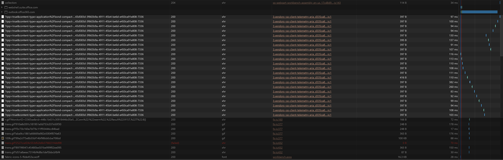

## Introduction

I think that custom SharePoint web parts should always look like they _belong_ to SharePoint; I want my users to be unable to tell my custom web parts from the ones that come out-of-the-box (O.O.B.) with SharePoint. I think that it helps users by presenting a common interface that they are already familiar with.

Sometimes, I’ll even go as far as examine the HTML, CSS and even analyze the network traffic an O.O.B. SharePoint web part produces to make sure mine behave consistently.

When testing a SharePoint web part on the SPFx workbench, analyzing network traffic using your web browser’s developer tools can get pretty overwhelming; there are so many telemetry calls every few seconds that it becomes impossible to figure out what calls are _real_ API calls, and which ones are telemetry calls.

For example, I added a test web part on my workbench page and refreshed the page, then took a screenshot of the number of telemetry calls the page made (non-telemetry calls are greyed out):

I left the page running while I wrote this introduction, and took another screenshot of the network traffic the page logged; this is what it looks like now:

The page is filled with telemetry calls! Every little tick in the timeline pane above the list is a telemetry call.

Fortunately, you can temporarily disable telemetry while you’re debugging your web parts on the SPFx workbench!

## What is telemetry

SPFx uses **telemetry** to collect measurements (such as performance and usage) and automatically sends that data at regular intervals automatically. It normally does not affect performance and can be quite useful to the Engineering team to detect (and resolve) potential issues.

When using your browser’s developer tools, on the **Network** tab, you can see a bunch of harmless Ajax calls to a link that looks like: [https://spoprod-a.akamaihd.net/files/sp-client-prod\_2019-06-21.008/3.vendors~sp-client-telemetry-aria\_d335ca85ff1f5f8fcce5.js](https://spoprod-a.akamaihd.net/files/sp-client-prod_2019-06-21.008/3.vendors~sp-client-telemetry-aria_d335ca85ff1f5f8fcce5.js)

## DisableTelemetry=true

If you want to debug a web part on your SPFx workbench (**[https://localhost:5432/workbench](https://localhost:5432/workbench)** or **[https://yourtenant.sharepoint.com/\_layouts/15/workbench.aspx](https://yourtenant.sharepoint.com/_layouts/15/workbench.aspx)** ), you can simply append **`?disableTelemetry=true`** to the your query string to temporarily disable telemetry calls.

Notice how there are no more telemetry calls on my page’s network traffic below? No more regular dots in the timeline means no more regular Ajax calls.

That’s all!

## Conclusion

Telemetry can be super useful, but sometimes it can be annoying — especially when you’re trying to analyze a page’s network traffic.

The `disableTelemetry=true` query string parameter only seems to work on SPFx workbench pages, but that’s fine with me.

I hope it helps you?

### Image Credit

Image by [swooshed](https://pixabay.com/users/swooshed-933348/?utm_source=link-attribution&utm_medium=referral&utm_campaign=image&utm_content=812679) from [Pixabay](https://pixabay.com/?utm_source=link-attribution&utm_medium=referral&utm_campaign=image&utm_content=812679)
