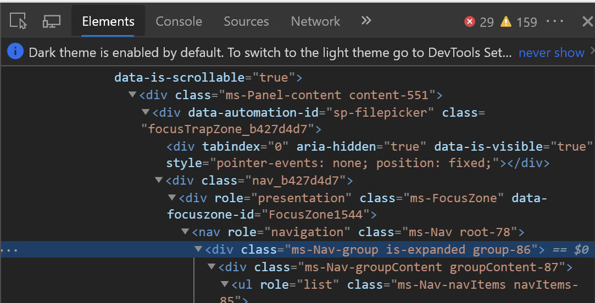
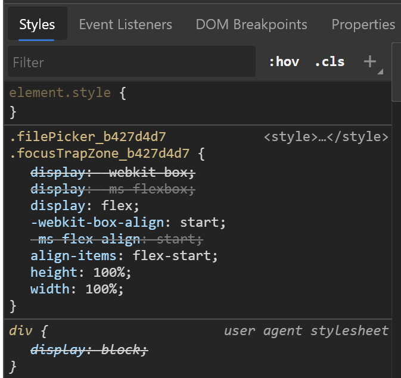
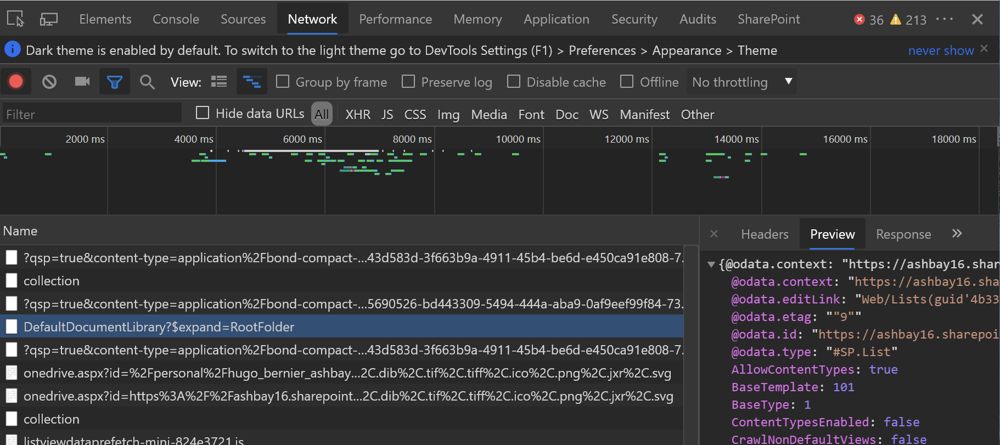

## Introduction

Recently, Microsoft announced a plan to rename **Office UI Fabric** to **Microsoft UI Fabric**. The [Fabric React Component](https://developer.microsoft.com/fabric#/components/activityitem) that have become ubiquitous on Microsoft web applications will be updated to give the Fabric controls that new cool Fluent style — eventually aligning the desktop and web app look and feel to give users a consistent experience.

To help understand how the controls will change with the Fluent style, the UI Fabric team created a [Preview web site](https://fluentfabric.azurewebsites.net/#/components). On it, there is a component that allows you to compare how the controls will appear before and after the Fluent style update by dragging a slider left to right. Although it isn’t a standard UI Fabric component, the comparer component looks and feels like it belongs to UI Fabric.

At that time, I was putting together a demo for a client that needed to compare two images on their SharePoint site. I thought I’d re-create the comparer component into an SPFx web part.

As I was building the web part, I decided to add the ability for users to pick the _Before_ and _After_ images using a file picker like the one available in SharePoint.

The out-of-the-box file picker allows users to pick files from their recent files, web search, OneDrive, the current site they’re on, an uploaded file, or a hyperlink. Perfect for my needs!

Being the **World’s Laziest Developer**, I looked for a standard control within the SPFx libraries, Fabric UI, the [PnP Reusable React controls for SPFx solutions](https://github.com/pnp/sp-dev-fx-controls-react), and the [PnP Reusable SPFx property pane controls](https://github.com/pnp/sp-dev-fx-property-controls) .

But I found nothing.

What I lack in being _lazy_, I make up in being _stubborn_. So I decided to write my own File Picker control.

The web part came out OK, but I was pretty happy with the File Picker.

This article will describe some of the techniques and approaches I used to reverse engineer the out-of-the-box File Picker to create my own.

If all you need is to see the code, you can find the **React Comparer** web part on the SharePoint **[SP-Dev-Fx-WebParts Sample Repository](https://github.com/pnp/sp-dev-fx-webparts/tree/master/samples/react-comparer)**.

## Design Criteria

Before I set out to build the File Picker, I defined some rules that I would have to stick to no matter what:

1. To the best of my ability, the File Picker had to look and feel exactly like the out-of-the-box File Picker. That includes copying some of the weird inconsistencies in the out-of-the-box component — I’ll get to those later.
2. Even though I only cared about picking images, the File Picker must be designed to eventually support picking documents as well as images. I wouldn’t be spending any time testing the picker using documents, but I would spend every effort to make sure I would be able to add full support for documents later.
3. The control should be easy to re-use in other solutions. Eventually, it should be easy to add it to the [PnP Reusable SPFx property pane controls](https://github.com/pnp/sp-dev-fx-property-controls) — as long as anybody else shows interest in it.
4. Using the File Picker control should not require setting custom permissions or prompt the user to enter their credentials — or any other weird behavior (see #1).
5. Should be designed to support mobile browsing in the future, but no testing on mobile device.
6. The File Picker control should be easy to extend without disrupting the user experience. For example, I would like to add a **Camera** tab to allow users to insert an image from their camera, but I’d want the tab to look like the feature came out-of-the-box.

With all the above rules established (_why do I do this to myself, again?_), I started coding!

## What kind of control?

When I first started trying to figure out how I’d go about doing this control, I thought I’d do a regular control that I’d launch when clicking on the property pane button. I thought I’d use the `@microsoft/sp-webpart-base`‘s `PropertyPaneButton` and the `onClick` handler to display a UI Fabric `Panel` control.

The problem with this approach is that I would need to track whether the panel was opened or not to determine when to render the panel. Since I had no control over the state of the `PropertyPaneButton` control, I would have to store that information in the web part properties — something that I didn’t want to do.

But if I created a custom property pane control, I could render the button to open the dialog and add the state of the dialog to the property pane control’s state.

Luckily, there is a great training module called [SharePoint Framework training package – Working with the Web Part Property Pane](https://github.com/SharePoint/sp-dev-training-spfx-webpart-proppane) that teaches you how to use and develop your own property pane controls. The PnP  
Reusable SPFx Property Pane Controls [source code](https://github.com/pnp/sp-dev-fx-property-controls) is also a great place to look for examples to get started.

Ultimately, I mimicked the code from PnP (after all, I’m planning on submitting the control to PnP!) and created the property control.

## Taking inspiration from existing controls

Since my goal was to reproduce the exact same look and I feel, I started rebuilding the same component structure by using the out-of-the-box file picker and examining the HTML it produced.

Using your browser’s Developer Toolbox (F12 on Chrome and Edge) **Elements** tab, you can navigate through the page elements and determine what kinds of controls are used.

For example, the navigation which allows users to select whether to pick a file from OneDrive, the Site, upload, etc. has the `ms-Nav-group` CSS class.

.

A [quick search](https://github.com/OfficeDev/office-ui-fabric-react/search?q=ms-Nav-group&unscoped_q=ms-Nav-group) for `ms-Nav-group` in the UI Fabric source code pointed to the UI Fabric `Nav` component.

By comparing the [samples](https://developer.microsoft.com/fabric#/components/nav), I was able to find the sample that matched the look of the out-of-the-box control the closest and started with that.

## When to split components

Since React makes it easy to create controls that are made up of many components, it can be difficult to figure out when a group of HTML elements are from a single control, and when they aremade of individual controls.

Luckily, the majority of controls usually consist of the control’s `.tsx` file, and a `.scss` file that contains all the CSS classes needed to render that control.

When React renders a control in a web page, it adds the control’s CSS to the page. To prevent one’s control’s CSS from interfering with another control’s CSS, React uniquely names each CSS class by appending a unique suffix to each class name.

In the example below, the `nav` CSS class is rendered as `nav_b427d4d7`. If you look closely at the parent elements of the `nav_b427d4d7` element, you’ll find there is an element with a class `focusTrapZone_b427d4d7` — with the same `_b427d4d7` suffix.

Elements with the same class name suffix are generally rendered from the same React control. By navigating up and down the HTML elements, I was able to determine which items were rendered together.

## Copying styles

While I was reverse engineering the controls I would need, I was also able to extract the styles I needed for each element by looking at the Developer Toolbar’s **Styles** pane in the **Elements** tab:

I simply gave my HTML elements the same CSS class names that I would see in the Developer Toolbar (minus the unique suffix) and used the same styles.

With a bit of tweaking, I was able to make the control look exactly the same.

## Listening In

Once I got the HTML to look the way I wanted, I had to figure out where SharePoint got the results.

Once again, the browser’s Developer Toolbars came to the rescue. By loading the out-of-the-box file picker and using the **Network** tab, I was able to see what REST calls SharePoint makes to retrieve documents.

After filtering through many XHR calls, I was able to find which calls returned the data I was looking for.

I used the `@pnp/sp` library to re-create the calls in my components and return the same data that the SharePoint file picker control returned.

## Discrepancies

By analyzing the file picker, I noticed some discrepancies how each tab was rendered. For example, the **OneDrive** tab and the **Site** tab may look very similar, but a closer look reveals minor differences between the two.

For example, the Site tab shows folders within the site with no file count:  

Meanwhile, the OneDrive tab shows a file count within each file and offers users the ability to select which view they wish to use (in the upper right corner):  

The HTML behind each tab is also very different.

I chose to keep the same discrepancies between tabs, even if I was tempted to clean up and optimize the code. I suspect the each tab was created by a different team members (or teams?) within Microsoft, which explains the lack of consistency.

## Conclusion

The value proposition of SPFx is that it gives third-party developers (like me) the same set of tools that first-party developers (like Microsoft) can use.

By using the browser’s developer tools and a bit of elbow grease, you can reproduce the look and feel of SharePoint components and make them do whatever you want them to do.

If you want to find out more on how I wrote the File Picker control, take a look at the [code](https://github.com/pnp/sp-dev-fx-webparts/tree/master/samples/react-comparer).

I hope this helps?

## Updates

- The **FilePicker** control is now available in the [Pnp reusable controls](https://sharepoint.github.io/sp-dev-fx-controls-react/controls/FilePicker/), woo hoo! I can’t take the credit for submitting the re-usable control, but I’m super proud that members of the PnP community were able to get together to make this happen… and that I was able to help!
