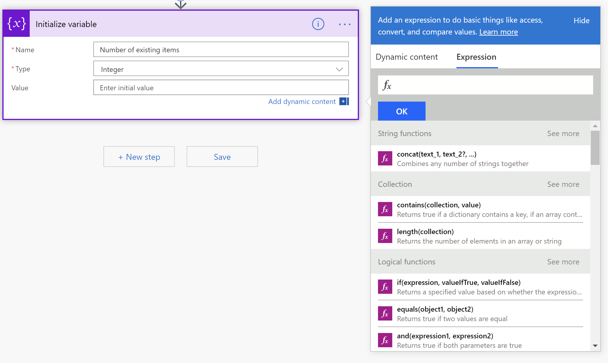
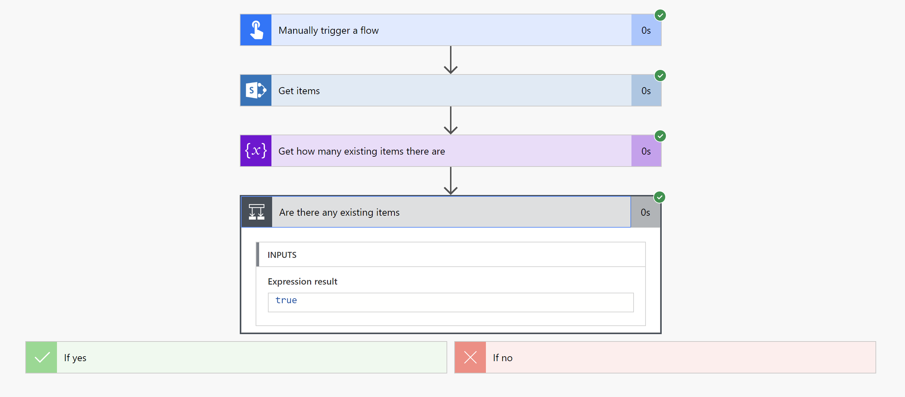

## Introduction

In my [previous post](https://tahoeninja.blog/2019/07/03/using-the-sharepoint-getitems-action-in-flow/), I explained how to use the SharePoint [Get items action](https://docs.microsoft.com/en-us/connectors/sharepointonline/#get-items) in Flow. As the name implies, it retrieves items from a SharePoint list.

Sometimes you need to know if your Get items action returned any items. For example, if you wanted to update an existing item or create a new item in none was found.

In this post, I’ll show you how to count how many items were returned by SharePoint and how to test if any items were found.

And don’t worry, this post won’t be as long as the last one.

## Counting results from SharePoint Get items

For the purpose of this example, we’ll assume that you already created a flow with a SharePoint Get items action. If you haven’t done so yet, [take a look at my previous post](https://tahoeninja.blog/2019/07/03/using-the-sharepoint-getitems-action-in-flow/).

When I have to use fancy formulas in many places within my flow, I like to define a variable. That way, I can just refer to the variable instead of re-entering the formula in many places.

> You should always strive to make your flows easy to read so that if someone else has to maintain it (or if you have to come back to it later), it will be easy to understand what the flow does. Make sure to give your actions a descriptive name (not **Get items** like in my example, use something like **Get existing responses from current user**, for example). Using variables is another way to make your flows easier to use.

When using variables in flow, you use a different action to define a variable the first time (**Initialize variable**) than you would to set the variable or change its value (**Set variable**, **Increment variable**, and **Decrement variable** for example).

Since this is the first time we set the variable, we’ll use **Initialize variable** using the following steps:

1. In the flow editor, select **+New step**
2. From the **Choose an action** box, type **variable** in the search box.
3. From the list of suggested actions, select **Initialize variable**.  
      
    4.An **Initialize variable** box will replace the **Choose an action** box. Give your variable a descriptive **Name**. For example: **Number of existing items**.
4. In the **Type** field, select **Integer** — because we’ll be storing the _number_ of items returned.
5. We’ll write the expression to calculate the number of items returned the **Value** field. If the dynamic content pane doesn’t show, select **Add dynamic content**, the select **Expression**.  
    
6. Look for the **length(collection)** function in the **Collection** category and select it to insert it in the expression box. The length function is specifically designed to calculate how long a collection of items is — and that’s what the Get items action returns: a collection of items.  
    
7. Make sure your cursor is positioned between the two parantheses **()** in the `length` function. Select the **Dynamic content** tab and look for the **value** dynamic content for the **Get items** action (or whatever your SharePoint Get items action is called).  
    
8. Flow will automatically insert `body('Get_items')?['value']` inside your `length()` function. The final expression should be:

        length(body('Get_items')?['value'])

9. Select **OK** to insert the value.  
    

Save and test your flow. Mine returned 1 item:  

## Testing if any items were returned

Now that you have a variable that contains the number of items, you can use it anywhere you want.

For example, if you wanted your flow to do something if _any_ items were returned, and something else if nothing was returned you would follow these steps:

1. In the flow editor, select **+New step**
2. From the **Choose an action** box, select **Control** then **Condition**.  
    
3. A **Condition** box will replace the **Choose an action** box. Give your condition a descriptive name. For example: **Are there any existing items**.  
    
4. If the **Choose a value** box, use **Add dynamic content** to select the variable you created earlier.
5. In the next field, select **is greater than**
6. In the next field (**Choose a value**) enter **0**  
    

Save and test your flow. If everything worked well, the **Expression value** from your condition should return `true` if SharePoint found items, and `false` if nothing was found.  

Of course, you would want to add actions to your **If yes** and **If no** paths, but that’s for another post.

## Conclusion

The key to testing if the SharePoint Get items action returned items it to understand that Get items returns a _collection_ of items. Using the `length()` function against the return value of your Get items action will tell you the length of your collection of items.

I _could_ have avoided using a variable and just entered the `length(body('Get_items')?['value'])` formula directly in the condition, but I wouldn’t be able to tell how many items were returned when I was testing the flow. This sample was an easy one, and I really didn’t need to evaluate how many items were returned more than once — so I really didn’t _need_ a variable — but in more complicated flows, you’ll find it a lot easier to define variables and use the variables throughout instead of copying the same formula every time.

I hope this helps?
