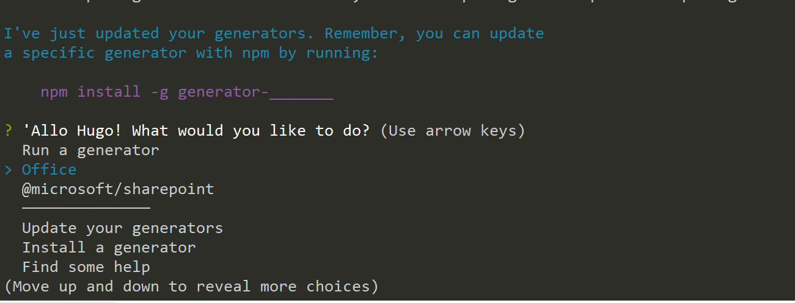

## Introduction

Sometimes you just need to figure out what version of the SPFx Yeoman generator is installed on someone’s machine.

I got tired of having to look it up all the time, but I can never find the command (probably because it is too obvious for most people to write it down?).

So here is a note for myself, but I hope it helps somebody else too one day.

## Getting the version number

To find the version of your SPFx Yeoman generator, follow these steps:

1. Launch a **Node.js command prompt** command or whatever terminal you use
2. Type the following command:

    ```shell
    npm ls -g --depth=0 @microsoft/generator-sharepoint
    ```

3. Wait…
4. The response should look a little like this:  
    

The command isn’t specific to the SPFx Yeoman generator. It can be used for any NPM package. Here is what it really does:

* `npm` indicates a **Node Package Manager** command.
* `ls` means to list packages
* `-g` means that you want to list the **global** packages. If you don’t use `-g`, you’ll only list the packages installed in the current solution (assuming that you’re currently in a folder that contains a solution)
* `--depth=0` means that you only want the **top-level modules**. In other words, you don’t want to list all modules that includes the package you’re looking for.
* `@microsoft/generator-sharepoint` is the actual package you want to list. You can actually put whatever package you want here. For example, `npm ls -g --depth=0 yo` would tell you what version of the Yeoman generator is globally installed, and `npm ls --depth=0 office-ui-fabric-react` would tell you what version of Office UI Fabric React is currently installed in your current solution.

## How to check if Yeoman has an update for you

As [Stefan Bauer](https://twitter.com/StfBauer?s=17) pointed out, if you don’t want to know _which_ version of the SPFx Yeoman generator you have installed, but you want to see if there is an update, you can follow these steps:

1. Launch a **Node.js command prompt** command or whatever terminal you use
2. Type the following command:

    ```shell
    yo
    ```

3. Yeoman will greet you. If you have an update available, Yeoman should tell you right away (see how my **Office** generator has an update in the screen shot below)  
    
4. Select **Update your generators**
5. Yeoman will prompt you to select the generators you want to upgrade. Use the spacebar to toggle which generators you want to update, then press **Enter**  
    
6. Yeoman will do its thing, then will tell you **I’ve just updated your generators. Remember, you can update a specific generator with npm by running `npm install -g generator-______`**. Good to know Yeoman, good to know.  
    

## Conclusion

This article shows you how you can use a standard NPM command to query what version of the SPFx Yeoman generator is installed on a workstation.

You can use the same command for any NPM package, but in my particular case, I just wanted to remember how to diagnose the version of the SPFx Yeoman generator.

There may be an easier/faster way to do this. If you know a different way, please share with the rest of the class.

I hope it helps?

## Update

* Thanks to [Stefan Bauer](https://twitter.com/StfBauer?s=17) ([https://n8d.at/](n8d.at)) for confirming that there aren’t any faster ways to do this, and for also suggesting that I explain how the command works. The section about using `yo` to update your generators was also his idea. Stefan is someone that I respect immensely and I truly appreciated his feedback!
