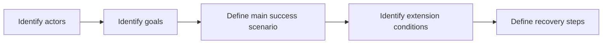
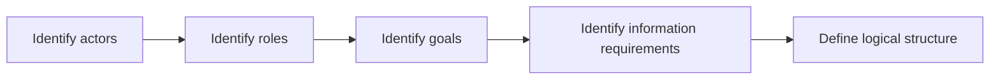
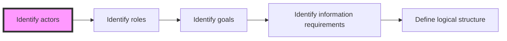
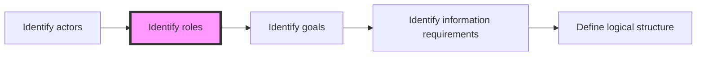
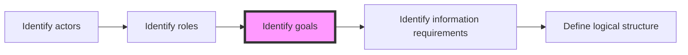
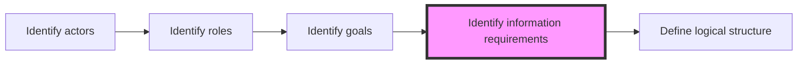
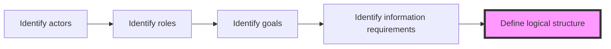

## Introduction

In my [previous post](/2019/02/20/information-architecture-in-sharepoint-3-dimensions-of-ia/) on Information Architecture (IA) in SharePoint, I explained that you should build your IA on 3 dimensions.

I discussed how you should build the **physical** dimension around your authors, by creating sites, document libraries and — if you must — folders optimized for those who create and maintain content.

In this article, we’ll discuss the **logical** dimension of IA.

## Readers

If the **physical** dimension is for authors, the **logical** dimension is for **readers** — those who _consume_ your SharePoint content.

Authors are usually subject of matter experts on a given domain. For example, your Human Resources department people are experts in all things HR-related. They understand the subject, and they even use jargon that is specific to their domain of expertise.

In contrast, readers may not be subject of matter experts. They don’t care about how to maintain content — they just want to find the content.

And, unlike authors, readers don’t share a common knowledge of a domain of expertise. That means that every reader navigates through content using their own logic.

For example, your company has employee benefits. Your Human Resources department handle _some_ of those benefits, while your Finance department handles other benefits. Maybe your IT department offers additional benefits (like providing phones and computers for home use).

The HR folks, Finance folks, and IT folks maintain information about the respective benefits their department offer. Based on what we learned earlier, you would build a physical IA that would allow each department to store documents where it makes sense to them.

To keep things simple, let’s pretend that you created three SharePoint **team sites**:

- Finance
- Human Resources
- Information Technology

And let’s pretend that, on each of those sites, you created a **document library** called **Benefits**.

People from the Finance department can update benefits documents in the Finance team site. People from the HR department can do the same in their Human Resources team site, and so on.

### Meet Nancy

**Nancy, the New Employee** is a fictitious person.

> Everyone that has worked with me knows the I like to build _personas_ to help gather requirements.

She’s a typical new employee. She’s excited, nervous, and eager to learn.

Nancy is fresh out of college. She joined as a Junior Accountant. She recently got engaged. Like most people of her generation, she wants to get recognized for her hard work, but she also wants a proper work/life balance.

One of the reasons she accepted her new job with your company is because of the amazing employee benefits it offers.

This is Nancy’s first real "grown-up" job. She’s never had real employee benefits before. She doesn’t know what to expect, or where to get started with taking advantage of her benefits.

Nancy doesn’t care what department offers what benefits. She doesn’t want to go through Finance, HR, and IT sites to learn about benefits.

She just wants a place the shows her everything related to benefits in a single, convenient location.

> In other words: Nancy doesn’t care where the benefits documents are **physically** located, as long as they are available together **logically**.

Nancy’s Information Architecture needs as a _reader_ are very different than those of an HR employee’s IA needs as an author.

That’s the difference between the **physical** dimension and the **logical** dimension.

## How to design your IA’s Logical dimension

The secret to building the ideal logical IA is to understand your users and their goals.

To do so, I always use a slightly modified version of the process I use for gathering Use Cases.

Here is the Use Case process:

Here is the modified process for logical IA design:

Let’s discuss each step in details.

### Identify actors

I use the term _actor_ instead of _user_ because I don’t ever want people to get confused give me a list of every single person who logs on to SharePoint.

In a play, an actor can often play multiple roles. Many people can also play the same role (think: understudies).

So, in our IA design process, an _actor_ is a person who plays many roles. Your actors can be real people, or they can be fictitious people that you create for the IA design process.

For example, _Nancy the New Employee_ is a fictitious actor we’ll use to represent real new employees. We don’t want to have a list of every single new employee, we just want to use Nancy as a proxy for all the other new employees.

Keep going through until you find all your actors. Resist the temptation to move on to the next step. If you move on to the next step now, you’ll have an IA that suits one actor very well, but doesn’t work for others.

If you’re struggling to identify, here are some tips:

#### Look for extremes

Your actors should almost be caricatures of your real users. Look for people in your company that are stereotypical users.

Find the _worst_ and the _best_ people in your organization.

> I once did this exercise for one of the top 5 accounting firms in the world.
>
> The Firm had many partners, who –rightfully so– ran everything.
>
> Partners were often older men who were at the top of their profession.
>
> Most of them were nice, but some of them were just _grumpy_ old men.
>
> Most of them didn’t trust computers and wanted their assistants to print everything for them.
>
> We took the oldest, grumpiest partner we knew, and used him as an actor. Of course, we changed his name to **Perry the Partner**.

#### Look for opposites

One trick is so easy it almost feels like cheating: find the opposite of an actor you already have.

You have a _new employee_ actor, create an _old employee_ actor — their needs are different. The new employee doesn’t know anything about the organization structure yet, the policies, the people. The old employee knows everyone in the company, knows every department, every policy, etc. They’ll look for information differently.

You have a _grumpy old partner that doesn’t like technology_ actor, maybe you need a \*younger partner who is technically savvy.

#### Primary actors and secondary actors

This is another trick I borrowed from capturing requirements: primary actors, and secondary actors.

_Primary actors_ are the reason why your system exists. Without them, you wouldn’t need SharePoint. This one is obvious — that’s probably everyone you have identified so far.

_Secondary actors_ exist _because the system exists_. In this case, secondary actors are people who support SharePoint, create content, etc.

But secondary actors could also be people who already existed, but whose jobs become more important because of your new system.

Remember _Peter the Partner_? He hates technology. He needs everything printed (which I disagree with, but that’s another topic). Who prints everything for him?

His assistant, _Allison_.

Don’t confuse _Primary_ and _Secondary_ as _Important_ and _Less important_. For our IA, Allison the Assistant is just as important as Peter if not _more_. Without Allison, Peter won’t use the system.

#### Look for evidence

I’m a big fan of _evidence-based requirements gathering_.

When you interview people to gather requirements, they tend to tell you what they think you want to hear. They talk about _features_ instead of _goals_. They try to translate things in geek speak for you because that’s what they think you want to hear.

_Evidence_, doesn’t lie. It doesn’t change because you’re looking (although [Quantum physics](https://en.m.wikipedia.org/wiki/Observer_effect_(physics)) disagrees)

If you want to get a list of typical people who use the system, look for evidence.

What kinds of evidence are there?

- Active Directory groups
- Distribution list
- Newsgroups

> Be careful: I have been in many organizations where the distribution groups and security groups combined outnumber the number of employees.

#### Look for life events

Remember we started this whole example about employees finding benefits.

What most HR professionals will tell you is that benefit needs for an employee tend to change around _life events_.

For example:

- Getting married
- Having a child
- Getting divorced
- Getting sick
- Getting older
- Retiring

Not every employee will experience the same life events, but life events definitely help shape a person’s goals.

For example, Nancy recently got engaged. She will get married soon. She’ll be thinking about adding her husband to her benefits. She might want to change her last name.

After getting married, her next life event might be to get pregnant. She’ll want to find information about pregnancy leave, child care benefits, etc.

> Please don’t send me angry emails about my antiquated views of the world or calling me sexist. I _know_ that it isn’t always the case, and I agree with you. Those are the life event patterns HR professional often consider.

In our previous example, Perry the Partner is probably pondering his prospective retirement. (That’s a lot of "p").

Life events can also be professional events. For example:

- Getting hired
- Promotion
- Certification
- Becoming a manager
- Getting a bad performance review

#### Consider accessibility

Many countries have (or will have) a legal requirement for accessibility. How do people who are visually impaired access your information? How about those who can’t use a mouse? What about people with cognitive impairments?

When I create my actors, I _always_ create an actor with accessibility requirements. It may not affect our IA, but it will definitely impact our designs. But that’s a different post.

#### How many actors should I get?

It depends on how different types of people you have. I tend to aim for 12 actors at most. Why? _Because I’m lazy_. If you aren’t lazy, feel free to do more than 12, but I’m not sure how much more value you’ll get.

#### For bonus points

If you’re up to it, create little posters with each one of your actors.

I usually create a fictitious profile, complete with picture, of each actor.

I post them around the team room so that everyone that works on my project sees the posters every day. They serve as a gentle reminder to our team that we’re building this for _people_, not computers.

I’ll often hear team members having discussions where they use our actors as if they were real people:

> "Nancy will never know how to do this! Remember, she’s new, she doesn’t know what benefits are available to her yet!"

I bet you that if you talked to the people who worked with me on that accounting firm project, they’d remember _Nancy the New Employee_.

That’s the point of defining actors: we’re not building an IA in a vacuum. We’re building it for people (even if those people are fictitious).

### Identify roles

Now that you have your list of actors, you can define _roles_ for each one of them.

We’re not talking about security roles here. We’re talking about _purposes_ or _unique traits_ that will affect their goals.

In our example, Nancy plays many roles:

- New employee
- Junior accountant
- Accounting department staff
- Bride to be

> "Why do we do all this work to define an IA?" you may ask. Or "Why identify actors just so that we can identify their goals". Your actors are there to serve as a reminder that you’re building this for _people_.
>
> If you define memorable actors for you and your team, your actors will become the litmus test for every design decision you make.
>
> Roles help you identify goals in a way that helps you focus. Trust me, you’ll get a more complete list of requirements by listing goals on a role-by-role basis than you would if you just spewed a list of random goals for your entire system.

What if you get duplicate roles? It happens. You should try to create actors with distinct roles, but don’t stress about it. During this step, we often realize that we have duplicate roles and we combine multiple actors together, or trade roles between actors to make them more unique.

Once again, resist the urge to go to the next step before you complete this one.

Why?

If you move to the next step, you will not have any idea of the scale of effort involved in completing your IA. You will have an incomplete IA and no clue how much you didn’t accomplish.

Instead, your goal should be to have a complete list of roles. That way, you’ll know how much work is ahead of you and it will help you plan accordingly.

### Identify goals

For every role you identified, list the possible goals.

Complete this sentence "As a \[role\] I want to use SharePoint to \_\_\_\_".

Notice that this step isn’t _identify requirements_. It is _identify goals_.

What’s the difference?

Every single engagement I take on, there will be at least one person who will insist that "search" or "searching" is a goal.

"Search" isn’t a goal. It is a requirement.

No one ever says "I think I’ll go to Google and search for something and do nothing with the results".

You search because your goal is to _find something_.

So don’t write "Search". Write "Find \[something\]". How you find _something_ is through search, but keeping the end goal in mind may help shape your IA differently.

Here are some tips:

- **One role at a time:** give each role the consideration they deserve.
- **Resist the urge to describe the goals in further details:** you can do that later. We want _speed_ and _quantity_ here.
- **Duplicates are good**: you may find the many roles have the same goal. That’s a good thing. Write it down for every role. A goal that appears for multiple roles is a goal that is more probably important. When it comes time to implement, you may want to focus on common goals first.
- **Write the _out of scope_ goals:** Keep that list going. Include things that are obviously out-of-scope. You can always mark that goal as out-of-scope later. If that goal comes back over and over again, you should consider including it in scope.
- **Don’t let the tools get in your way:** I often find that people get stuck on the tool they should use for this step. This phase is more about _brainstorming_. You should use whatever tool allows you to capture goals as quickly as possible without worrying about fonts, formatting, or structure. I like to use a mind mapping tool or OneNote. I loooove OneNote.

For example, the _new employee_ role might want to accomplish the following goals:

- Learn about the company
- Learn about the organization structure
- Find out what my benefits are
- Apply for benefits
- Learn about policies and procedures I should know about
- Learn about my team members
- Learn the company jargon
- Get office supplies
- Learn about holidays

The _bride to be_ role might want to accomplish these goals:

- Learn about benefits for spouses or dependents
- Add a beneficiary
- Book time off (for wedding and honeymoon)

The _junior accountant_ role’s goals might be:

- Get my certification
- Complete my training
- Get promoted

### Identify information requirements

Once you have an extensive list of goals, you can consolidate it into common goals. You can also filter out the list of goals that are out-of-scope.

For every goal, try to answer this question: "How will users accomplish \[this goal\]?". Or "What information do users need to accomplish \[this goal\]?".

As tempting as it may be, I’ll resist the urge to list example information requirements.

Just think about every document, list, news, and people you may need to accomplish a goal.

> "Wait a minute! Didn’t you say in a [previous post](/2019/02/15/information-architecture-in-sharepoint-data-information-knowledgei/) that people are knowledge?"
>
> Wow, I didn’t know you read that! Thank you! But no, _people hold knowledge_. Listing the people who know stuff is just _information_. Remember: I can write everything I know about a subject, it becomes _information_. You need to apply your own experience to make it your own _knowledge_.

### Define logical structure

I would love to be able to give you a magical formula to define your logical structure. Unfortunately, I don’t, because every IA is different.

However, I can give you some tips:

#### Establish success criteria

Define what success will be before you even start.

For example, I always start with **3 clicks or 30 seconds**.

That means that every actor should be able to achieve their goals within 3 clicks on their landing page, or within 30 seconds.

As you build your logical IA, test it with goals you identified in the previous step and see if it meets your success criteria.

#### Duplicates are OK

Let me be clear: in the _physical_ IA, duplicating content is a no-no. You don’t want two physical copies of the same data because it will invariably lead to content getting out of sync.

_Logically_, I should be able to see content in multiple places.

Every user will navigate your IA differently, so why force them down a path that doesn’t make sense for them?

Think of a news post. It may physically be on an HR site, but it may show up logically on your SharePoint tenant’s root site news feed, in the user’s own news feed, in the HR site’s news feed, etc.

#### _Me-centric_, not _organization_ centric

I can’t stress this enough. Build an IA that is centered around the users. Don’t try to copy your Org Chart.

#### Do an open card sorting workshop

If you need help getting started, try writing all the goals on individual index cards (or sticky notes).

Invite groups of _actual users_ to review the goals and physically group the cards into groups that make sense to them. They can work together, or they can work individually. Tell them that they can to move other people’s cards too.

Then watch how they work.

See if people disagree or fight about where a particular goal should go. Make sure to remember any contentious points.

When they are finished, ask them to give each group of goals a name they would use to describe it.

Record the results and repeat with different user groups. You’ll be surprised to find some similar patterns, while some groupings will wildly vary across different user groups.

This will give you a good indication of how your users see your information.

> **IMPORTANT:** Ask the users to do this. Avoid the _we know better_ attitude.
>
> I once conducted this workshop with folks from the IT department, then asked the _actual users_ to do the same exercise. The results were wildly different. Embarrassingly so.

#### Do a closed card sorting workshop

If you think you have defined your logical IA, try it with users.

Just as before, print some user goals on index cards or sticky notes. If you want to change things up, you can list some of the information you identified in the previous steps instead of goals.

Now draw your logical IA on a giant whiteboard or on different color index cards laid out on a big table.

Invite groups of users to read each user goal (or types of information), and to place each one where they think it belongs on your logical IA.

If they instinctively place the cards where you intended them to go in your logical IA, you’re doing great.

If they struggle, your IA needs more work.

## Conclusion

Your physical IA is for authors. Your logical IA is for readers.

Build your logical IA with users in mind.

Remember that every user has a different perspective when looking for information.

In our [next article](/2019/02/24/information-architecture-in-sharepoint-the-metadata-dimension/), we’ll discuss the last dimension of IA: Metadata.
