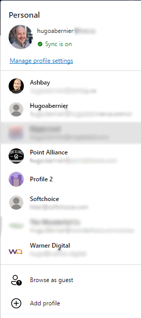

## Introduction

Ugh. I was useless today: my internet was down for most of the day and I was powerless.

I tried to make myself useful by writing blog posts that I have been meaning to write for a long time (it _has_ been a long time, hasn't it?!). 

If you're like me, you probably have a bazillion accounts on various Microsoft 365 tenants. I have one for each of my clients, sometimes two (one is a regular user, one is an admin user), plus one for each of my developer tenants, my MVP tenant, and one for when I collaborate with the [nicest, most hard-working MVP that I know](https://twitter.com/davidwarnerii).

I have already shared [how to use Edge profiles to log on to different tenants](https://tahoeninjas.blog/2019/12/12/working-as-multiple-office-365-users-using-user-profiles-in-edge-chromium/) and even how to [add custom images for each profile](https://tahoeninjas.blog/2020/07/30/adding-custom-edge-profile-images/), but today I'll show you the next step: creating shortcuts to launch an instance of the Edge browser as a different profile.

If you use an [Elgato Streamdeck](https://www.elgato.com/en/gaming/stream-deck), I'll also show you how you can create keys to launch your browser as a different profile from your Streamdeck.

## Creating a shortcut to launch Edge as a different profile

For these instructions, I'll assume that you already have more than one profile on Edge. If you don't, please [follow my instructions](https://tahoeninjas.blog/2019/12/12/working-as-multiple-office-365-users-using-user-profiles-in-edge-chromium/) and come back when you're done. I'll be right here.

I recently moved to a new computer and I haven't migrated all my accounts yet, but I'll the profiles that I already have set up as an example.

Let's say that I want to create a shortcut to launch the browser to my Warner.Digital tenant. I'd use the following steps:

1. Before we start, we need to know the location of the shortcut we want to create. The shortcut we need consists of three components:
   `[path to your Edge executable] [profile flag] [url]`. I usually open a file in Notepad to write down my shortcut path.
1. The first part is easy: you want to find where the Edge executable is installed on your computer. It is most likely `"c:\program files (x86)\Microsoft\Edge\Application\msedge.exe"`, but we'll confirm it in the next step.
1. The second part of your shortcut is the **profile flag**. It usually consists of the following:
` --profile-directory="Your profile directory"`. To find your profile directory, follow these steps:
	1. Launch Edge under the profile you wish to use. I'm going to use my **Warner Digital** one for this example
	   
	1. While running as the Edge profile you want, in the address bar, type: `edge://version` and hit <kbd>Enter</kbd>
	   
	1. In the page that appears, you should find the path to your Edge installation under **Executable path**, and the path to your profile, under **Profile path**. 
	> **NOTE:** You may be tempted to use the value from **Command-line**, but it always points to the wrong profile path -- at least in the version of Edge that I'm currently using. 
	1. You only need the last part after the last `\` of your **Profile path**. For example, my profile path is `D:\Users\hugoa\AppData\Local\Microsoft\Edge\User Data\Profile 4`, so I'll use `Profile 4`
1. We have what we need for the first two parts of your shortcut! My shortcut to launch my Warner Digital profile would be `"C:\Program Files (x86)\Microsoft\Edge\Application\msedge.exe" --profile-directory="Profile 4"`. Note that if your profile path has any spaces in it, you'll want to use double quotes (`"`), like I did in mine.
1. If you just want your shortcut to open to a blank tab (or whatever is your default start page for that profile), you don't need to add anything else. However, if you want to launch a particular URL, just add a space, followed by whatever URL you want. For example, to launch SharePoint in the Warner Digital tenant, I'd use: `"C:\Program Files (x86)\Microsoft\Edge\Application\msedge.exe" --profile-directory="Profile 4" https://warnerdidigal.sharepoint.com`
1. Once you have your shortcut path ready, you can use whatever approach you want to create the shortcut. If you want to create shortcuts for your Elgato Streamdeck, just use the path as is (see below). To create a new Windows shortcut, use these steps:
	1. In Windows, go to the location where you want your shortcut to be created and select **New** > **Shortcut**
    
	1. In the **Create Shortcut** dialog, you'll be prompted to enter the location of the new item.
    , just past your new shortcut path and select **Next**
	1. Give your new shortcut a name, for example I used `Warner Digital` and select **Finish**.

That's all you need! You should be able to add the shortcut to your Start Menu, your task bar, or anywhere on your desktop.

## Creating Shortcuts to open Teams (web-based) using different profiles

This is so easy, it probably doesn't warrant a section, but I'll say it anyway: you just need to need to make the URL portion of your shortcut `https://teams.microsoft.com`.

That's it.

So, to open Teams in my Warner Digital profile, my shortcut would be:
`"C:\Program Files (x86)\Microsoft\Edge\Application\msedge.exe" --profile-directory="Profile 4" https://teans.microsoft.com`

## Creating a shortcut to call/chat with someone using Teams on a specific profile

Also pretty easy, but I thought I'd share. Just make the URL portion of the shortcut `https://teams.microsoft.com/l/chat/0/0?users=`, followed by the email address of the user (or users) you want to chat with.

For example, to chat with David Warner, I'd use:
`"C:\Program Files (x86)\Microsoft\Edge\Application\msedge.exe" --profile-directory="Profile 4" https://teams.microsoft.com/l/chat/0/0?users=david.warner@fakeemail.com`

To chat with David Warner and Luise Freese, I'd use:
`"C:\Program Files (x86)\Microsoft\Edge\Application\msedge.exe" --profile-directory="Profile 4" https://teams.microsoft.com/l/chat/0/0?users=david.warner@fakeemail.com,luise.freese@fakeemail.com`

## Launching a regular meeting using a profile

Just like the previous tips, this one is pretty straight forward. Copy the URL from the join link of a Teams meeting, and add it as the URL portion of your shortcut.

For example, if I wanted to join the bi-weekly SPFx special interest group community call using my regular profile, I'd use:
`"C:\Program Files (x86)\Microsoft\Edge\Application\msedge.exe" --profile-directory=Default https://aka.ms/spdev-spfx-call-join`

## BONUS SECTION: Putting it all together on an Elgato Streamdeck

I have a 15-key [Elgato Streamdeck](https://www.elgato.com/en/gaming/stream-deck) and I really enjoy it. I should probably get myself the [XL Stream Deck](https://www.elgato.com/en/gaming/stream-deck-xl) one of these days...

One thing that many people don't know (I myself learned it from [David Warner](https://twitter.com/DavidWarnerII), who is the king of gadgets) is that you can create folder buttons on your Streamdeck. Your folder can contain a different set of buttons -- or even more folders!

To create a folder in Stream deck:
1. Launch your Stream Deck application
1. In the right pane, search for `folder` and select **Create folder** from the **Stream Deck** group
   
1. Drag the **Create folder** icon to a blank button on your Stream Deck.
1. After you drop the **Create folder** icon on a button, it will create a new folder for you. While the new button is selected, you can edit the folder's title or icon, if you wish.
   
1. If you click on the newly created folder, it will open into the new folder where you can add new buttons or more folders. You can also click on the back arrow icon (on the top left button in the folder) to go back one level.
   

Theoretically, you could create an infinite number of folders with buttons... so the possibilities are endless.

Here's how I use my Streamdeck. I'm sure there are plenty of other ways to set it up, but this is how I like to set mine up:

At the root, I have folder for **Edge** profiles, one for **Teams** instances, and one for regular **Meetings**

In my **Edge** folder, I have all my  most frequently used profile. The ones I use for my clients and my personal tenants.

In my **Teams** folder, I have all my frequent Teams clients that I use.

And, finally, in my **Meetings** folder, I have all the join links for all my regular meetings, as well as some frequent chat buttons.

Of course, I make sure to select fun icons so I can easily identify which button is for what meeting -- complete with a warrior horse animated GIF for the General Microsoft 365 Special Interest Group bi-weekly call, because: [Chris Kent](https://twitter.com/theChrisKent).

You may wonder: why wouldn't I just create a folder for each client/team I work with and put my Edge, Teams, and meetings buttons in each client folder? Sometimes I work with more clients than I have buttons available, and I still want to have enough room to have my ZoomIt, PowerPoint presentation, light control, and sound control buttons :-(

## Conclusion

I hope that this will help you making the most of shortcuts with Edge profile.

Do you use Edge profile in creative ways? Let me know in the comments.
