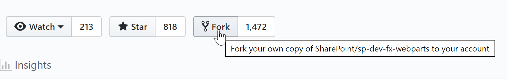
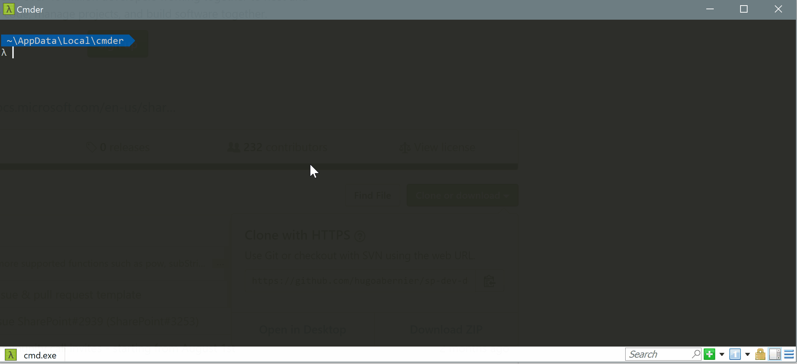
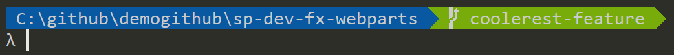

## Introduction

I have to admit, I _still_ consider myself a GitHub newbie.

Most of my clients use TFS or Azure DevOps and my previous experiences with GitHub were unpleasant.

But since I started contributing to the Office 365 Developer Community, I had no choice but to become familiar with GitHub.

The majority of the repositories under [https://github.com/PnP](https://github.com/PnP) have contribution guidelines, but they assume that you have a basic understanding of GitHub — or at least, a better understanding of GitHub than I had when I started contributing.

Because I still hesitate with GitHub commands once in a while, I use a cheat sheet when I start a new PnP contribution. I copy and paste the GitHub commands from the cheat sheet and substitute placeholders with the values I want. It is really an amalgamation of GitHub commands from the various contributing guideline documents I have found useful into (I hope) a coherent set of instructions. I try to use the GitHub browser interface wherever I can, and GitHub commands where it is easier.

I have written this post to answer all the questions I had when I started. It is really a note for myself, but I hope it can be useful for someone else who wants to get started. While this article is written specifically for PnP contributions, they also apply to most open source contributions on GitHub.

> I am **not** a GitHub expert. There may be better ways to do what is described in this post, but these are the instructions that have worked well for me in the past. If you have any suggestions on how to improve the instructions, please submit a comment below. I’ll even buy you a coffee when you’re in town!

This article focuses on the GitHub commands. If you need help with your first contribution, [David Warner II has kindly volunteered to help anyone with their first PnP contribution](/2019/08/15/take-your-first-step-and-contribute-to-office-dev-pnp/). He’s a true main on the topic.

## Note

I’m trying something new today: interactive, personalized instructions for **you**. Yes, you!

Instead of putting placeholders in the instructions (like **\[your\_repo\_name\]**) that you have to change as you follow the instructions, the placeholders are connected to a form at the top of each section.

When you change the values of the placeholders, the instructions in this post change automatically!

To get customized instructions, just replace the placeholder values with your own values.

Don’t worry, we don’t save any values you entered.

Let me know if you like this in the comments below. If you do, I may do more interactive posts in the future. It’s kinda fun!

## Overview

If you [know me](/2019/03/21/the-reason-i-consult-the-inner-voice-of-a-40-something-year-old-with-autism/), you know that I love processes.

The process consists of the following steps:

1. Fork repository
2. Clone repository
3. Create a branch
4. Contribute
5. Push changes
6. Submit pull request
7. Repeat (go back to _Create branch_)

## Step 1: Fork repository

Before you can contribute to a repository, you need to **Fork** it. Forking a repository creates a copy of it from the original owner’s account to your own.

Once you have created your own fork, you can freely change the code in your own copy of the repository without worrying about affecting the original repository, or **upstream repository**. However, GitHub _remembers_ what the upstream repository is, which will make it easy for you to submit your contributions when you’re done but also to synchronize changes that have been made to the upstream repository since you forked it.

Forking only happens within GitHub; it doesn’t affect the code on your machine (that is, until you _clone_ it, but that’ll happen later).

### How to fork a repository

1. In your browser go to [http://github.com](http://github.com/) and find the repository you want to contribute to. For example, the [sp-dev-fx-webparts](https://github.com/pnp/sp-dev-fx-webparts) is where you would submit SharePoint web part samples.
2. In the upper right corner, select the **Fork** button  
    
3. If you haven’t already logged in to GitHub, you’ll be prompted to do so. If you haven’t already created a GitHub account, you’ll be able to create one. If you have already logged in, it will automatically begin the forking process. You get a cute little animation showing that it is "copying" the repository, and you end up in your _own_ copy of the repository.  
    
4. You’ll know that you’re in a fork because the owner will have changed to you, and it should say "forked from …"  
    

The repository name should now be `[your_github_username]/[repo_name]`, for example, if you forked `pnp/sp-dev-fx-webparts` and your username is `hugoabernier`, your forked repository will be called `hugoabernier/sp-dev-fx-webparts`.

<div class="interactive">

## Customize this article

Take a second to enter the original repository URL and your GitHub username below, and the rest of this post will automatically change to match what you should see:

| Variable | Value |
| --- | --- |
| Original Repository (Upstream) |<input id="txtRepo" value="https://github.com/pnp/sp-dev-fx-webparts">  |
| Your GitHub username |<input id="txtOwner" value="[your_github_username]">  |
</div>

You have created your own fork! This is what is called an **origin** repository. I know, I know, the terms are confusing, but here is a table that may help break down the differences:

| Characteristics | Upstream | Origin |
| --- | --- | --- |
| **What is it** | The original repository | Your forked instance of a repository |
| **Where is it** | <span class="lnkUpstream"><a href="https://github.com/pnp/sp-dev-fx-webparts">https://github.com/pnp/sp-dev-fx-webparts</a></span> | <span class="lnkOrigin"><a href="https://github.com/[your_github_username]/sp-dev-fx-webparts">https://github.com/[your_github_username]/sp-dev-fx-webparts</a></span> |
| **Who owns it** | <span class="upstreamOwner">pnp</span> **(Not you!)** | <span class="originOwner">[your_github_username]</span> **(You)** |
| **What changes should you make** | Create issues, submit a pull request | Whatever you want |
| **What is the impact of your changes** | Affects the original repository | Affects only your fork |
| **Who can see your changes** | Everyone | Everyone who looks at your repository, unless you made it private |

Once you have forked a repository, clicking on **Fork** again will do nothing; It simply redirects you to your own fork.

## Step 2: Clone repository

Once you created your origin repository, it is time to **clone** it. **Cloning** a repository creates a copy of your fork to your local machine, so you can work on it.

The cloned repository, which will reside on your local hard-drive, will become your **local repository**; The repository that is on GitHub will be what’s called your **remote repository**.

You can make any changes to the local files on your hard-drive, it will only affect your local repository. It won’t affect your remote repository (until later, when we push the changes).

### To clone your repository

1. From your computer, launch whatever tool you like to run Git commands. Some people like **Git Bash**, but I prefer [**Cmder**](https://cmder.net/) or the **Node.js command prompt**.
2. Make sure that your command prompt is in the directory where you’ll want to create your local repositories. I like to use `c:\github`. You can do so by typing:

    ```cmd
    cd \github
    ```

    or, if using Git Bash:

    ```bash
    cd /c/github
    ```

3. The repository you will clone will be created a directory within your current directory. To clone the repository, just type `git clone` followed by the URL of the repository you forked in the previous section. Note that the URL should end with `.git`:

    <pre><code id="step1">git clone https://github.com/[your_github_username]/sp-dev-fx-webparts.git</code></pre>

    It should create a directory with the same name as your repo, then should download all the files locally to that directory. It doesn’t take very long, but it really depends on your internet connection. This is what it should look like:  
    

4. Once your local repo is created, change to the directory that was just created by typing `cd` followed by the repo name and `[Enter]`:

    <pre><code id="step2">cd sp-dev-fx-webparts</code></pre>

5. To link your local repo with the original upstream repo, you’ll type `git remote add upstream` followed by the original upstream repo URL, as follows:

    <pre><code id="step3">git remote add upstream https://github.com/pnp/sp-dev-fx-webparts.git</code></pre>

    Linking to the upstream repo will make your life easier later when you want to make more contributions.

6. Before you start making changes, you should make sure that you have the latest version from the original upstream repository. Of course, since you just forked the repo, you should already up to date, but if make more contributions later, you’ll want to make sure you’re always making your new contributions against the latest code. To do so, simply type the following:

    ```sh
    git fetch upstream
    ```

Now you’ll have a local repository with a remote that is connected to the upstream repo that we can create a branch from.

## Step 3: Create a branch

In GitHub, repositories usually have multiple branches. In GitHub, a **branch** is a way to keep track of change by grouping them into a feature set. The `main` branch is usually the default branch, where all approved code usually ends up. You normally shouldn’t make changes to the `main` branch directly, that’s what pull requests are for.

When you want to make changes in a repo, you should create your own branch to help keep track of the changes you’re making. For example, if you want to add a **new feature** to a repo, you would create a branch called `my-feature`. Meanwhile, someone else may create their own branch called `my-cooler-feature`, which may later become the basis for someone else’s `most-coolest-feature` branch.

Eventually, when those branches are submitted via a pull request (assuming they get approved), they’ll end up being merged back to the `main` branch.


Most PnP repositories usually have a `main` branch, which is meant to be your starting point for your changes.

Take a moment to look in your repo for any contribution guidelines to make make sure that the starting branch is the `main` branch.

To help you, [David Warner II](https://twitter.com/DavidWarnerII?s=17) and I have compiled a [list of popular PnP repositories](/2019/08/23/popular-pnp-repositories-and-how-to-get-started/) that will tell you which branch you should use.

Once you have confirmed what branch you should start from, you should create own branch from the starting branch, and give it a name that will describe what you’ll be doing in that branch. For example `my-feature`, or `hugo-patch-1`. Try to avoid spaces and funny characters.

#### Enter your own variables

Enter the name of the branch you want to create, and we’ll update the instructions for you:

| Variable | Value |
| --- | --- |
| Start branch name (default is `main`) | <input id="txtBaseBranch" value="main"> |
| Branch name | <input id="txtBranch" value="my-feature"> |

### To create your branch

To create your branch, follow these steps:

1. To create a branch, we’ll start by calling `git pull upstream`, which will update your local repository with the latest changes from the upstream repository. We’ll also specify which branch to start from, and what to call the new branch by typing the following:

    <pre><code id="step4">git pull upstream main:my-feature</code></pre>

2. Now we’ll let your forked origin repo know about the new branch you’ve created by typing `git push origin` followed by your new branch name, as follows:

    <pre><code id="step5">git push origin my-feature</code></pre>

3. Finally, we’ll switch to the new branch you’ve created by calling `git checkout`, followed by your new branch name. Type the following:

    <pre><code id="step6">git checkout my-feature</code></pre>

If you’re using Cmder, you should see that your prompt has changed to indicate that you’re now in your new branch:  


> Note: If you need instructions to configure Cmder to display your repo and branch, read [my earlier post](/2018/05/27/changing-your-command-prompt-to-display-node-module-and-git-information-like-the-sharepoint-conference-presenters/)

Now you’re reading to contribute!

## Step 4: Contribute

Now that you have your own branch, you can make the changes you need. Please make sure you follow the [Microsoft Open Source code of conduct](https://opensource.microsoft.com/codeofconduct/).

If you aren’t sure about the code of conduct, you can also check out the [Code of Conduct FAQ](https://opensource.microsoft.com/codeofconduct/faq/).

Once you’re done making your changes, you’ll want to push your contributions.

## Step 5: Push your changes

As you make changes to files in your local branch, your changes will be tracked locally. Changing the files in your local folder does not affect the local repository until you commit your changes.

Once you have committed your changes to the local repository, you can push your changes to your remote repository (the one on GitHub.com).

You can do so by following these steps:

1. From the local branch folder, type:

    ```sh
    git add .
    ```

2. Commit your changes by typing `git commit -v -a -m` followed by a comment indicating what your changes were. For example, if you wanted to say **"Initial commit"**, you would type the following:

    ```sh
    git commit -v -a -m "Initial commit"
    ```

Now your changes are committed with a comment. Time to submit a pull request!

## Step 6: Submit a pull request

In GitHub, a pull request is really simply a request for someone else to review the work that you’ve done and merge your changes in. When you create a pull request, you need to select two branches on GitHub, the branch that you’ve made your changes on, and the branch where you would want to merge your changes into.

To do so, follow these steps:

1. Push your changes to your origin repository (the forked repository you created), you’ll want to type `git push origin` followed by your branch name, as follows:

    <pre><code id="step7">git push origin my-feature</code></pre>

2. Once done, use your browser to your forked repository (<span class="lnkForked"><a href="https://github.com/%5Byour_github_username%5D/sp-dev-fx-webparts">https://github.com/[your_github_username]/sp-dev-fx-webparts</a></span>), you should see that your changes have already been reflected to GitHub.
3. From your forked repository, click on **Pull requests** in the navigation, then click on **New pull request**. Optionally, you can visit <span class="lnkPullRequest"><a href="https://github.com/hugoabernier/sp-dev-fx-webparts/pull/new/my-feature">https://github.com/hugoabernier/sp-dev-fx-webparts/pull/new/my-feature</a></span>.  
    
4. You’ll be prompted to confirm the branches you want to merge, with an arrow going from one branch tco another. Make sure that the arrow is pointing from your branch on your forked repo to the branch on the remote repo. If you follow all the steps above, you should also see **Able to merge**.  
    
5. Provide a descriptive title for your pull request. For example, **New coolest feature**
6. Most PnP repositories have a pull request template. Please be courteous and follow the instructions in the template. Follow the prompts and answer as much as possible. If there are sections that say `> _(DELETE THIS PARAGRAPH AFTER READING)_`, delete them.
7. When you have filled the template, click **Create pull request**.

After you’ve completed your pull request, you’ll see that its status is marked as **Open**


All you have to do now is to wait for your pull request to be merged with the `main` branch.

It can take a few days, sometimes weeks before your pull request is approved. Please be patient; Most reviewers are volunteers and have a day-to-day job.

While you’re waiting, you can start a new contribution!

## Step 7: Repeat

If you want to continue making contributions, you simply create a new branch from the original base branch. For example, if you were created the second update to your `my-feature`, you could call your next branch `my-new-feature`.

#### Enter your own variable

Enter the name of the next branch you want to create, and we’ll update the instructions for you:

| Variable | Value |
| --- | --- |
| Next branch name |  |

To create your next branch, follow these steps:

1. Calling `git pull upstream` with your next branch name by typing the following:

    <pre><code id="step8">git pull upstream main:my-new-feature</code></pre>

2. Push your new branch by typing `git push origin` followed by your next branch name, as follows:

    <pre><code id="step9">git push origin my-new-feature</code></pre>

3. Finally, switch to your new branch by calling `git checkout`, followed by your next branch name. Type the following:

    <pre><code id="step10">git checkout my-new-feature</code></pre>

Once your next branch is created, continue contributing as you did before (contribute, push your changes, submit a pull request).

## Deleting your branch

Once your pull request has been approved and merged to the `main`, you can delete your branch. **Do not** delete your branch before it has been approved — just in case you need to make a change to your pull request before it has been approved.

Trust me on this one.

## Conclusion

I know, this was a long post. However, I hope that it will be useful for someone who wants to get started with making contributions to the PnP community.

## For more information

There are many other resources available out there. Here are some that you should _definitely_ check out:

- **[No code contributions](http://warner.digital/no-code-pnp-contributions/):** See how you can provide “No Code” contributions to the Microsoft 365 PnP (Patterns and Practices) Community using just your browser — with video!.
- **[Community Demo – Getting started on using GitHub to contribute to SharePoint dev community](https://www.youtube.com/watch?v=YYBiTj9UWXY)**: [Andrew Connell](https://twitter.com/andrewconnell?s=17) walks you through how to get started. Maybe you didn’t need to read this entire post after all?
- **[Keep Your Forked Git Repo Updated with Changes from The Original Upstream Repo](http://www.andrewconnell.com/blog/keep-your-forked-git-repo-updated-with-changes-from-the-original-upstream-repo):** [Andrew Connell](https://twitter.com/andrewconnell?s=17) explains what happens when the upstream repo has changes that occur between the time when you first forked it and when you submitted the pull request, and how to avoid such issues.

## Updates

- **April 26, 2021:** Updated information to use PnP instead of SharePoint GitHub organization
- **August 23, 2019:** Added **For more information** section, because there are many great references out there that people should know about. Also, added link to the latest [list of popular PnP repositories](/2019/08/23/popular-pnp-repositories-and-how-to-get-started/)

## Photo credits

Branch image by [GitHub](https://github.com/).  
Note image by [Pexels](https://pixabay.com/users/Pexels-2286921/?utm_source=link-attribution&utm_medium=referral&utm_campaign=image&utm_content=1840276) from [Pixabay](https://pixabay.com/?utm_source=link-attribution&utm_medium=referral&utm_campaign=image&utm_content=1840276)
