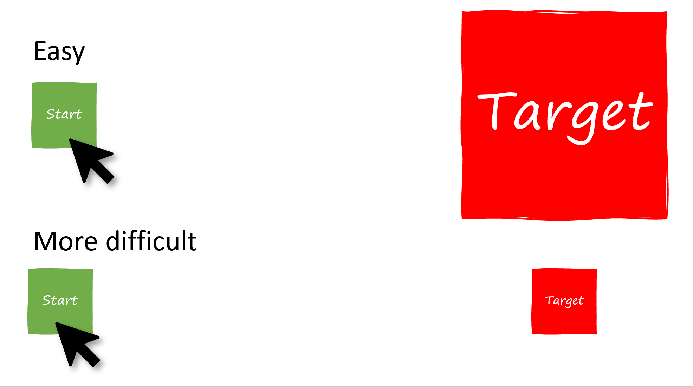

## Introduction

The [SharePoint Design](https://spdesign.azurewebsites.net/) is a beautiful web site that provides design guidance on beautiful and fast sites, pages, and web parts with SharePoint in Office 365.

Unfortunately, the SharePoint Design site does not tell you _how_ to create the beautiful web parts they show you.

[This series](/2019/07/08/introducing-the-sharepoint-framework-design-series/) is intended as a companion to the SharePoint Design site, providing you with code samples and detailed _how-to_ information for every design topic. It should help you create web parts that look exactly like the ones on the SharePoint Design site.

In our [last post](/2019/07/28/sharepoint-framework-design-series-layout-patterns-ii/) we discussed the **filmstrip layout**.

In today’s post, we’ll continue our discussion about the [web part layout patterns](https://docs.microsoft.com/sharepoint/dev/design/layout-patterns) and discuss the **carousel layout**.

## What is the carousel

The [carousel](https://docs.microsoft.com/sharepoint/dev/design/layout-patterns#carousel) is a standard web part layout that presents your web part content, showing items one at a time.


The carousel is best suited when you want to showcase _the content_ instead of the metadata about the content. For example, if you want to show a large preview of your documents or a large picture.

By default, the carousel will expand your images to fit the whole width of your web part and maintain the aspect ratio of your images, with a minimal amount of metadata below the image (for example, the file name and location). It also shows how many items there are in the carousel and which "slide" you’re currently viewing.

As your cursor approaches the carousel, two buttons appear, providing the users with the options to go to the next and/or the previous slide. The buttons are positioned halfway down the carousel, one button on each side of the image.

On touch-enabled devices, such as phones and tablets, users can also swipe left of right ~to indicate whether they like the image~ to move to the next/previous slide.

After the user has viewed all images, the carousel restarts with the first images, potentially keeping your users entertained for hours and hours.

## The problem with carousels

If you mention carousels to most designers, they’ll often groan and sigh heavily. That’s because the carousel quickly became a trend that everybody wanted on their web sites without really understanding the impact on their users.

If you ask me, there were worse trends out there (like when suddenly _everyone_ decided that you needed to enter your email address and then _confirm your email_, presumably to fool someone who was trying to enter a fake email address to give your the _right_ email address the second time…? )

I already discussed [the issues with carousels](/2019/07/28/sharepoint-framework-design-series-layout-patterns-ii/) when I covered the filmstrip, but here is a brief summary:

- Their design and frequent movement make people think that they are an ad, causing _banner blindness_.
- Moving elements can hurt accessibility, especially for users with motor skill issues
- People with cognitive difficulties can have difficulty reading all the text before the carousel moves to the next slide
- Because they see only one slide at a time, users often miss content

## The SharePoint carousel: the kinder, gentler carousel

Fortunately, the SharePoint carousel is better designed and less _evil_.

For one, it does not automatically scroll. It puts users in control of the navigation.

It also supports keyboard navigation and gestures, making it slightly easier for those with accessibility requirements to use the carousel.

It is designed to keep the amount of information on each slide simple (instead of overloading users with too much information)

## How to use a carousel properly

Here are some tips for a better carousel design (backed by [_science!!!!_](https://www.nngroup.com/articles/designing-effective-carousels/)):

- **Keep your slides to fewer than 5:** It can be frustrating to swipe through too many items in a carousel. Also your [users may not be able to keep a mental list of more than 5 items](https://en.wikipedia.org/wiki/The_Magical_Number_Seven,_Plus_or_Minus_Two) and may not recognize when they’re seeing the same items over and over again. Keeping your items to fewer than 5 the number helps users discovering content, and makes it easy for them to find content again later.
- **Show how many items there are and which slide is currently displayed:** It helps users understand that there are more items and helps them feel "in control".
- **Try to show items that are related:** Because users only get to see one item at a time, stick to items that are related so that users can easily predict what the other items (the ones they can’t see) are.

And probably the most important: make each slide a giant button. It’s **Fitts’s law**!

## Fitts’s law

In 1954 — long before there were carousels and web sites — [Paul Morris Fitts](https://en.wikipedia.org/wiki/Fitts%27s_law) was researching the human motor system. I’ll spare you the boring math, but what he found is this:

- The greater the distance between your starting point and your target, the harder it is to hit a target
- The smaller the target is, the harder it is to hit
- The faster you move from your starting point to your target, the harder it is to hit.

Nowadays, Fitts’s law is used in user experience and user interface design. It is the reason why the menu on your Mac computer is located at the top of the screen without a top border (essentially making the menu a button of infinite size), and why Windows 8 tried to use the edges of your screen for the start menu, the share menu, and the context menus.

For example, here is how the distance between two buttons affect how easy it is to hit the target:  


And here is how size affects how easy it is to hit a target:  


The reason why the SharePoint Framework web part layouts (the grid, the filmstrip, the carousel and the compact layout) mostly use large rectangular targets is not just because it _looks cool_, it is also because it makes it easier for users to hit the targets, regardless of where they started from on the page.

That’s why you need to make sure that your _entire_ carousel slide is a giant button that will lead to whatever item you’re currently displaying.

Unfortunately, I still think that the next and previous buttons (and the little dots on the filmstrip layout) are a little too small, but since the layout controls support keyboard, and touch gestures, I’ll stop complaining now.

> For more information about Fitts’s law, [check out this cool interactive visualization](http://simonwallner.at/ext/fitts/)

## How carousel control is implemented

As is the case with the filmstrip control, the out-of-the-box carousel layout uses [Ken Wheeler’s Slick slider](https://kenwheeler.github.io/slick/) — not just to provide the previous/next functionality, but to control how each slide is resized to fit within the viewable area.

The control I created for this sample aims to mimic the _exact_ functionality of the out-of-the-box SharePoint carousel layout. It also uses the Slick slider. (Hey, if it’s good enough for the SharePoint team, it’s good enough for me). It the one I wrote for the [React Calendar Feed sample](https://github.com/SharePoint/sp-dev-fx-webparts/tree/master/samples/react-calendar-feed) in June 2018.

However, it is worth noting that [Piotr Siatka](https://twitter.com/@PiotrSiatka) recently submitted a [carousel control](https://github.com/pnp/sp-dev-fx-controls-react/pull/334) to the [Reusable React controls for SharePoint Framework solutions](https://sharepoint.github.io/sp-dev-fx-controls-react/) and I can’t wait for it to become available in an upcoming version of the PnP controls. He actually built it _without_ any third-party libraries and it looks really cool. I encourage you to check out his awesome work.


Piotr’s carousel control, coming soon to a PnP library near you

When it will become available, Piotr’s control will give you the ability to control most aspects of carousel appearance and behavior.

My carousel layout control is designed to make it easy to create a web part with that mimics the carousel layout. It doesn’t give you control over how the arrows look, where they are located, or anything else that deviates from the carousel layout standard.

Feel free to use whichever control is most suitable for you.

## To create a carousel layout web part

To create your own web part using the carousel layout, follow these steps:

1. Copy the folder `src/components/carouselLayout` from my [sample code](https://github.com/hugoabernier/WebPartDesignSeries/tree/master/WebPartLayouts) to your own web part project.
2. In your `src\webparts\[YourWebPartName]\components\[YourWebPartName].tsx`, add an import for the `CarouselLayout` and the `CarouselSlide` controls.

    ```typescript
    import { CarouselLayout, ICarouselItem } from '../../../components/carouselLayout';
    ```

3. In your web part’s component, retrieve the items you wish to display and store them where you can retrieve them later. For example, it your web part’s state. For this example, I’ll store sample items in the constructor:

    ```typescript
    constructor(props: ICarouselProps) {
    super(props);
    
    this.state = {
      items: [{
        imageSrc: "https://lorempixel.com/744/418/technics/1/",
        title: "Adventures in SPFx",
        location: "SharePoint",
      }, {
        imageSrc: "https://lorempixel.com/744/418/technics/2",
        title: "The Wild, Untold Story of SharePoint!",
        location: "SharePoint",
      }, {
        imageSrc: "https://lorempixel.com/744/418/technics/4",
        title: "Not Your Grandpa's SharePoint",
        location: "SharePoint",
      }, {
        thumbnail: "https://lorempixel.com/744/418/technics/5/",
        title: "Get with the Flow",
        location: "Flow",
      }]
    };
    }
    ```

    This is pretty much the same thing we’ve done in all web part layouts samples so far, except that this time the items we pass must follow the `ISlideItem` interface and provide a `title`, a `imageSrc`, and a `location` (that’s all the carousel has room to display).

4. In the `onRender` method, add a `CarouselLayout` object and pass it the items you wish to display. You’ll also need to provide a `pagingTemplate` string, which is template to control how you want to render the "1 of 5" items label. In your `pagingTemplate`, use a `0` for the current item placeholder, and `1` for the number of items placeholder.

    ```typescript
    public render(): React.ReactElement<ICarouselProps> {
    
    return (
      <div className={styles.carousel}
    
      >
        <CarouselLayout
          pagingTemplate={'{0} of {1}'}
          ariaLabel={'Use right and left arrow keys to navigate between images in the carousel. Use up and down arrow keys to access the edit and remove buttons for any image.'}
          items={this.state.items}
          onSlideClick={(currentSlide) => { alert(`You clicked on slide ${currentSlide+1}`); }}
        >
        </CarouselLayout>
      </div>
    );
    }
    ```

    You should also provide an `ariaLabel` for accessibility’s sake, and you must pass an event handler to handle when a user clicks on a slide.

If all goes well, you’ll render the following carousel:


## Conclusion

I’m not crazy about the fact that the carousel layout control I used in this sample isn’t as flexible as the previous controls, but that’s because all we can display is an image, a title and a location.

On the other hand, it makes it pretty easy to implement your own carousel layout web part.

The code for this sample can be found in my WebPartLayouts solution on my [repo](https://github.com/hugoabernier/WebPartDesignSeries).

We’re almost done with the layouts! Next stop: the compact layout.

Until then, let me know if you have any questions, comments, or concerns!
