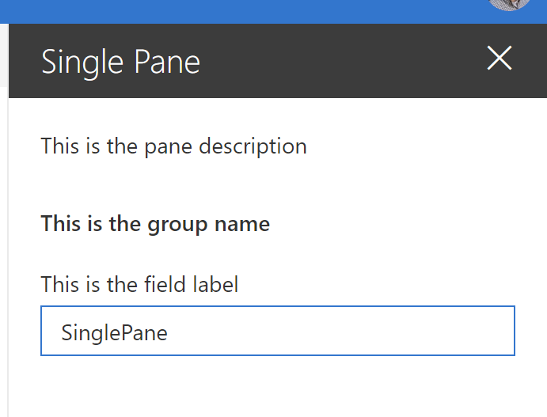
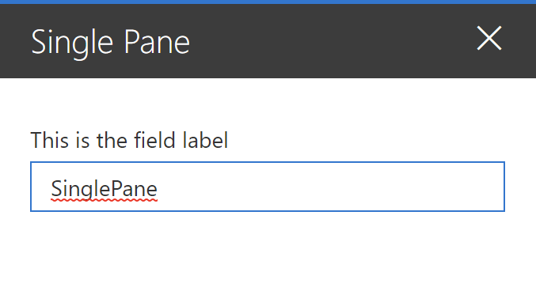
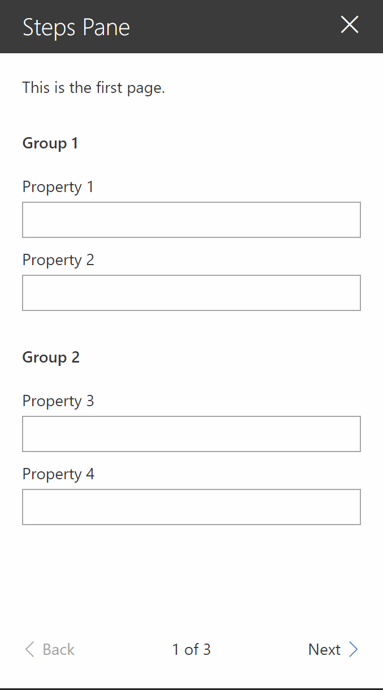

## Introduction

The [SharePoint Design](https://spdesign.azurewebsites.net/) is a beautiful web site that provides design guidance on beautiful and fast sites, pages, and web parts with SharePoint in Office 365.

Unfortunately, the SharePoint Design site does not tell you _how_ to create the beautiful web parts they show you.

[This series](/2019/07/08/introducing-the-sharepoint-framework-design-series/) is intended as a companion to the SharePoint Design site, providing you with code samples and detailed _how-to_ information for every design topic. It should help you create web parts that look exactly like the ones on the SharePoint Design site.

Today’s post is a companion to the [**Designing SharePoint web part**](https://docs.microsoft.com/sharepoint/dev/design/design-a-web-part#property-pane-types) page.

## What is a property pane?

The property pane is a panel that appears when users select **Edit** on a web part. It allows users to enable and disable features, select a layout, connect to another web part, or set other options.


The property pane

When visible, the property pane is **320 pixels**, which makes it the perfect size to appear full-screen on a mobile device. On a tablet or desktop device, the page content area shrinks by 320 pixels and the content re-flows responsively to make room for the property pane.


The property pane in action

## When to use a property pane

You **should** use a property pane when you need to offer options to your users to configure the web part.

You **should not** use a property pane to edit the web part’s content.

**Directness** is a user interface design principle which says that your **users should be able to achieve their goals through a minimal set of actions**. It also says that **users should be able to manipulate the objects they’re working on in the most direct manner**.

In other words, **directness** says that, whenever possible, you should allow users to edit the content of a web part where the content actually resides — in the web part’s content area.

That’s why the out-of-the-box **Text** and **Hyperlink** web parts make you edit content directly within the web part.


Text web part in action


Hyperlink web part in action

In contrast, the **Image** web part opens a pane to insert and edit an image, because there isn’t a natural way to create an image directly from the web part’s content area.


Image web part’s use of the property pane

In some cases, you may wish to use the property pane to provide additional options for the selected content of the web part. For example, the **Text** web part uses the property pane to provide users with additional formatting options that would otherwise clutter the text editing toolbar. Users edit the content directly within the web part, but can also use additional formatting options in the property pane.


The text web part uses the property pane to provide additional formatting options

The best way to leverage property panes it to use it to provide options to your page authors that you don’t want other users (i.e.: readers) to see. Because SharePoint automatically hides or shows the **Edit** depending on the user’s permissions, you don’t have to build your own sophisticated security logic to hide or show options within your web part.

If in doubt about whether you should show an option within the web part body or within the property pane, ask yourself whether you want _all users_ to be able to control that option. For example, if you want to allow all users to refresh a feed via a **Refresh** button, or if you want users to control whether they want their personal feed to be sorted in ascending or descending order, give the users the option to do that within the web part’s body.

On the other hand, if you only want page authors to control options that will affect all users, you should probably place that option within the property pane.

Take a look at the various out-of-the-box web parts to see how they present their various options for inspiration.

## Types of property panes

When designing a property pane, you can use one of three property pane types:

### Single pane

Used for simple web parts with a few properties to configure. As the name implies, there is only one single pane without any grouping.


### Accordion pane

Contains a group or groups of properties with many options, and where the groups result in a long scrolling list of options.

For example, you might have three groups named Properties, Appearance, and Layout, each with many options.


### Steps pane

Group properties in multiple steps or pages. Used when web configuration needs to follow a precise order of steps, or when choices in the first step affect the options that display in next steps.

The property pane will display a **Back** and **Next** buttons at the bottom of the pane, along with an indication of how many steps there are, and which step is currently displayed.


For more information on each property pane type refer to the [SharePoint Design site](https://docs.microsoft.com/sharepoint/dev/design/design-a-web-part#property-pane-types).

## Create a single pane property pane

To create a single pane property pane, follow these steps:

- Do nothing

That’s because it is what the SPFx Yeoman generator automatically produces for you when you create a web part.

Let’s take a second to explore the default code to understand it better.

When you create a web part using the Yeoman generator, this is the standard `getPropertyPaneConfiguration` method that you get in your `[YourWebPartName]WebPart` class:

```typescript
 protected getPropertyPaneConfiguration(): IPropertyPaneConfiguration {
    return {
      pages: [
        {
          header: {
            description: strings.PropertyPaneDescription
          },
          groups: [
            {
              groupName: strings.BasicGroupName,
              groupFields: [
                PropertyPaneTextField('description', {
                  label: strings.DescriptionFieldLabel
                })
              ]
            }
          ]
        }
      ]
    };
  }
```

If you aren’t familiar with SPFx, Typescript, or React, it may not be obvious what each part of the code does. The biggest reason is that the SharePoint team is being really nice to us and provides us with a template that encourages you to localize all your web part resources (i.e.: the text in your web parts). That’s why you see `strings.PropertyPaneDescription` as the `description` for the property pane. It is a great habit to follow, and I encourage you to keep localizing all your resources — even if your web part is only ever going to be in one language. It makes it easier to change the text (like when fixing spelling mistakes) without having to touch the code.

To make things easier, let’s replace the code and see what happens. Replace your existing `getPropertyPaneConfiguration` code with the following code:

```typescript
protected getPropertyPaneConfiguration(): IPropertyPaneConfiguration {
    return {
      pages: [
        {
          header: {
            description: "This is the pane description"
          },
          groups: [
            {
              groupName: "This is the group name",
              groupFields: [
                PropertyPaneTextField('description', {
                  label: "This is the field label"
                })
              ]
            }
          ]
        }
      ]
    };
  }
```

When test your web part (using `gulp serve`), your property pane will look like this:



If we use our browser’s developer toolbar to explore the various elements, we can see the individual components:


You may have noticed that the property pane’s title isn’t configured anywhere. That’s because it uses the web part’s title, which is configured in the `[YourWebPartName].manifest.json` under `preconfiguredEntries` > `title` > `default`. If you change the title, remember that the settings won’t take effect until you re-bundle the web part (by running `gulp serve` again, or `gulp build`) and re-add the web part to your page.

### Property pane page description

I encourage you to use the page **description** to provide your users with instructions on what you expect them to do. For example, this is what the out-of-the-box **Image** property pane page description looks like:

> Change your image and image options. Turn on or off the display of text over your image, add a link, and add or modify alternative text.

The **File viewer** web part gives you different directions based on what type of file you select. This is what it says if you select a PowerPoint presentation:

> Select the slide you want people to see first.

And this is what you get if you selected a Word document:

> Select the page you want people to see first.

If you didn’t select a file, however, this is what you’ll see:

> Add a file to view on your page. You can select from a variety of file types including Excel, Word, PowerPoint, Visio, PDFs, 3D models, and more. You can also connect to a source to dynamically view files by selecting the ellipses (…) and Connect to source.

Last example: this is what the **Highlighted content** web part page description says:

> Select the content you want to highlight, and choose layout options.

Use your property pane page description to provide users with useful guidance. If you don’t have anything useful to say, you can simply omit the page description by removing the line in your code:

```typescript
 protected getPropertyPaneConfiguration(): IPropertyPaneConfiguration {
    return {
      pages: [
        {
          // REMOVED: to remove the description
          // header: {
          //   description: "This is the pane description" //strings.PropertyPaneDescription
          // },
          groups: [
            {
              groupName: "This is the group name", //strings.BasicGroupName,
              groupFields: [
                PropertyPaneTextField('description', {
                  label: "This is the field label" //strings.DescriptionFieldLabel
                })
              ]
            }
          ]
        }
      ]
    };
  }
```

Which gets you this:


Property pane without a description

For the record, though, I encourage you to provide some helpful text instead of removing the description.

### Property pane group

Your property pane can have more that one **group**. However, when you use the single pane property pane when you have few options to present, otherwise you should use the accordion or steps property pane.

You may have noticed that some of the out-of-the-box web parts have no property pane groups. Or, rather, they have a single property pane group with no group header.


The image web part property pane has no group header


The text web part property pane has no group header either

To reproduce the same look, all you need to do is omit a group header in your code:

```typescript
 protected getPropertyPaneConfiguration(): IPropertyPaneConfiguration {
    return {
      pages: [
        {
          // REMOVED: To hide the property pane page description
          // header: {
          //   description: "This is the pane description"
          // },
          groups: [
            {
              //REMOVED: For single pane property pane
              //groupName: "This is the group name",
              groupFields: [
                PropertyPaneTextField('description', {
                  label: "This is the field label"
                })
              ]
            }
          ]
        }
      ]
    };
  }
```

Which produces the following web part property pane:



## Create an accordion pane property pane

Sometimes you have too many options to present to your users at one time.

Take the out-of-the-box **Highlighted content** web part, for example. Imagine if showed all available options without any grouping. It would look like this:


Too many options at once!

Now take the same web part, but group the options logically. You get something like this:


Ah! Much easier to understand!

It makes sense to group your choices into smaller, collapsible sections known as **accordion panes**.

Why should you do this? It’s the **law**!

[**Hick’s Law**](https://en.wikipedia.org/wiki/Hick%27s_law), to be precise. Also known as **the Hick-Hyman Law**, it is named after a British and an American psychologist team of William Edmund Hick and Ray Hyman. In 1952, they found a relationship between the number of stimuli present and an individual’s reaction time to any given stimulus.

Specifically, they found that **the more stimuli to choose from, the longer it takes** the user to make a decision.

(That’s what I like to call the **Cheesecake Factory Law**, because of how long it takes to decide what to eat when at the Cheesecake Factory. Have you seen how long [their menu](https://www.thecheesecakefactory.com/menu/) is?!)

When you bombard your users with too many choices at once, they have to take time to interpret and decide, giving them work they don’t want.

If you have a lot of choices to offer your users, consider grouping them into smaller choices. For example, instead of giving you 7 configuration choices to pick from, the **Highlighted content** web part gives you three simple choices:

- Content
- Filter and sort
- Layout

Within each of those three, you have two or three smaller choices to make. Making it easier for users to make sense of the choices that are available to them.

> Note that the rule only applies to choices that the user is unfamiliar with. For example, if you want to list the months of the year, don’t group them into smaller choices. Otherwise, you’ll actually increase the time it takes for a user to find the item they want.

For this sample, we have created 6 properties (`demoProperty1` through `demoProperty6`) which we’ll group into three categories (**Group 1**, **Group 2** and **Group 3**). Feel free to use your own categories and properties.

If you want to create an accordion pane property pane, follow these steps:

1. In your `[YourWebPartName]WebPart.ts` file, find the `getPropertyPaneConfiguration` function and create as many groups as you need, with fields within those groups.

    ```typescript
    protected getPropertyPaneConfiguration(): IPropertyPaneConfiguration {
    return {
      pages: [
        {
          header: {
            description: "This web part demonstrates how to use an accordion property pane"
          },
          groups: [
            {
              groupName: "Group 1",
              groupFields: [
                PropertyPaneTextField('demoProperty1', {
                  label: "Property 1"
                }),
                PropertyPaneTextField('demoProperty2', {
                  label: "Property 2"
                })
              ]
            },
            // ADDED: Group 2 and 3 for accordion support
            {
              groupName: "Group 2",
              groupFields: [
                PropertyPaneTextField('demoProperty3', {
                  label: "Property 3"
                }),
                PropertyPaneTextField('demoProperty4', {
                  label: "Property 4"
                })
              ]
            },
            {
              groupName: "Group 3",
              groupFields: [
                PropertyPaneTextField('demoProperty5', {
                  label: "Property 5"
                }),
                PropertyPaneTextField('demoProperty6', {
                  label: "Property 6"
                })
              ]
            }
            // END added
          ]
        }
      ]
    };
    }
    ```

    The `groups` and `groupFields` nodes expect arrays of items, which means that we can have many groups and many fields within the groups.

2. To make the groups appear as accordions, add a `displayGroupsAsAccordion` property and set it to `true`, as follows (see line 9):

    ```typescript
    protected getPropertyPaneConfiguration(): IPropertyPaneConfiguration {
    return {
      pages: [
        {
          header: {
            description: "This web part demonstrates how to use an accordion property pane"
          },
          // ADDED: to turn groups into accordions
          displayGroupsAsAccordion: true,
          // END added
          groups: [
            {
              groupName: "Group 1",
              groupFields: [
                PropertyPaneTextField('demoProperty1', {
                  label: "Property 1"
                }),
                PropertyPaneTextField('demoProperty2', {
                  label: "Property 2"
                })
              ]
            },
            {
              groupName: "Group 2",
              groupFields: [
                PropertyPaneTextField('demoProperty3', {
                  label: "Property 3"
                }),
                PropertyPaneTextField('demoProperty4', {
                  label: "Property 4"
                })
              ]
            },
            {
              groupName: "Group 3",
              groupFields: [
                PropertyPaneTextField('demoProperty5', {
                  label: "Property 5"
                }),
                PropertyPaneTextField('demoProperty6', {
                  label: "Property 6"
                })
              ]
            }
          ]
        }
      ]
    };
    }
    ```

3. If you wish to make the groups initially appear as expanded or collapsed, you can specify the `isCollapsed` property at the group level and set it to `true` or `false`, as desired:

    ```typescript
    protected getPropertyPaneConfiguration(): IPropertyPaneConfiguration {
    return {
      pages: [
        {
          header: {
            description: "This web part demonstrates how to use an accordion property pane"
          },
          displayGroupsAsAccordion: true,
          groups: [
            {
              groupName: "Group 1",
              // ADDED: to collapse group initially
              isCollapsed: true,
              // END added
              groupFields: [
                PropertyPaneTextField('demoProperty1', {
                  label: "Property 1"
                }),
                PropertyPaneTextField('demoProperty2', {
                  label: "Property 2"
                })
              ]
            },
            {
              groupName: "Group 2",
              // ADDED: to collapse group initially
              isCollapsed: true,
              // END added
              groupFields: [
                PropertyPaneTextField('demoProperty3', {
                  label: "Property 3"
                }),
                PropertyPaneTextField('demoProperty4', {
                  label: "Property 4"
                })
              ]
            },
            {
              groupName: "Group 3",
              // ADDED: to collapse group initially
              isCollapsed: true,
              // END added
              groupFields: [
                PropertyPaneTextField('demoProperty5', {
                  label: "Property 5"
                }),
                PropertyPaneTextField('demoProperty6', {
                  label: "Property 6"
                })
              ]
            }
          ]
        }
      ]
    };
    }
    ```

4. If you run `gulp serve`, you should get an accordion pane property pane:  
    

> Note: To keep the code easier to read, we did not localize our text resources. Please don’t do this at home.

## Create a steps pane property pane

As we previously discussed, if you have a lot of configuration options in your web part, you should use an accordion pane and group your configuration options to make it easier for your users. Accordion panes work well when you want to allow your users to configure your web part in no particular order.

Sometimes, you need your users to configure your web part by following a specific sequence.

That’s when you should use **steps pane** property panes.

To prepare this sample, we created `demoProperty1` through `demoProperty10`. We’ll show these options across 3 pages, divided into 5 groups. Feel free to use your own properties.

Just like the `groups` and `groupField` property, the `pages` property expects an array. You can define more than one page and they will be displayed in the same order that you defined them in the code.

To create our sample steps pane property pane, follow these steps:

1. In your `[YourWebPartName]WebPart.ts` file, find the `getPropertyPaneConfiguration` function and create as many pages as you need, with groups and group fields within those pages:

    ```typescript
    protected getPropertyPaneConfiguration(): IPropertyPaneConfiguration {
    return {
      pages: [
        {
          header: {
            description: "This is the first page."
          },
          displayGroupsAsAccordion: false,
          groups: [
            {
              groupName: "Group 1",
              groupFields: [
                PropertyPaneTextField('demoProperty1', {
                  label: "Property 1"
                }),
                PropertyPaneTextField('demoProperty2', {
                  label: "Property 2"
                })
              ]
            },
            {
              groupName: "Group 2",
              groupFields: [
                PropertyPaneTextField('demoProperty3', {
                  label: "Property 3"
                }),
                PropertyPaneTextField('demoProperty4', {
                  label: "Property 4"
                })
              ]
            }
          ]
        },
        // ADDED: To add steps
        {
          header: {
            description: "This is the second page."
          },
          displayGroupsAsAccordion: false,
          groups: [
            {
              groupName: "Group 3",
              groupFields: [
                PropertyPaneTextField('demoProperty5', {
                  label: "Property 5"
                }),
                PropertyPaneTextField('demoProperty6', {
                  label: "Property 6"
                })
              ]
            },
            {
              groupName: "Group 4",
              groupFields: [
                PropertyPaneTextField('demoProperty7', {
                  label: "Property 7"
                }),
                PropertyPaneTextField('demoProperty8', {
                  label: "Property 8"
                })
              ]
            }
          ]
        },
        {
          header: {
            description: "This is the third and final page."
          },
          displayGroupsAsAccordion: false,
          groups: [
            {
              groupName: "Group 5",
              groupFields: [
                PropertyPaneTextField('demoProperty9', {
                  label: "Property 9"
                }),
                PropertyPaneTextField('demoProperty10', {
                  label: "Property 10"
                })
              ]
            }
          ]
        }
        //END added
      ]
    };
    }
    ```

2. By default, the web part will start the property pane on the first page. If you’d like to override this (for example, if you want to bring attention to a specific page to encourage a user to solve an issue), specify the `currentPage` property as follows (see **line 4**):

    ```typescript
    protected getPropertyPaneConfiguration(): IPropertyPaneConfiguration {
    return {
      // ADDED: To change the default current page
      currentPage: 3,
      // END added
      pages: [
        {
          header: {
            description: "This is the first page."
          },
          displayGroupsAsAccordion: false,
          groups: [
            {
              groupName: "Group 1",
              groupFields: [
                PropertyPaneTextField('demoProperty1', {
                  label: "Property 1"
                }),
                PropertyPaneTextField('demoProperty2', {
                  label: "Property 2"
                })
              ]
            },
            {
              groupName: "Group 2",
              groupFields: [
                PropertyPaneTextField('demoProperty3', {
                  label: "Property 3"
                }),
                PropertyPaneTextField('demoProperty4', {
                  label: "Property 4"
                })
              ]
            }
          ]
        },
        // ADDED: To add steps
        {
          header: {
            description: "This is the second page."
          },
          displayGroupsAsAccordion: false,
          groups: [
            {
              groupName: "Group 3",
              groupFields: [
                PropertyPaneTextField('demoProperty5', {
                  label: "Property 5"
                }),
                PropertyPaneTextField('demoProperty6', {
                  label: "Property 6"
                })
              ]
            },
            {
              groupName: "Group 4",
              groupFields: [
                PropertyPaneTextField('demoProperty7', {
                  label: "Property 7"
                }),
                PropertyPaneTextField('demoProperty8', {
                  label: "Property 8"
                })
              ]
            }
          ]
        },
        {
          header: {
            description: "This is the third and final page."
          },
          displayGroupsAsAccordion: false,
          groups: [
            {
              groupName: "Group 5",
              groupFields: [
                PropertyPaneTextField('demoProperty9', {
                  label: "Property 9"
                }),
                PropertyPaneTextField('demoProperty10', {
                  label: "Property 10"
                })
              ]
            }
          ]
        }
        //END added
      ]
    };
    }
    ```

Try to avoid skipping directly to another page without a valid reason, otherwise, your users may be a bit confused. If you choose to skip to a page other than page 1, help the users understand why you did it — perhaps with a little message at the top of the page.

Once completed, you should get a property pane with three pages (I kept the default page to page 1, in case you’re wondering:  


## Conclusion

That’s probably enough for one day.

As you hopefully noticed, creating property panes isn’t very difficult. Most of the work is already done for you.

The code for this post is available on the [SharePoint Framework Web Part Design Series repo](https://github.com/hugoabernier/WebPartDesignSeries/tree/master/PropertyPanes).

In our [next post](/2019/07/15/sharepoint-framework-design-series-property-panes-part-ii/), we’ll continue discussing property panes with some advanced options, such as adding images to property pane headers, showing loading indicators, and making responsive/non-responsive property pane web parts. We’ll also discuss what the text within these property panes should look like.

Then we’ll discuss more exciting stuff, like creating conditional property pane groups and fancy property pane fields.

I hope this helps?
