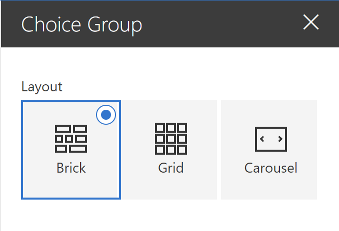
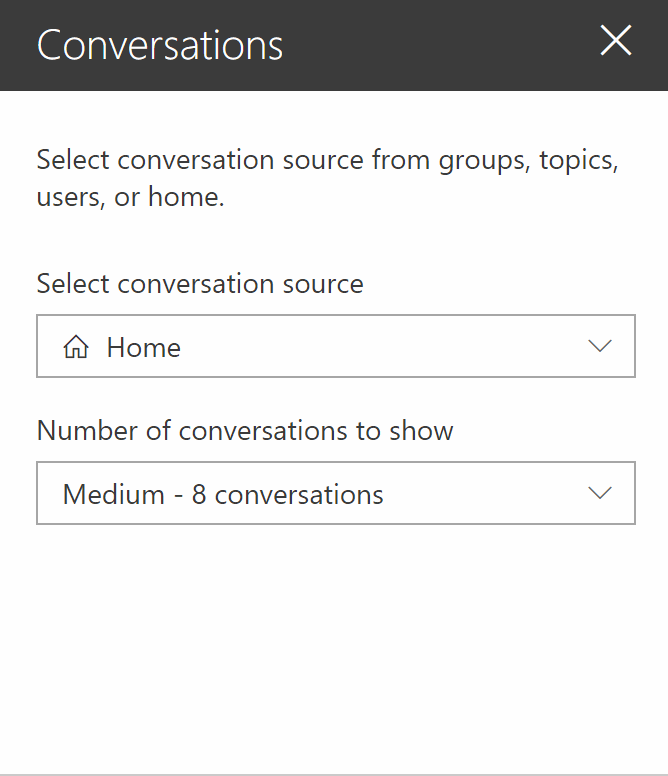
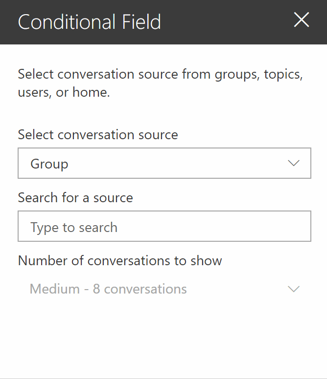
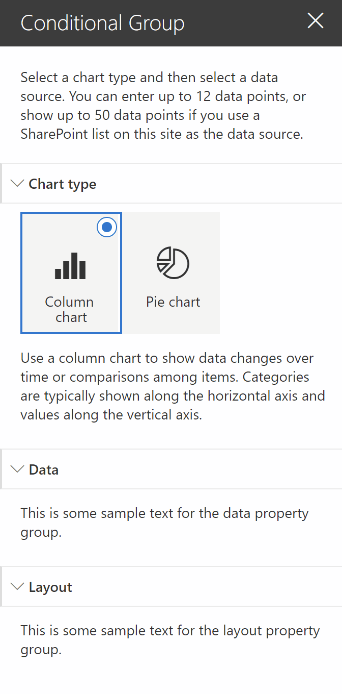

## Introduction

I love the [SharePoint Design](https://spdesign.azurewebsites.net/) web site. It is a beautiful web site that provides design guidance on how to create beautiful and fast sites, pages, and web parts with SharePoint in Office 365.

However, the site does not provide you with enough code samples to tell you _how_ to create the beautiful web parts they show you.

[This series](/2019/07/08/introducing-the-sharepoint-framework-design-series/) is intended as a companion to the SharePoint Design site. It provides you with code samples and detailed _how-to_ information for every design topic.

It should help you create web parts that look exactly like the ones on the SharePoint Design site.

Today’s post is the third on **property panes**. In [part I](/2019/07/12/sharepoint-framework-design-series-property-panes-part-1/), we covered the various types of property panes. In [part II](http://bit.ly/32uOX7E) we showed how to create non-reactive web parts and how to add a loading indicator.

Today, we’ll look at out-of-the-box web parts and we’ll discuss how to replicate some of their property panes in your own web parts.

If you want to download the code samples used in this article, download [the solution](https://github.com/hugoabernier/WebPartDesignSeries/tree/master/PropertyPanes) from the [GitHub repo](https://github.com/hugoabernier/WebPartDesignSeries).

## Create a choice group with images

One of the most frequently asked questions I see with property panes is about the property pane choice groups with images.

The out-of-the-box **Highlighted content**, **Hero**, **Image gallery** are examples of how the choice group property field is used.


Highlighted content web part with a choice group


Hero web part choice group

You should use the property pane choice group when you have a small number of choices — I recommend less than 7, no more than 9 choices — where the user may not be immediately able to understand the differences between the choices.

For example, the difference between the **Brick**, **Grid** and **Carousel** layout in the **Image gallery** web part may not be immediately obvious to everyone. Adding images to represent each choice makes it easier to understand:


Image gallery web part choice group

As it turns out, it’s not very complicated to do.

Let’s reproduce the **Image gallery** layout setting for our demo. To do so, follow these steps:

1. In your `[YourWebPartName]WebPart.ts` file, create a property to store the new setting you want. We’ll use `layout`. To make things easier to read, I’ll just use possible values of `Brick`, `Grid`, or `Carousel`, but feel free to use an integer value, an `enum`, or any other data type you want:

    ```typescript
    export interface IChoiceGroupWebPartProps {
    layout: 'Brick'|'Grid'|'Carousel';
    }
    ```

2. At the top of the file, there should already an import statement for the `@microsoft/sp-property-pane`. To it, add an import for `PropertyPaneChoiceGroup`, which is the type of field we’ll need to use:

    ```typescript
    import {
    IPropertyPaneConfiguration,
    PropertyPaneChoiceGroup
    } from '@microsoft/sp-property-pane';
    ```

3. You’ll need an image or an icon for every choice you want to show in your choice group. I like to use SVG files with dimensions of 32px by 32px. I also like to store my web part images in a folder called `assets` in the `[YourWebPartName]` folder. For this sample, we’ll use `brick.svg`, `grid.svg` and `carousel.svg`. Feel free to store the images wherever you like.  
    
4. The easiest way to include the image in your bundle is to use a `require` statement with the path to the file. Because I’ll need to use each image twice (for each choice’s `imageSrc` and `selectedImageSrc`), we’ll define a variable for each image we’ll need at the top of the `getPropertyPaneConfiguration`:

    ```typescript
    protected getPropertyPaneConfiguration(): IPropertyPaneConfiguration {
    const layoutBrick: string = require('./assets/brick.svg');
    const layoutGrid: string = require('./assets/grid.svg');
    const layoutCarousel: string = require('./assets/carousel.svg');
    ...
    ```

5. Add a `propertyPaneChoiceGroup` if your property pane’s `groupFields`, making sure to pass the same image for the `imageSrc` and `selectedImageSrc`. Of course, you can have a different image for the selected and un-selected images if you’d like, but I don’t usually. You `getPropertyPaneConfiguration` method will look as follows:

    ```typescript
    protected getPropertyPaneConfiguration(): IPropertyPaneConfiguration {
    const layoutBrick: string = require('./assets/brick.svg');
    const layoutGrid: string = require('./assets/grid.svg');
    const layoutCarousel: string = require('./assets/carousel.svg');
    return {
      pages: [
        {
          header: {
            description: null
          },
          groups: [
            {
              //groupName: strings.BasicGroupName,
              groupFields: [
                PropertyPaneChoiceGroup('layout', {
                  label: "Layout", // don't forget to localize your test in a real-world solution
                  options: [
                    {
                      key: 'Brick',
                      text: 'Brick',
                      selectedImageSrc: layoutBrick,
                      imageSrc: layoutBrick,
                    },
                    {
                      key: 'Grid',
                      text: 'Grid',
                      selectedImageSrc: layoutGrid,
                      imageSrc: layoutGrid,
                    },
                    {
                      key: 'Carousel',
                      text: 'Carousel',
                      selectedImageSrc: layoutCarousel,
                      imageSrc: layoutCarousel,
                    }
                  ]
                }),
              ]
            }
          ]
        }
      ]
    };
    }
    ```

    Note that in the above code, I did not localize the text to make the code easier to read. Please consider localizing all your text.

6. I recommend that you define a default `layout` value in your `[YourWebPartName]WebPart.manifest.json`‘s `preconfiguredEntries`:

    ```json
    "properties": {
      "layout": "Brick"
    }
    ```

    Remember that your changes to the `manifest.json` file will not take effect until you re-build your web part and re-add it to your workbench.

If you run `gulp serve` on your web part, you should see the following property pane:  


## Create a choice group with Fabric icons

If you’re lucky enough to find [Office UI Fabric icons](https://developer.microsoft.com/en-us/fabric#/styles/web/icons) that suit your needs, it is even easier to create a choice group with icons.

To do so, follow these steps:

1. Add a property to store your new setting. We’ll use `shape` and we’ll allow `Circle`, `Square`, or `Triangle`:

    ```typescript
    export interface IChoiceGroupWebPartProps {
    layout: 'Brick'|'Grid'|'Carousel';
    // ADDED: For icon choice group
    shape: 'Circle'|'Square'|'Triangle';
    // END: added
    }
    ```

2. Add a `PropertyPaneChoicegroup` control in your `getPropertyPaneConfiguration` method, making sure to pass a `iconProps` value instead of an `imageSrc` and `selectedImageSrc`. The `iconProps` should contain a single property `officeFabricIconFontName`, which should be set to the name of the icon you wish to use:

    ```typescript
    protected getPropertyPaneConfiguration(): IPropertyPaneConfiguration {
    const layoutBrick: string = require('./assets/brick.svg');
    const layoutGrid: string = require('./assets/grid.svg');
    const layoutCarousel: string = require('./assets/carousel.svg');
    return {
      pages: [
        {
          header: {
            description: null
          },
          groups: [
            {
              //groupName: strings.BasicGroupName,
              groupFields: [
                PropertyPaneChoiceGroup('layout', {
                  label: "Layout", // don't forget to localize your test in a real-world solution
                  options: [
                    {
                      key: 'Brick',
                      text: 'Brick',
                      selectedImageSrc: layoutBrick,
                      imageSrc: layoutBrick,
                    },
                    {
                      key: 'Grid',
                      text: 'Grid',
                      selectedImageSrc: layoutGrid,
                      imageSrc: layoutGrid,
                    },
                    {
                      key: 'Carousel',
                      text: 'Carousel',
                      selectedImageSrc: layoutCarousel,
                      imageSrc: layoutCarousel,
                    }
                  ]
                }),
                // ADDED: For icon-based choice group
                PropertyPaneChoiceGroup('shape', {
                  label: "Shape", // don't forget to localize your test in a real-world solution
                  options: [
                    {
                      key: 'Circle',
                      text: 'Circle',
                      iconProps: {
                        officeFabricIconFontName: 'CircleShapeSolid'
                      }
                    },
                    {
                      key: 'Square',
                      text: 'Square',
                      iconProps: {
                        officeFabricIconFontName: 'SquareShapeSolid'
                      }
                    },
                    {
                      key: 'Triangle',
                      text: 'Triangle',
                      iconProps: {
                        officeFabricIconFontName: 'TriangleShapeSolid'
                      }
                    }
                  ]
                })
                // END: Added
              ]
            }
          ]
        }
      ]
    };
    }
    ```

3. As before, I recommend that you define a default `shape` value in your `[YourWebPartName]WebPart.manifest.json`‘s `preconfiguredEntries`:

    ```json
    "properties": {
      "shape": "Square"
    }
    ```

Running `gulp serve` will give you the following:  


## Conditional field in property panes

Sometimes, you want to show settings that are dependent on each other. If a user selects one choice, you may want to show a dependent setting, but if they select another choice, you may want to hide that setting.

The out-of-the-box **Yammer** web part does this by hiding or showing the **Number of conversations to show** setting depending on the **conversation source** the user selects.



This is what I’ll call **conditional fields** for the purpose of this conversation.

Making fields conditional can help improve the user experience by removing choices that do not apply, therefore reducing the **complexity of choice** (remember [**Hick’s law**](https://lawsofux.com/hicks-law.html)).

However, there are some guidelines you should follow:

- Make sure that the user easily understands the reason why a field is shown or hidden. For example, the **Yammer** web part lets you see plainly that the **Number of conversations** is impacted by the **conversation source**.
- Make sure that fields that depend on each other are logically grouped/visible together. For example, do not place one field on a property pane page (or step) and the field that depends on it on another page.
- If you find it difficult to convey the relationship between two fields, you may wish to **enable** and **disable** the dependent field instead of hiding it. For bonus points, you should add some text (or, at least, some form of tooltip) that explains why the field is disabled.
- If you want some options to be available some times, and not available some other times, consider disabling the option instead of hiding it. If the option will **never** be available because of a specific condition (e.g.: user doesn’t have sufficient permissions, the wrong source selected, etc.), consider hiding the field instead.

To demonstrate this concept, we’ll recreate the **Select conversation source**, **Search for a source**m and **Number of conversations to show** fields from the **Yammer** web part. To do so, follow these step steps:

1. In your `[YourWebPartName]WebPart.ts`, add properties to store the conversation source, the search criteria, and the number of conversations:

    ```typescript
    export interface IConditionalFieldWebPartProps {
    conversationSource: 'Group'|'User'|'Topic'|'Home';
    searchCriteria: string;
    numberOfConversations: number;
    }
    ```

2. In the `getPropertyPaneConfiguration`, add the following code to render the property pane fields. Again, code is not localized to make it easier to read, please localize text in a real-world scenario:

    ```typescript
    protected getPropertyPaneConfiguration(): IPropertyPaneConfiguration {
    return {
      pages: [
        {
          header: {
            description: "Select conversation source from groups, topics, users, or home."
          },
          groups: [
            {
              groupFields: [
                PropertyPaneDropdown('conversationSource',{
                  label: "Select conversation source",
                  selectedKey: this.properties.conversationSource,
                  options: [
                    {
                      key: "Group",
                      text: "Group"
                    },
                    {
                      key: "User",
                      text: "User"
                    },
                    {
                      key: "Topic",
                      text: "Topic"
                    },
                    {
                      key: "Home",
                      text: "Home"
                    },
                  ]
                }),
                PropertyPaneTextField('searchCriteria', {
                  label: "Search for a source",
                  placeholder: "Type to search"
                }),
                PropertyPaneDropdown('numberOfConversations',{
                  label: "Number of conversations to show",
                  selectedKey: this.properties.conversationSource,
                  options: [
                    {
                      key: 4,
                      text: "Small - 4 conversations"
                    },
                    {
                      key: 8,
                      text: "Medium - 8 conversations"
                    },
                    {
                      key: 12,
                      text: "Large - 12 conversations"
                    }
                  ]
                })
              ]
            }
          ]
        }
      ]
    };
    }
    ```

3. To Make the **Search for a source** field hide if the **conversation source** field is set to **Home**, add `this.properties.conversationSource !== "Home" &&` in front of the line that begins with `PropertyPaneDropdown('numberOfConversations'`. Doing so says "Only execute the next line if the conversation source is not equal to **Home**". The new `getPropertyPaneConfiguration` method should look like this:

    ```typescript
    protected getPropertyPaneConfiguration(): IPropertyPaneConfiguration {
    return {
      pages: [
        {
          header: {
            description: "Select conversation source from groups, topics, users, or home."
          },
          groups: [
            {
              groupFields: [
                PropertyPaneDropdown('conversationSource',{
                  label: "Select conversation source",
                  selectedKey: this.properties.conversationSource,
                  options: [
                    {
                      key: "Group",
                      text: "Group"
                    },
                    {
                      key: "User",
                      text: "User"
                    },
                    {
                      key: "Topic",
                      text: "Topic"
                    },
                    {
                      key: "Home",
                      text: "Home"
                    },
    
                  ]
                }),
                // ADDED: conditional rendering for field
                this.properties.conversationSource !== "Home" && PropertyPaneTextField('searchCriteria', {
                  label: "Search for a source",
                  placeholder: "Type to search"
                }),
                PropertyPaneDropdown('numberOfConversations',{
                  label: "Number of conversations to show",
                  selectedKey: this.properties.conversationSource,
                  options: [
                    {
                      key: 4,
                      text: "Small - 4 conversations"
                    },
                    {
                      key: 8,
                      text: "Medium - 8 conversations"
                    },
                    {
                      key: 12,
                      text: "Large - 12 conversations"
                    }
                  ]
                })
              ]
            }
          ]
        }
      ]
    };
    }
    ```

4. No necessary for this example, but if you want the mimic the **Yammer** web part and enable/disable the **Number of conversations** field on the selection, add a `isDisabled` attribute to the `PropertyPaneDropDown` field, as follows:

    ```typescript
    protected getPropertyPaneConfiguration(): IPropertyPaneConfiguration {
    return {
      pages: [
        {
          header: {
            description: "Select conversation source from groups, topics, users, or home."
          },
          groups: [
            {
              groupFields: [
                PropertyPaneDropdown('conversationSource',{
                  label: "Select conversation source",
                  selectedKey: this.properties.conversationSource,
                  options: [
                    {
                      key: "Group",
                      text: "Group"
                    },
                    {
                      key: "User",
                      text: "User"
                    },
                    {
                      key: "Topic",
                      text: "Topic"
                    },
                    {
                      key: "Home",
                      text: "Home"
                    },
    
                  ]
                }),
                this.properties.conversationSource !== "Home" && PropertyPaneTextField('searchCriteria', {
                  label: "Search for a source",
                  placeholder: "Type to search"
                }),
                PropertyPaneDropdown('numberOfConversations',{
                //ADDED: To enable/disable field based on selection
                  disabled: this.properties.conversationSource !== "Home",
                  label: "Number of conversations to show",
                  selectedKey: this.properties.conversationSource,
                  options: [
                    {
                      key: 4,
                      text: "Small - 4 conversations"
                    },
                    {
                      key: 8,
                      text: "Medium - 8 conversations"
                    },
                    {
                      key: 12,
                      text: "Large - 12 conversations"
                    }
                  ]
                })
              ]
            }
          ]
        }
      ]
    };
    }
    ```

5. Set default property values in your `[YourWebPartName]WebPart.manifest.json`, under `preconfiguredEntries`:

    ```json
    "properties": {
      "conversationSource": "Group",
      "searchCriteria": "",
      "numberOfConversations": 8
    }
    ```

Running a new `gulp serve` should give you a web part pane that behaves like the **Yammer** web part:  


The logic for enabling/disabling and hiding/showing property pane fields in **Yammer** is more complicated than what we cover in this example, but I hope it’ll do for now.

In my opinion, the **Yammer** **Number of conversations** should probably tell you why it is disabled. If it is never supposed to be available from any other sources than **Home**, it should probably be hidden instead of disabled — but that’s my personal preference, not a hard rule.

> Note: Don’t worry, we’ll cover how to create a drop-down box with icons in a later post.

## Creating conditional property pane groups

The out-of-the-box **Quick chart** web part allows users to choose between a **Column chart** or a **Pie chart**. If the user selects a **Column chart**, the property pane will show a **Data** property group and a **Layout** property group; If they choose **Pie chart**, the property pane will hide the **Layout** property group and only show the **Data** property group.


By hiding or showing only the property pane groups that are relevant to the user’s selected chart type, the **Quick chart** web part helps the user quickly configure the web part without presenting unnecessary settings.

Imagine if — instead of hiding the **Layout** property pane group — we disabled the property group entirely. The screen would be needlessly cluttered.

A while ago, I created a [Chartinator web part](https://github.com/pnp/sp-dev-fx-webparts/tree/master/samples/react-chartcontrol) sample for the SharePoint [sp-dev-fx-webparts samples repository](https://github.com/pnp/sp-dev-fx-webparts), which extends on the **Quick chart** web part and allows users to configure **9 different** types of charts. Depending on which chart type the user selects, multiple property pane groups appear and disappear to help users make sense of the options available to them. If we didn’t hide some sections, the property pane would be much too complicated to use.


For this code sample, we’ll emulate the **Quick chart** property pane and allow users to select one of two types of charts. Depending on the selection, we’ll hide or show the **Layout** property pane group. The **Data** property pane group will always be available.

To keep this sample simple, we won’t add any property fields in either property pane group — we’ll just put some text to illustrate the concept. If you really want to see how to implement the full **Quick chart** property pane, check out the [Chartinator sample](https://github.com/pnp/sp-dev-fx-webparts/tree/master/samples/react-chartcontrol/src/webparts/chartinator).

To mimic the **Quick chart** web part property pane, follow these steps:

1. As before, add a property to your web part to store the **Chart type** selection:

    ```typescript
    export interface IConditionalGroupWebPartProps {
    chartType: "Column" | "Pie";
    }
    ```

2. Change the `getPropertyPaneConfiguration` method to create an `IPropertyPaneConfiguration` variable to store the property pane configuration (instead of simply returning it) so that we can manipulate the content of the property pane configuration.

    ```typescript
    protected getPropertyPaneConfiguration(): IPropertyPaneConfiguration {
    const chartDescription: string = this.properties.chartType === "Column" ?
      "Use a column chart to show data changes over time or comparisons among items. Categories are typically shown along the horizontal axis and values along the vertical axis."
      : "Use a pie chart to show percentages of a whole. Best when used with fewer than seven categories.";
    
      const configuration: IPropertyPaneConfiguration = {
      pages: [
        {
          header: {
            description: "Select a chart type and then select a data source. You can enter up to 12 data points, or show up to 50 data points if you use a SharePoint list on this site as the data source."
          },
          displayGroupsAsAccordion: true,
          groups: [
            {
              groupName: "Chart type",
              groupFields: [
                PropertyPaneChoiceGroup('chartType', {
                  options: [
                    {
                      key: 'Column',
                      text: 'Column chart',
                      iconProps: {
                        officeFabricIconFontName: 'BarChart4'
                      }
                    },
                    {
                      key: 'Pie',
                      text: 'Pie chart',
                      iconProps: {
                        officeFabricIconFontName: 'PieDouble'
                      }
                    }
                  ]
                }),
                PropertyPaneLabel('chartType', {
                  text: chartDescription
                }),
    
              ]
            },
            {
              groupName: "Data",
              isCollapsed: false,
              groupFields: [
                PropertyPaneLabel('data', {
                  text: "This is some sample text for the data property group."
                }),
              ]
            }
          ]
        }
      ]
    };
    
    return configuration;
    }
    ```

3. At the end of the same method, add some conditional logic to insert a new element in the `groups` array using `push`:

    ```typescript
    protected getPropertyPaneConfiguration(): IPropertyPaneConfiguration {
    const chartDescription: string = this.properties.chartType === "Column" ?
      "Use a column chart to show data changes over time or comparisons among items. Categories are typically shown along the horizontal axis and values along the vertical axis."
      : "Use a pie chart to show percentages of a whole. Best when used with fewer than seven categories.";
    
      const configuration: IPropertyPaneConfiguration = {
      pages: [
        {
          header: {
            description: "Select a chart type and then select a data source. You can enter up to 12 data points, or show up to 50 data points if you use a SharePoint list on this site as the data source."
          },
          displayGroupsAsAccordion: true,
          groups: [
            {
              groupName: "Chart type",
              groupFields: [
                PropertyPaneChoiceGroup('chartType', {
                  options: [
                    {
                      key: 'Column',
                      text: 'Column chart',
                      iconProps: {
                        officeFabricIconFontName: 'BarChart4'
                      }
                    },
                    {
                      key: 'Pie',
                      text: 'Pie chart',
                      iconProps: {
                        officeFabricIconFontName: 'PieDouble'
                      }
                    }
                  ]
                }),
                PropertyPaneLabel('chartType', {
                  text: chartDescription
                }),
    
              ]
            },
            {
              groupName: "Data",
              isCollapsed: false,
              groupFields: [
                PropertyPaneLabel('data', {
                  text: "This is some sample text for the data property group."
                }),
              ]
            }
          ]
        }
      ]
    };
    // ADDED: To insert a conditional group
    // If the selected type is not Column, we don't need to make any further changes
    if (this.properties.chartType !== "Column") {
      return configuration;
    }
    
    // Get the list of property groups
    const { groups } = configuration.pages[0];
    
    // Insert a property pane
    groups.push({
      groupName: "Layout",
      isCollapsed: false,
      groupFields: [
        PropertyPaneLabel('layout', {
          text: "This is some sample text for the layout property group."
        }),
      ]
    });
    
    // END: added
    return configuration;
    }
    ```

4. Make sure to define some default properties in your web part’s `manifest.json` file:

    ```json
    "properties": {
      "chartType": "Column"
    }
    ```

On your next `gulp serve`, you’ll have a web part property pane hides/shows conditional property groups just like the **Quick chart** web part:



At the risk of repeating myself: the sample does not localize the text to help keep the code easy to read. It is killing me to do this. Please localize your text in a real solution.

## Conclusion

In today’s post, we discussed how to create image choice groups, create conditional property pane fields and conditional property pane groups.

All the code samples for this post can be found in [my sample solution](https://github.com/hugoabernier/WebPartDesignSeries/tree/master/PropertyPanes) from the [GitHub repo](https://github.com/hugoabernier/WebPartDesignSeries).

Every time I created a web part for this series so far, I wanted to change the body of the web part to make it look better (instead of using the default styles rendered by the Yeoman generator). It took everything in me not to tinker with the web part body and create something that would be worthy of the SharePoint Design series.

In our next post, we’ll focus on the web part body.

Finally!!!
