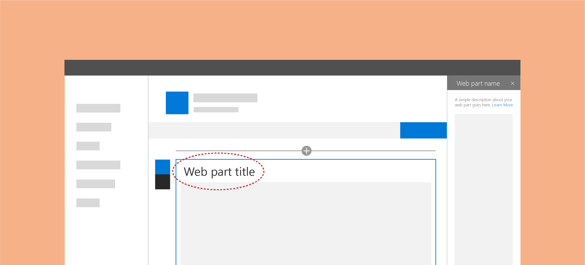
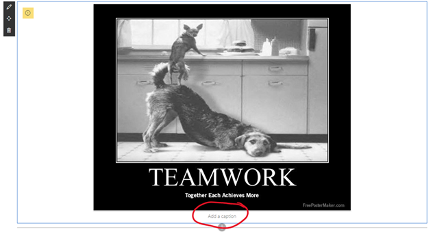
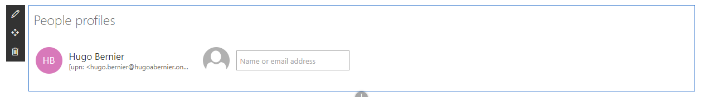
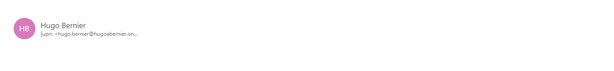
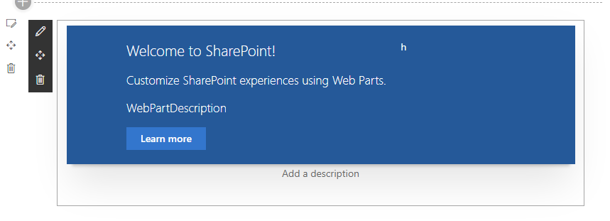

## Introduction

The [SharePoint Design](https://spdesign.azurewebsites.net/) is a beautiful web site that provides design guidance on beautiful and fast sites, pages, and web parts with SharePoint in Office 365.

Unfortunately, the SharePoint Design site does not tell you _how_ to create the beautiful web parts they show you.

[This series](/2019/07/08/introducing-the-sharepoint-framework-design-series/) is intended as a companion to the SharePoint Design site, providing you with code samples and detailed _how-to_ information for every design topic. It should help you create web parts that look exactly like the ones on the SharePoint Design site.

Today’s post is a companion to the [Titles and descriptions for SharePoint web parts](https://docs.microsoft.com/en-us/sharepoint/dev/design/web-part-titles-and-descriptions)

## What is a Web Part Title?

A Web Part **title** is a heading that appears above a web part to visually separate the web part from other content and to provide information to users about the purpose of a web part.



Most often, web parts provide a default title that page authors can override (or remove) to customize the web parts to suit their needs.

## What is a Web Part Description

The Web Part **description** is often smaller text within the web part that describes the web part content. For example, the **caption** element in the **Image** web part.



Just like the title, page authors can override or omit the web part description to suit their needs.

It is important to not confuse **description** with **alternative text**. The description is optional, but it is always visible.

The alternative text is something that you _should_ always provide for visual content (such as images, charts, etc.). We’ll discuss alternative text in a later post.

## Why use titles and descriptions?

### Understanding

Back in my McKinsey & Company days, a wise person told me:

> When you leave it up to your audience to make an assumption, you lose control over that assumption

Seems kind of obvious, but what they meant was that if you present information to users and expect them to make a conclusion from it, they may make the wrong conclusion.

Don’t assume your users are stupid, but don’t assume that by just putting a web part on the page that they will understand the purpose of the web part is.

Titles and descriptions are a consistent way to indicate to your users the purpose of your web part.

### Accessibility

When I tell people about accessibility requirements in software design, most people’s initial reaction is often something like:

> "We don’t have any blind people \[who work here\], so we don’t need to worry about accessibility"

Unfortunately, accessibility is more than about blindness. It is estimated that more than 10% of the population live with a disability.

Accessibility is actually broken down into 4 categories:

* **Visual:** This can include blind (or non-sighted) users, but also includes users with low-vision, users with obstructed vision, or age-related visual impairment. This includes _color blindness_, which affects **1 in 12 men** (or about 8%) and **1 in 200 women**.
* **Auditory:** This includes hearing-impaired users.
* **Motor:** People with motor impairments includes people with Repetitive Stress Injuries, Cerebral palsy, Parkinson’s and Muscular dystrophy.
* **Cognitive:** which relates to the ease processing of information. It includes people with autism, Down’s syndrome, Dyslexia, or global developmental delay. Consider stroke victims and concussion victims as well.

Accessibility may be a permanent or temporary condition. People often (wrongly) assume that web accessibility is only for people with permanent or long-term disabilities, but accessibility benefits people with or without disabilities. For example, it may impact the following people:

* People who are not fluent in English.
* People who do not have or are unable to use a keyboard or mouse.
* People with temporary disabilities due to accident or illness.
* Older people.
* New users.

Plus, in some countries, you are now legally obligated to provide accessible resources to your employees.

Lucky for you, the use of titles and descriptions in web parts help alleviate some of the accessibility issues by providing headings, plenty of white space on the page, visually grouping information together, and even tackling colour contrast requirements on the page — to name only a few benefits.

## When should you use titles

Let’s pretend for a second that we are not talking about SharePoint, but Microsoft Word instead. You can add things in a Word document that will make the _body_ of the document. Things like text, images, hyperlinks, page breaks, etc. When you insert such elements in a Word document, you want them to _blend in_ together and print nicely.

If your web part is intended to blend in with other content within your SharePoint page, you probably don’t need a title. For example, the following out-of-the-box web parts do not need a title:

* Text
* Image
* File viewer
* Link
* Embed
* Divider
* Markdown

On the other hand, if your web part provides a new set of information that should be visually distinctive from the rest of your page content, it should probably provide a title.

For example, if you add the **Events** web part or the **Document library** web part in a page, you probably don’t want to dump a list of events or documents in between two paragraphs without providing context to your users.

This decision tree may help. You can tell that it was written by a consultant because one of the answers is "it depends".

```flowchart
st=>start: Does my web part need a title?
e=>end: No title needed
cond=>condition: Does your web part 
need to blend in?
cond2=>condition: Does it need to visually
group information?
io=>parallel: No title needed
para=>end: Title is recommended
st->cond
e3=>end: It depends :-)
cond(yes)->e
cond(no)->cond2(yes)->para
cond2(no)->e3
```

## When should you use descriptions

Unlike the web part title, the description is not intended to visually distinguish the web part. It is purely intended to help understand the purpose or context of a web part. I recommend providing the option for a description in your web parts if the body of your web part mostly consists of images or graphics. For example, a chart web part, or an image.

In my [Comparer web part](/2019/04/11/file-picker-creating-a-custom-component-for-spfx-web-parts/), which allows users to compare two images side-by-side, I allow editors to provide a description for each image.

## How to add a web part title to your web part

> If you want to see the sample web part I’m building in this post, visit the [GitHub repo](https://github.com/hugoabernier/WebPartDesignSeries) and open the `WebPartTitles` solution. The web part is called `EditableTitle`

I chose the web part title as the first in this series because it is probably the easiest one to implement. That’s because the [PnP Reusable Controls library](https://sharepoint.github.io/sp-dev-fx-controls-react/) provides a perfect [Web Part Title component](https://sharepoint.github.io/sp-dev-fx-controls-react/controls/WebPartTitle/).


Here is how to add the web part title in your SPFx web part solution using React:

1. Using your **Node.js Command Prompt** (or whatever terminal you wish to use), make sure that you’re in your web part solution’s root directory. (It should be the same folder where your solution’s `package.json` is located).
2. Type the following command to add the PnP Reusable Controls library to your project:

    ```shell
    npm install @pnp/spfx-controls-react
    ```

    > Note: most instructions tell you to use `npm install @pnp/spfx-controls-react --save --save-exact`, but the `--save` parameter is considered obsolete now. Feel free to use what you feel most comfortable with.

3. In your web part class (the one that extends `BaseClientSideWebPart`), add a property to store your web part’s title. If your web part is called `EditableTitle`, you would open the `EditableTitleWebPart.ts` file, and look for the `IEditableTitleWebPartProps` interface (usually located at the top of the file. Add the following code:

    ```typescript
    export interface IEditableTitleWebPartProps {
    description: string;
    // BEGIN Add to support web part title
    title: string;
    // END Add
    }
    ```

4. In your `render` method, your web part will need to pass the web part title, the `displayMode` (to determine whether the web part is in **Edit Mode** or **Read Mode**), and a function to handle changes to the title. All these things get passed to the component that is responsible for rendering the body of your web part. Your new `render` method will look like this:

    ```typescript
    public render(): void {
    const element: React.ReactElement<ieditabletitleprops> = React.createElement(
      EditableTitle,
      {
        description: this.properties.description,
        // BEGIN: Add to support web part title
        // Don't forget that you need to add a comma at the end of the previous line
        title: this.properties.title,
        displayMode: this.displayMode,
        updateTitle: (value: string) => {
          this.properties.title = value;
        }
        //END: Add
      }
    );
    
    ReactDom.render(element, this.domElement);
    }
    ```

    If you get a nasty error message when you add the code, don’t worry. We just haven’t defined a `title`, `displayMode`, and `updateTitle` property for your component yet.

    

    Don’t worry about this error message, we’ll fix it soon

5. Open your component’s `I[YourWebPartName]Prop` interface (located under `src\webparts\[YourWebPartName]\components\I[YourWebPartName]Props.ts`). Since my web part is called `editableTitle`, I’ll open `src\webparts\editableTitle\components\IEditableTitleProps.ts` and add an import for the `DisplayMode` at the top of your file:

    ```typescript
    import { DisplayMode } from '@microsoft/sp-core-library';
    ```

6. Add the properties your component will need to support the web part title in your `I[YourWebPartName]Props` interface:

    ```typescript
    export interface IEditableTitleProps {
    description: string;
    //BEGIN: Add support for web part title
    title: string;
    displayMode: DisplayMode;
    updateTitle: (value: string) => void;
    //END: Add
    }
    ```

7. Open the web part’s component TSX file (located under `src\webparts\[YourWebPartName]\components\[YourWebPartName].tsx`) and add an import for the `WebPartTitle` control:

    ```typescript
    import { WebPartTitle } from "@pnp/spfx-controls-react/lib/WebPartTitle";
    ```

8. In your `[YourWebPartName]`‘s `render` method, add the `WebPartTitle` control. You should add it immediately after the first opening `<div>`:

    ```typescript
    public render(): React.ReactElement<ieditabletitleprops> {
    return (
      <div classname="{styles.editableTitle}">
        {/* BEGIN: Add to support web part title */}
        <webparttitle displaymode="{this.props.displayMode}" title="{this.props.title}" updateproperty="{this.props.updateTitle}">
        {/* END: Add */}
        <div classname="{styles.container}">
          <div classname="{styles.row}">
            <div classname="{styles.column}">
              <span classname="{styles.title}">Welcome to SharePoint!</span>
              <p classname="{styles.subTitle}">Customize SharePoint experiences using Web Parts.</p>
              <p classname="{styles.description}">{escape(this.props.description)}</p>
              <a href="https://aka.ms/spfx" classname="{styles.button}">
                <span classname="{styles.label}">Learn more</span>
              </a>
            </div>
          </div>
        </div>
      </webparttitle></div>
    );
    }
    ```

    > **Note:** some people prefer to add the web part title within the second `div` — the one with the `container` CSS class. I’ll be removing that `div` in future code samples, but feel free to do as you please.

9. Run `gulp serve` to test your web part and try editing your web part’s title


## Adding a default title

To make things easier for your users, you should provide a default title for your web part. Try to use a title that users won’t immediately have to change (like **Insert Title Here**). For example, if your web part retrieves a list of recently added documents, try using **Recent documents**. If your web part displays events, try **Upcoming events** or **Events**.

Since the web part title is stored in a web part property (we called it `title` in our sample above), the easiest way to add a default title is to use your web part manifest’s `preconfiguredEntries` to provide a default title.

To do so:

1. Open the `[YourWebPartName]WebPart.manifest.json` file (located under the `src\webparts\[YourWebPartName]` folder)
2. Locate the `preconfiguredEntries` JSON node
3. Under the `"properties"` node, add the default web part title as follows:

    ```json
    "properties": {
      "description": "EditableTitle",
      "title": "My Default Web Part Title"
    }
    ```

4. Run `gulp serve` again. If your solution was already running, you need to stop the existing `gulp serve` and start a new one, otherwise, the updated manifest won’t be reflected in your web part.
5. If your web part was already running, remove it from the workbench, refresh the page, and re-add the web part. You should see your updated web part, now with a default title:


## Adding a placeholder title

If your web part title is optional, or you prefer to start with a blank title, you should add a placeholder.

For example, the **People** web part uses **People profiles** for the placeholder title. It shows the title placeholder when your page is in **Edit** mode, but if you don’t specify a title and save your page to view it in **Read** mode, the title will disappear.



People web part in edit mode shows placeholder



People web part in reading mode hides placeholder

To implement this functionality, follow the same steps you did to add the web part title, but don’t provide a default title. Then:

1. In the `[YourWebPartName].tsx` file, find your `WebPartTitle` component in the `render` method.
2. Add the `placeholder` prop with the placeholder title you want to use.

    ```typescript
    <webparttitle displaymode="{this.props.displayMode}" title="{this.props.title}" updateproperty="{this.props.updateTitle}" placeholder="{"Web" part="" placeholder"}="">
    ```

> Note: please consider localizing your placeholder text. I’ll explain localizing in a later post.
>
> If you want to see the sample web part I’m building in this post, visit the [GitHub repo](https://github.com/hugoabernier/WebPartDesignSeries) and open the `WebPartTitles` solution. The web part is called `PlaceholderTitle`

## How to add a description

Unfortunately, there isn’t a `WebPartDescription` component that you can use to easily add a description section to your web part.

Fortunately, we can cheat and use the `WebPartTitle` component and apply some CSS magic to get the same results.

Here is how:

1. If you haven’t done so already, add the PnP Reusable Controls library to your project by typing the following command:

    ```shell
    npm install @pnp/spfx-controls-react
    ```

2. In your web part class (located under `src\webparts\[YourWebPartName]\[YourWebPartName]ts`. Add a property to store your description. Since the default web part already has a `description` prop, I used `webPartDescription`, but in real life, I’d use the `description` prop for that purpose.

    ```typescript
    export interface IEditableTitleWebPartProps {
    description: string;
    // BEGIN Add to support web part description
    webPartDescription: string;
    // END Add
    }
    ```

3. In your `render` method, your web part will need to pass the web part description, the `displayMode` (to determine whether the web part is in **Edit Mode** or **Read Mode**), and a function to handle changes to the description. All these things get passed to the component that is responsible for rendering the body of your web part. Your new `render` method will look like this:

    ```typescript
    public render(): void {
    const element: React.ReactElement<ieditabletitleprops> = React.createElement(
      EditableTitle,
      {
        description: this.properties.description,
        // BEGIN: Add to support web part description
        // Don't forget that you need to add a comma at the end of the previous line
        webPartDescription: this.properties.webPartDescription,
        displayMode: this.displayMode,
        updateDescription: (value: string) => {
          this.properties.webPartDescription = value;
        }
        //END: Add
      }
    );
    
    ReactDom.render(element, this.domElement);
    }
    ```

4. Open your component’s `I[YourWebPartName]Prop` interface (located under `src\webparts\[YourWebPartName]\components\I[YourWebPartName]Props.ts`). Since my web part is called `webPartDescription`, I’ll open `src\webparts\webPartDescription\components\IWebPartDescriptionProps.ts`.

5. If you haven’t done so already, add an import for the `DisplayMode` at the top of your file:

    ```typescript
    import { DisplayMode } from '@microsoft/sp-core-library';
    ```

6. Add the properties your component will need to support the web part description in your `I[YourWebPartName]Props` interface:

    ```typescript
    export interface IWebPartDescriptionProps {
    description: string;
    //BEGIN: Add support for web part description
    webPartDescription: string;
    displayMode: DisplayMode;
    updateDescription: (value: string) => void;
    //END: Add
    }
    ```

7. Open the web part’s component TSX file (located under `src\webparts\[YourWebPartName]\components\[YourWebPartName].tsx`).

8. If you haven’t done so already, add an import for the `WebPartTitle` control:

    ```typescript
    import { WebPartTitle } from "@pnp/spfx-controls-react/lib/WebPartTitle";
    ```

9. In your `[YourWebPartName]`‘s `render` method, add the `WebPartTitle` control where you would like the description to appear. We also add a placeholder (**Add a description** to override the default **Web Part Title** placeholder that comes with the `WebParttitle` component). In my sample, I’ll add it below the `container` `div`:

    ```typescript
    public render(): React.ReactElement<iwebpartdescriptionprops> {
    return (
      <div classname="{" styles.webpartdescription="" }="">
        <div classname="{" styles.container="" }="">
          <div classname="{" styles.row="" }="">
            <div classname="{" styles.column="" }="">
              <span classname="{" styles.title="" }="">Welcome to SharePoint!</span>
              <p classname="{" styles.subtitle="" }="">Customize SharePoint experiences using Web Parts.</p>
              <p classname="{" styles.description="" }="">{escape(this.props.description)}</p>
              <a href="https://aka.ms/spfx" classname="{" styles.button="" }="">
                <span classname="{" styles.label="" }="">Learn more</span>
              </a>
            </div>
          </div>
        </div>
         {/* BEGIN: Add to support web part description */}
         <webparttitle displaymode="{this.props.displayMode}" title="{this.props.webPartDescription}" updateproperty="{this.props.updateDescription}" placeholder="{"Add" a="" description"}="">
        {/* END: Add */}
      </webparttitle></div>
    );
    }
    ```

10. To change the CSS for the web part description, we’ll add some CSS. Open the `[YourWebPartName].module.scss` (located under `src\webparts\[YourWebPartName]\components\[YourWebPartName].module.scss`) and add the following CSS just above the `.container` class:

    ```css
    .descriptionElement textarea {
    font-size: 14px;
    font-weight: 400;
    line-height: 1.6em;
    overflow-x: hidden;
    text-overflow: ellipsis;
    color: $ms-color-neutralPrimary;
    }
    
    .descriptionElement__NoMargin textarea  {
    margin-bottom: 0;
    }
    
    .descriptionElement__centerAlign textarea {
    text-align: center;
    }
    ```
    
    We’re defining three CSS classes here: `descriptionElement` to render a smaller font, `descriptionElement__NoMargin` to remove the bottom margin, and `descriptionElement_centerAlign` to align the description at the center of the web part. You can use all three CSS styles, or only `descriptionElement` as it suits you.

11. Go back to your `[YourWebPartName].tsx`.

12. Add a reference to the `css()` function at the top of the file.

    ```typescript
    import { css } from "@uifabric/utilities/lib/css";
    ```
    
    The `css()` function allows you to combine multiple CSS classes. To do so, I added. If you want to read more about the `css()` function, [read my post](/2019/01/21/dynamically-assign-multiple-css-class-names-in-spfx-the-easy-way/).

13. Add the CSS prop to the `WebPartTitle` you added in step 9. Use whatever combination of the three CSS classes we defined earlier as you desire (I use all three here):

    ```typescript
         {/* BEGIN: Add to support web part description */}
         <webparttitle displaymode="{this.props.displayMode}" title="{this.props.webPartDescription}" updateproperty="{this.props.updateDescription}" placeholder="{"Add" a="" description"}="" classname="{css(styles.descriptionElement," styles.descriptionelement__nomargin,="" styles.descriptionelement__centeralign)="" }="">
        {/* END: Add */}
    ```

14. Run `gulp serve` and test your web part.

You should get something that looks like this:



> **Note:** I really dislike the default shadowy border that comes with every Yeoman-generated SPFx web part because it isn’t found anywhere else in the out-of-the-box SharePoint web parts. I always remove it from my projects. Although this is outside of the scope of this post, if you want to remove it, simply comment out the `box-shadow` line in the `.container` CSS class of your `[YourWebPartName].module.scss`. You’ll get the following result:  
> 
>
> If you want to see the code for this web part, visit the [GitHub repo](https://github.com/hugoabernier/WebPartDesignSeries) and open the `WebPartTitles` solution. The web part is called `WebPartDescription`. I know, I didn’t think the web part name through when I built it.

## UI text guidelines for Titles and descriptions

I’ve mostly copied this from the [UI text guidelines for SharePoint web parts](https://docs.microsoft.com/en-us/sharepoint/dev/design/ui-text-for-web-parts), but I include it here (and will continue to include the relevant sections throughout this series) because it is important to use consistent User Interface (UI) text within your web parts.

### Capitalization

Use sentence casing (the first letter of the first word is capitalized, the rest all lowercase) for all titles.

Always capitalize:

* The first word of a web part title or description
* The word following a colon in a title. For example, "Step 1: Begin by entering your account information."
* Proper nouns, such as the names of people, cities, and so on.

### Punctuation

**Don’t** use periods in titles. For other punctuation types, follow the basic rules of punctuation.

### Voice and tone

If you want your users to fall in love with your web parts, make sure to use the right tone in your UI text. It will help build a strong, lasting relationship with your users.

Try to keep your words crisp and clear, warm and relaxed, and approachable.

Follow these simple tips:

* Use a casual, conversational tone in the UI.
* Use contractions. For example, use "can’t" instead of "cannot".
* Read your UI text out loud to test the tone. Does it sound like everyday language?
* Use simple words.
* Remove technical details if they’re not relevant to the user experience.
* Use "Please" only if you are inconveniencing the user. Avoid overuse.
* Use "Sorry" only in error messages in SharePoint that result in serious problems for the customer.

### Pronouns

Avoid pronouns if you can.

If you must use pronouns, follow these rules:

* Use second person ("you" or "your") when you’re presenting something that belongs to the user. For example, "Your drafts" or "Your images".
* Use the first person ("me" or "my") for UI in which the user instructs the service to do something. For example, "Alert me when someone responds to my post."
* Use "they" or "their" as a singular possessive modifier to avoid awkward "he/she" or "his/her" constructs. Ideally, rewrite the sentence as plural if possible.
* Avoid using "them"; instead, use words like "someone" or "people". For example, "Enter a user name and domain to give someone permission to use this PC."

If you want to sound really cold and snobby, use third person references. Instead of saying "Users can change the layout", use a phrase like "You can change the layout".

### Hint text

Hint text, or ghost text, is the text element you display in a UI element to help the user interact with the UI.

In the case of titles and descriptions, your hint text is your `placeholder` attribute. It should give information about what the user should enter.

You should try to use hint text sparingly, and only if it helps the user. Because titles and descriptions are not usually visible on a web part if they are empty, this is an instance where you should definitely use hint text.

## Conclusion

This post described how to add titles and descriptions to your web parts in accordance with the [SharePoint Design Principles](https://spdesign.azurewebsites.net/).

In future posts, I’ll explain the other design areas… but since the other design areas are a bit more complicated, I’ll break each down into a few smaller posts.

I hope this helps?

## Thanks

This post wouldn’t have been possible without the amazing work from the SharePoint team. The technical writers don’t often get the glory, so we should especially thank [Linda Caputo](https://github.com/Linda-Editor) and [David Chestnut](https://github.com/davidchesnut) for their contributions.

## More Information

I could have gone on for _days_ about some design topics in this article, but I’ll let the _actual experts_ do the talking:

* Serra, M. & Muzio, J. (2002). The IT support for acquired brain injury patients: The design and evaluation of a new software package. Proceedings of the 35th Hawaii International Conference on Systems Sciences – 2002.
* Jiwnani, K. (2001). Designing for users with cognitive disabilities. Universal Usability in Practice. \[online\] Available: [http://www.otal.umd.edu/uupractice/cognition/](http://www.otal.umd.edu/uupractice/cognition/)
* Hudson, R., Weakley, R. & Firminger, P. (2005). An accessibility frontier: Cognitive disabilities and learning difficulties. Webusability – Accessibility and Usability Services. Online \[available\]: [http://www.usability.com.au/resources/cognitive.php](http://www.usability.com.au/resources/cognitive.php)
* Brewer, J. (Ed.). (2005). How people with disabilities use the web: Working group internal draft, 5 May 2005. W3C. \[online\] Available: [http://www.w3.org/WAI/EO/Drafts/PWD-Use-Web/](http://www.w3.org/WAI/EO/Drafts/PWD-Use-Web/)
* Nielsen, J. (2005). Lower-literacy users. Alertbox. \[online\] Available: [http://www.useit.com/alertbox/20050314.html](http://www.useit.com/alertbox/20050314.html)
* DL (2003a). Making materials useful for people with cognitive disabilities. Southwest Educational Development Laboratory (SEDL) Research Exchange Newsletter, 8(3). Online \[available\]: [http://www.ncddr.org/du/researchexchange/v08n03/2\_materials.html](http://www.ncddr.org/du/researchexchange/v08n03/2_materials.html)
* Branigan, C. (2003). New study reveals 187 key web design rules. eSchool News. Online \[available\]: [http://www.eschoolnews.com/news/showStory.php?ArticleID=4772](http://www.eschoolnews.com/news/showStory.php?ArticleID=4772)
* Rowland, C. (2004). Cognitive disabilities part 2: Conceptualizing design considerations. Webaim – Accessibility in Mind. \[online\] Available: [http://webaim.org/articles/cognitive/conceptualize/](http://webaim.org/articles/cognitive/conceptualize/)
* Web Part Title PnP Reusable Control: [https://sharepoint.github.io/sp-dev-fx-controls-react/controls/WebPartTitle/](https://sharepoint.github.io/sp-dev-fx-controls-react/controls/WebPartTitle/)
