> **Note:** There are a lot of screenshots in this post. Here’s why: there is _nothing_ that I dislike more than having to download/install something to find out exactly what’s inside. _Yes_, there are a lot of screenshots, but you’ll know exactly what to expect if you decide to download my PowerPoint template.

## Introduction

As the self-proclaimed _World’s Laziest Developer_, I always look for shortcuts and ways to avoid doing work.

When I start a SharePoint project where I have to design an Information Architecture, I like to use low fidelity wireframes instead of spending countless hours creating SharePoint sites.

I’m not a designer or a user experience specialist, but I’ll take the time to do paper napkin drawings, whiteboard drawings, and any other available tools to help work through how my sites are going to be structured and laid out.

I’ll even use tools like Balsamiq, UXPin, Adobe XD, and Visio, but I like to spend as little time as possible building my low-fidelity wireframes. Also, I find that few people have experience with those tools (even though they are awesome).

I do it because it is faster convey to my stakeholders what I’m planning on doing and getting feedback **with a minimum effort**. And I’m all about minimum efforts.

Since PowerPoint now has [sketchy shapes](https://blog-insider.office.com/2019/07/03/sketchy-shapes-for-word-powerpoint-and-excel/), I decided to create a PowerPoint template that contains a sketchy design for SharePoint pages and a few of the commonly used web parts.

My template is not intended to replace the [SharePoint Toolkit](https://developer.microsoft.com/en-us/fabric#/resources), but it requires Adobe XD and most client workstations I use do not have Adobe XD. If you can use Adobe XD and the SharePoint Toolkit, do so. If you can’t feel free to use my PowerPoint template.

If you want to use it, you can [download it and use it as you wish](https://github.com/hugoabernier/SharePointWireframes).

> **Note:** This template will **only** work in the desktop version of PowerPoint. And it may require the **Office Insider** version of PowerPoint.

A few rules, though:

- If you add more page designs and web parts that you think other people would enjoy, share it with me and I’ll add it to the template
- Don’t go selling this template
- Share it with others (#SharingIsCaring)

## The components

Here are the elements you can use for now:

### The Communication Site master

There is also a read-only version of the communication site if you want to show what the experience looks like for visitors:

### Guided layouts

If you choose a slide master, you can pick a layout to help you place your web parts on the page.

1 column guide

2 column guide

3 column guide

Simply place your web parts so that they fit within the gray area. Once you’re done moving the web parts, select the **No guide** version, which hides all the guides.

### Hero web part

(I had a lot of fun drawing the placeholder pictures. Very therapeutic.)

### News web part

### Events web part

### Documents web part

### People web part

### Generic grid layout web part

If you want to write your web part with the [grid layout](https://tahoeninjas.blog/2019/07/28/sharepoint-framework-design-series-layout-patterns-i/) and would like to mock them up in your wireframes, you can use the **Generic Grid Layout Web Part**. It comes in **1/3 column**, **2/3 columns**, and **full-width** variations.

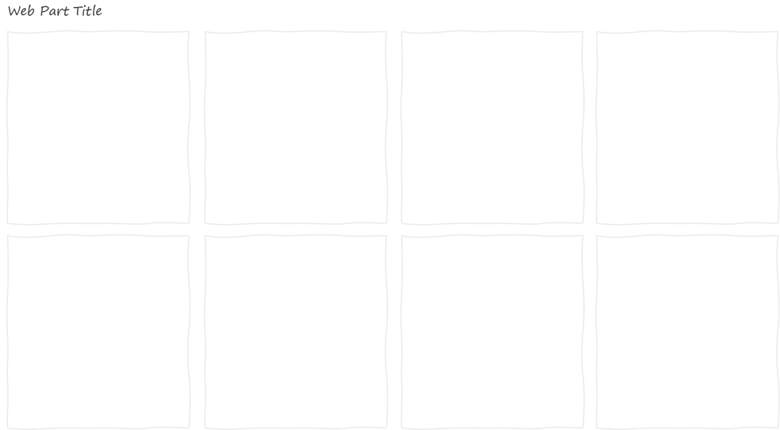

Generic Grid Layout Web Part — Full width

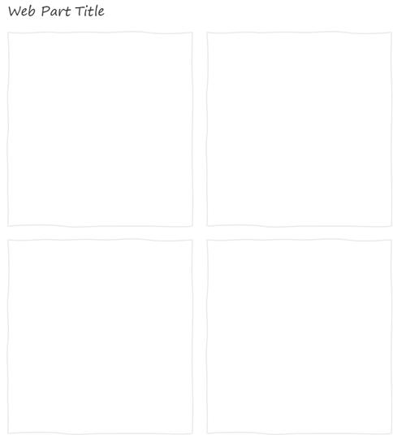

Generic Grid Layout Web Part — 2/3 columns

Generic Grid Layout Web Part — 1/3 column

### Generic filmstrip layout web part

If you want to write your web part with the [filmstrip layout](https://tahoeninjas.blog/2019/07/31/sharepoint-framework-design-series-layout-patterns-part-ii/) and would like to mock them up in your wireframes, you can use the **Generic Filmstrip Layout Web Part**. It comes in **1/3 column**, **2/3 columns**, and **full-width** variations.

Generic Filmstrip Layout Web Part — Full width

Generic Filmstrip Layout Web Part — 2/3 columns

Generic Filmstrip Layout Web Part — 1/3 column

### Generic carousel layout web part

If you want to design a custom web part that uses the carousel layout, use this template. Like the other generic web parts, it comes in 3 flavors: **Full-Width**, **2/3 columns** and **1/3 column**.

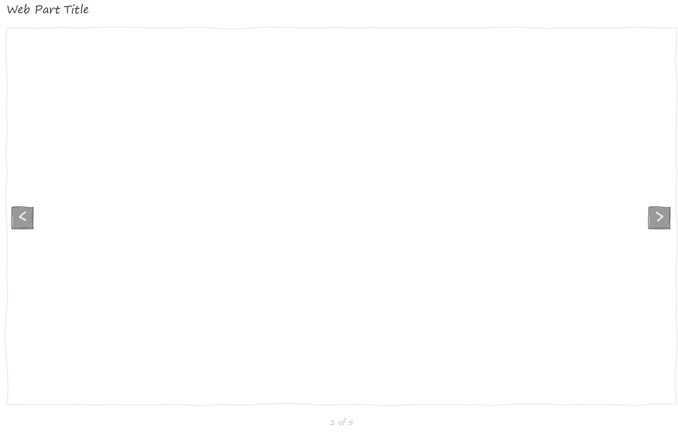

Generic Carousel Web Part — Full Width

Generic Carousel Web Part — 2/3 columns

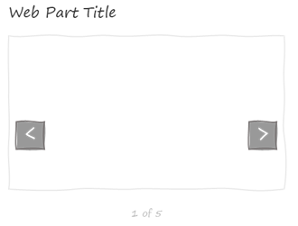

Generic Carousel Web Part — 1/3 column

### Generic list layout web part

I couldn’t do the other generic layouts and omit the list layout! This one is also available in **Full Width**, **2/3 columns** and **1/3 column**.

Generic List Web Part — Full Width

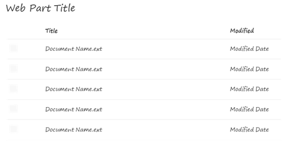

Generic List Web Part — 2/3 columns

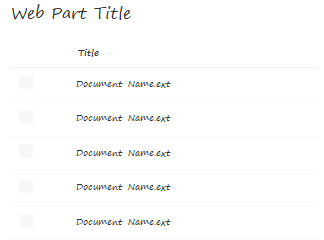

Generic List Web Part — 1/3 column

### Color palettes

Although many believe that low-fidelity wireframes should use grayscale and contrast instead of colors, sometimes I like to include colors. It really depends on my mood (and the audience).

Whether you’re in the "no-colors" camp or in the "with colors" camp, every slide includes the SharePoint color palettes on the right of the page — outside of the viewable area.

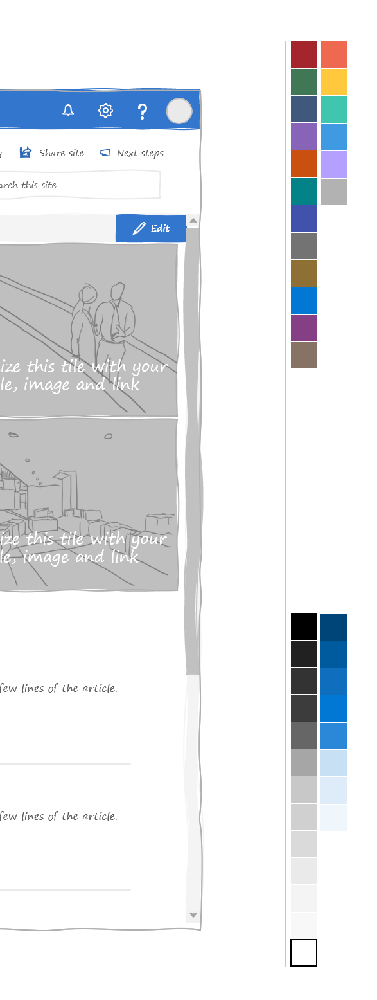

When you’re editing your pages, you can pick the **Eyedropper** tool to pick the colors you need from the palette.  
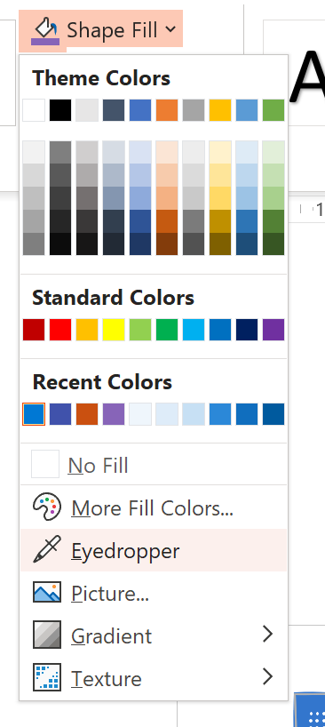

Don’t worry: because they are outside of the viewable area, the color palettes won’t show up while you’re presenting or when you print.

If you need to find out more about what each color is, there is a section at the end of the PowerPoint template that explains the SharePoint colors.

### Other stuff

There is also some token _lorem ipsum_ placeholder text in case you need it, but [I try to avoid it](https://www.nngroup.com/videos/fake-copy/).

Also, there are sticky notes to help annotate your wireframes.

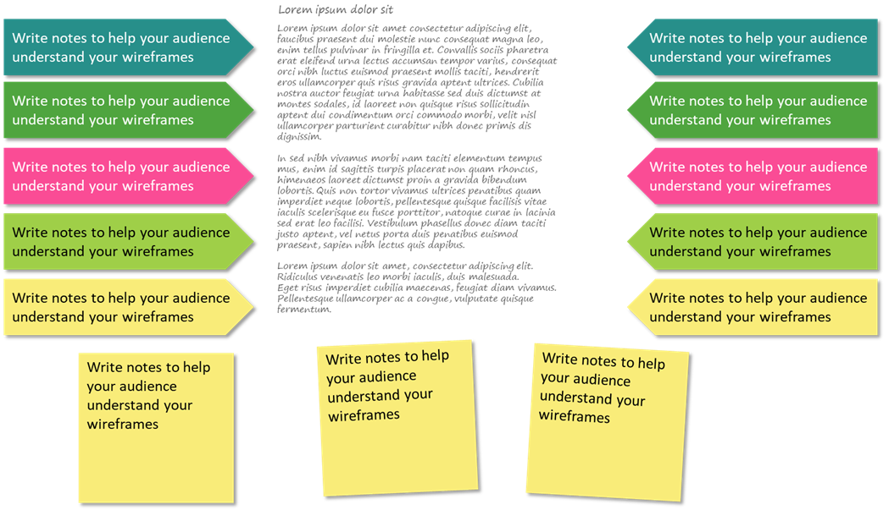

What else would you like to see? Let me know in the comments.

## Using the template

Here are simple tips to use the template:

- The template uses an 11"x17" page template. It may seem big, but it prevents you from having to deal with 4pt fonts. Don’t worry, it presents well on a screen, and prints great posters for your team project room walls.
- It uses the new **sketchy** line styles. It may not work in the web version of PowerPoint or if you don’t have the Office Insider edition of PowerPoint. Let me know if you need a non-sketchy version and I’ll try to oblige. If you get an error opening it in the web browser, try opening it on your desktop  
    
    
    
    If you get this message, it is most likely because I used sketchy lines
    
- To emphasize on the "work in progress" look, I used the **Segoe Print** font because I found that it was available on most workstations that I use. If you don’t have this font, feel free to use any font you like. [Ink Draft](https://www.microsoft.com/store/productId/9NPQGC3LCK31) and [Segoe Marker](https://www.microsoft.com/store/productId/9NGQR45WNJB2) work well too. Just resist the urge to use _Comic sans_ !
- For now, every slide uses the **communication site** layout (and the read-only variation). I’ll add the **team site** layout if I get requests to do so
- The title of the slide is the site title  
    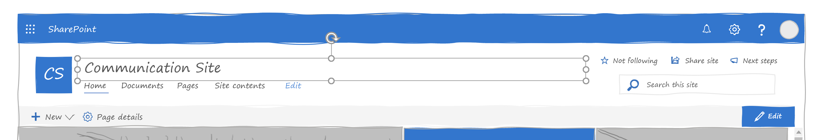
- Every site element is grouped to make it easier to move them around. Feel free to un-group them and edit them as you need  
    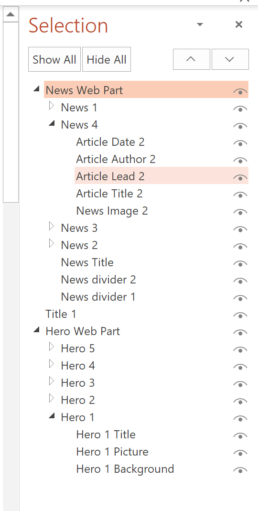
- I used some theme colors, but feel free to make the designs monochromatic if you want
- If you need to edit the navigation, feel free to copy the navigation elements (called **Site Navigation** ) from the master slide and paste the customized navigation on your slide. It already has a white background to hide the navigation from the master slide  
    

### To edit site navigation

To edit the site navigation, follow these steps:

1. From your PowerPoint slide, go to **View** then select **Slide Master** in the **Master Views** group  
    
2. PowerPoint should automatically take you to the master slide called **Communication site**. Select the site navigation by clicking on the site icon and click **Copy**.  
    
3. From the **Slide Master** menu, select **Close Master View** to go back to your slide  
    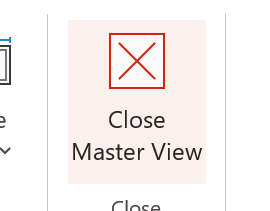
4. **Paste** the navigation on top of the existing navigation. The white background behind the site navigation you just copied should hide the existing one from the master slide.
5. Edit the navigation and site icon as you wish

### To create your own wireframe

Although I have a sample wireframe in my template, you can create your own using these simple steps:

1. In PowerPoint, insert a new slide in your presentation by going to **New Slide** and select the layout you want  
    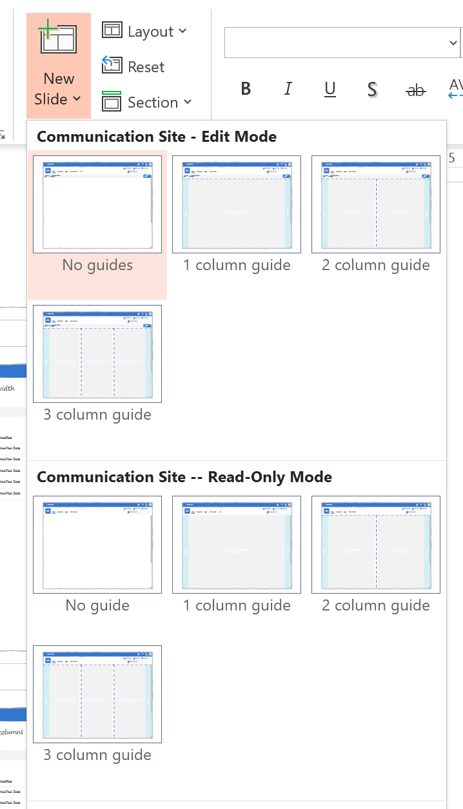  
    You can pick from the **Communication Site — Edit Mode** to show what an author would see, or **Communication Site — Read-only Mode** to show what a visitor would see.
2. Try to start with one of the guides. You can choose from **1 column guide**, **2 column guide** or **3 column guide**.
3. From the **Web Part Templates** section, find the web parts you want from the other slides in the PowerPoint template, copy them and paste them onto your new slide.
4. Make sure to place the web parts within the gray areas on the guides.
5. Edit the web part elements (like web part title and content). It may help to ungroup them first.
6. Once you’re done placing your web parts, go to **Layout** and pick the **No guide** version of whatever master you chose. It will remove the background guides, but will not affect where you placed your web parts.  
    

## Tips when preparing low fidelity wireframes

As [Page Laubheimer](https://www.nngroup.com/people/page-laubheimer/) from the [Nielsen Norman Group](https://www.nngroup.com/videos/low-fi-prototypes-stakeholders/) puts it:

> Sharing low fidelity user-interface prototypes with stakeholders is a great way to transfer knowledge and get buy-in early.

Tell your audience that this is work in progress. It may be obvious to you, but I have had clients get upset that their site was going to look "all wobbly" (and others who asked if the site was going to only be "in French" because I used _lorem ipsum_). Explain that you used this style of wireframe to help focus on the content and structure, not the look.

Explain to your audience that this is a great opportunity to share knowledge: for **them** to transfer their knowledge to **you** by getting their feedback early.

Don’t worry about the look and feel, worry about the content/structure and function. Resist the urge to put _lorem ipsum_ and try to put some text that is as real as you can make it for now.

Another way to use these wireframes is to print them and get your audience to mark them with their notes. You’d be amazed by what information you can get from watching people circle, underline, and annotate paper wireframes.

## Conclusion

My [PowerPoint template](https://github.com/hugoabernier/SharePointWireframes) is available for you to use.

I’ll continue adding web parts and designs. If you need anything else added to it, let me know in the comments.

Maybe I’ll create a higher-fidelity version of these if people like them. I’d also love to create a version that you can print out and cut so that you can layout page designs on paper.

Let me know what you think?

## Updates

- **August 5, 2019:** Thank you [Vesa Juvonen](https://twitter.com/vesajuvonen?s=17) for pointing out the broken link. Moved files to GitHub repo to make it easier for those of you who wish to contribute.
- **August 3, 2019:** Added more web parts (List, carousel, filmstrip) and explanation why I have so many damned screenshots. Also added introduction how to use the guides and section explaining color palettes.
- **August 2, 2019:** Added more web parts (generic grid 1/3, 2/3, and full width) and guide layouts