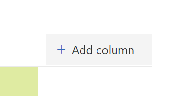
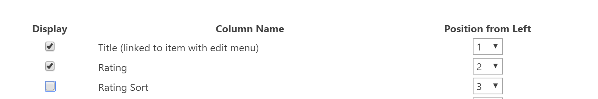
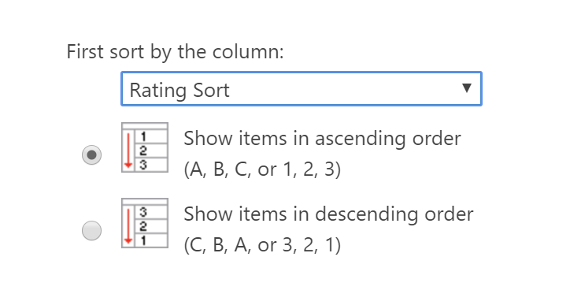

## Introduction

Sometimes, you need to create a view in a SharePoint list where the items are sorted using a custom sort order. For example, if you had a list of items that needs to be sorted by **Rating** where the possible choices are **High**, **Medium**, and **Low**, your list items would appear in the following order: **High**, **Low**, and **Medium** because SharePoint will want to sort your **Rating** values alphabetically.

Poor SharePoint, it doesn’t know that you want a custom sort order!

First instinct is to change the possible choices so that the list gets sorted in the right order. For example, renaming **Low** to **1 – Low**, **Medium** to **2 – Medium**, and **High** to **3 – High**. It will force SharePoint to sort by category in the right order.

But sometimes you don’t want to change the values in your metadata just so that it sorts properly.

This post will explain a quick method I use to sort list items in a view using a custom sort order.

It is so easy, it is almost embarrassing.

## Solution

All you need to do is simply add a **calculated column** where you assign a numerical equivalent to the column you wish to sort on.

Here are the steps:

1. From your list, select **Add column**  
    
2. When prompted to choose a column type, select **More…**  
    
3. In the **Create Column** page, select a **Column name** that suits you. I usually call it **\[Choice column\] Sort**, where the **\[Choice column\]** is the name of the choice column you want to sort on. For example, to sort by **Rating**, I would call the column **Rating Sort**. Feel free to use whatever name you like.
4. For **The type of information in this column is:**, select **Calculated**
5. Let’s skip the formula for a second, we’ll get back to it. For **The data type returned from this formula is:**, select **Number** and select **0** for the **Number of decimal places**  
    
6. For the **Formula**, use a whatever logic you want to assign a numerical value to the item. For example, to sort **Ranking**, I would assign **1** to **Low**, **2** to **Medium**, and **3** to **High** by using the following formula:

        =IF(Rating="Low",1,If([Rating] = "Medium", 2, 3))

7. Select **OK** to create your column.
8. Test that your column is returning the right values:  
    
9. If you’re getting the right numerical values, change your view to sort by the column you just created by going to **Settings** | **List settings** and selecting the view you want to change under **Views**.
10. In the **Edit View** page, make sure to de-select the column you created (we don’t actually want to show it!)  
    
11. Scroll to the **Sort** section and select your new column as the sort order.  
    
12. Select **OK** to save your view.
13. Test your view. It should short your items sorted using your sort logic.  
    

## Conclusion

I told you it was simple!

All you have to do is add a calculated column that calculates the sort value you want, and sort by that column!

I hope this helped?

## More Information

The example in this post uses the `IF` function.

The `IF` syntax is as follows:

    IF(logical_test,value_if_true,value_if_false)

So, if you want to return **1** if the `[Rating]` column is equal to **Low**, otherwise return **2** you would write:

    IF([Rating] = "Low", 1, 2)

You can nest `IF` statements too. For example, if the value of `[Rating]` isn’t **Low**, it could be **Medium** or **High**. To return the appropriate value, we nest a _second_ `IF` in the first `IF`‘s `value_if_false` parameter, as follows:

    IF([Rating] = "Low", 1, IF([Rating] = "Medium", 2, 3))

However, it’ll suck if you have a lot of choices to pick from. For example, if you wanted to sort by month, you would have to do something ugly like this:

    IF([Month] = "January",1 , IF([Month] = "February", 2, IF([Month] = "March", 3, IF([Month] = "April", 4, IF([Month] = "May", 5, IF([Month] = "June", 6, IF([Month] = "July", 7, IF([Month] = "August", 8, IF([Month] = "September", 9, IF([Month] = "October", 10, IF([Month] = 11, 12)))))))))))

But that’s _ugly_!

You don’t _have_ to use `IF` to calculate your numerical equivalent. For example, I like to use `FIND` to find the value in a long string.

The `FIND` syntax is as follows:

    FIND(find_text,within_text,start_num)

Where:

`Find_text` is the text you want to find.

`Within_text` is the text containing the text you want to find.

`Start_num` is the character at which to start the search. If you omit it, default is `1`.

Since `FIND` returns the location in the string where it found the value you’re searching for, you just need to make sure your possible values are in order (and unique). For example, this is how I would sort by month:

    FIND([Month], "January February March April May June July August September October November December")

Which would return **1** for **January**, **9** for **February**, **18** for **March**, etc.

Sure, the numbers aren’t sequential, but we don’t care, as long as they get bigger with each value!