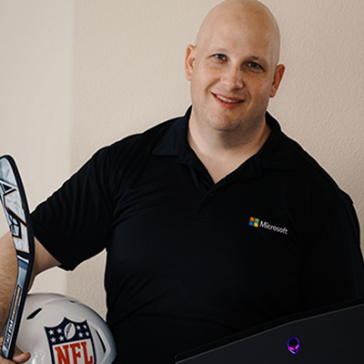

## Introduction

Do you find a spelling mistake in the [SharePoint Documentation](https://docs.microsoft.com/sharepoint/dev/) but you don’t know how to fix it?

Do you have a cool SPFx [web part](https://github.com/pnp/sp-dev-fx-webparts) or [extension](https://github.com/pnp/sp-dev-fx-extensions) sample that you think other SharePoint developers would appreciate?

Do you want to add to the [PnP reusable controls](https://github.com/pnp/sp-dev-fx-controls-react), [PnP property controls](https://github.com/pnp/sp-dev-fx-property-controls), or write your own command for the [PnP Powershell](https://github.com/pnp/PnP-PowerShell) or [CLI for Microsoft 365](https://github.com/pnp/cli-microsoft365)?

But you never got around to it because you just didn’t know where to start?

At the 2019 SharePoint Conference, the always entertaining [Vesa Juvonen](https://twitter.com/vesajuvonen?s=17) presented a session about how to start contributing to the PnP community. (I can’t find the actual session title or a video of it, but if anyone has a link to it, please let me know).

The whole point of the session was very clear: the SharePoint Development community (or PnP) is open for everyone to contribute.

However, it can be very overwhelming to get started.

Luckily, the community is here to help!

> Together, as a community, we can achieve much more than alone.

## It is scary for everyone

I’m sure if you asked any of the existing PnP contributors, they’ll tell you the same thing: the first contribution is always scary.

Why is it scary? [Gene Zelazny](https://twitter.com/gene_zelazny?s=17) who taught me everything about public speaking says that being nervous about speaking in public is a good thing: it means that you respect for the audience.

I think that being scared of making your first contribution to the PnP community is a good thing; it means that you respect the members of the community and you don’t want to introduce something that will break a solution, introduce bugs, or lower the quality bar.

That’s a good thing!

It doesn’t matter how much (or how little) experience you have with SharePoint. Newbies feel that maybe they have nothing new to add, or that it isn’t their place to contribute, while more senior developers probably experience [impostor syndrome](https://en.wikipedia.org/wiki/Impostor_syndrome).

If you’re worried that you’ll make a mistake and make a fool of yourself, don’t be. I’ve written many love letters about the PnP community ([here](/2019/04/25/why-i-heart-officedevpnp/) and [here](/2019/02/21/open-source-contributors-are-people-too/)), but the fact is: the PnP community is filled with awesome people who will help you. If you make a mistake, they may either fix your mistake for you, or reject your submission, make suggestions to fix it, and kindly encourage you to re-submit.

[David Warner II](https://twitter.com/DavidWarnerII?s=17) is one of those amazing PnP contributors who goes even further: he’ll help everyone with their first contribution!

He recently tweeted this:

> If you want to contribute & add your name to the contributors’ list, but not sure how I’m offering my time to help! DM me and I will personally walk you thru your 1st contribution in docs! #SharePoint #SPFx #SPC19 #OfficeDev
>
> — David Warner II via Twitter

If you don’t know who David Warner II, he’s a [prolific Microsoft Office Development MVP who is deeply focused on developing & branding](http://warner.digital/) — two of my favorite topics.

During the day, David is a Managing Consultant at [Catapult Systems](https://www.catapultsystems.com/), but after dark (or whatever spare time he has), he turns into a masked PnP contributor who has [contributed to pretty much every PnP repo there is](https://github.com/PopWarner).

Somewhere in between, he also finds the time to write [summaries for every PnP community call](http://warner.digital/category/pnp-summary/), complete with screenshots and links.

Come on, how could you not trust this guy?!

I have reached out to David before to seek his advice, and he could not have been more friendly or patient.

So, if you’re still afraid to contribute but you want to do so, [reach out to him via Twitter](https://twitter.com/DavidWarnerII?s=17).

## Paying it forward

The PnP community is so awesome that I feel it is also my responsibility to _pay it forward_ and help.

I’m not a GitHub expert and I still get confused with pull, pushes, branches, commits and pull requests, so I’m not the right person to help you with making your first contribution to GitHub.

However, I’m pretty comfortable with SPFx web parts and extensions; If you have an idea for an SPFx web part that you’d like to build and you don’t know where to start, [reach out to me](https://twitter.com/bernierh) and I’ll help you start your project and build it — **as long as you promise to share it with the rest of the community as your first contribution**.

If the solution doesn’t work, you can even blame me 🙂

## Conclusion

The Microsoft 365 PnP community is an awesome community that encourages sharing. It welcomes and celebrates newcomers just like you and me.  
It can be overwhelming to get started, but [the always awesome David Warner II](https://twitter.com/DavidWarnerII?s=17) has offered to help anyone get started with a new contribution.

Together, as a community, we can achieve much more than alone.

Welcome to the PnP community. I look forward to your first contribution!

### Photo Credit

Photo credit by [Esi Grünhagen](https://pixabay.com/users/FeeLoona-694250/?utm_source=link-attribution&utm_medium=referral&utm_campaign=image&utm_content=619399) from [Pixabay](https://pixabay.com/?utm_source=link-attribution&utm_medium=referral&utm_campaign=image&utm_content=619399)
