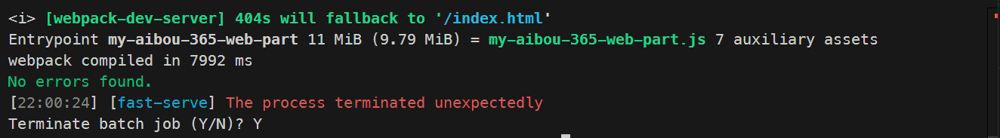
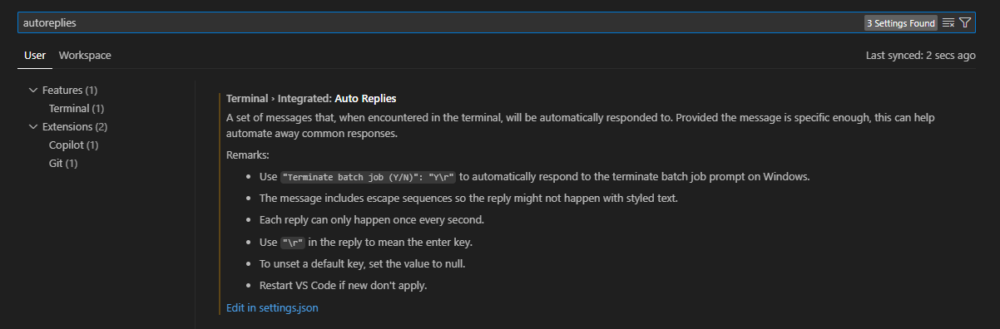

## Introduction

The disadvantages of typically writing long and detailed blogs is that it constantly raises the bar for the next blog post. Which leads to procrastination. So, I am going to try something different this time. I'm going to go back to how I started blogging: short posts that are intended to be a note to myself about something I always forget.

Because I am _lazy_, I don't want to have to look it up every time.  

So this post is going to be a #NoteToSelf about how to terminate batches quickly in VSCode. It may not be earth-shattering, or unique, and I'm sure that you can look it up easily, but I always forget. If you happen to find it useful, that's great. If not, that's fine too.

## The problem

When you run a batch task in VSCode, you often need to terminate it. When building SPFx solutions, this is especially true when you run `gulp serve` or `npm run serve` (if using fast-serve. Wait, you _are_ using fast-serve, right?).

When you terminate a batch task in VSCode (by hitting CTRL-C), you get a confirmation message that asks you if you are sure you want to terminate the batch. You need to hit "Y" to confirm, or hit CTRL-C again to terminate the batch. (Although, if you hit CTRL-C twice, you may end up in an endless loop where it prompts you again and again until you hit "Y".)



## The solution

You can configure automatic response in the VS Code terminal with the use of some settings.

Here's how to do it:

1. Open the settings in VSCode (CTRL-,) or **File** > **Preferences** > **Settings**.
1. In the preferences search bar, search for `autoreplies`.
   
1. Select **Edit in settings.json**.
1. In the `settings.json` file, add the following lines:

   ```json
   "terminal.integrated.autoReplies": {
        "Terminate batch job (Y/N)": "Y\r"
    }
    ```
1. Save the file.
1. Next time you get prompted to terminate a batch job, it will automatically respond with "Y" and terminate the batch.

You can add more auto-replies for other prompts as well.

## Conclusion

That's it. Now you can terminate batches twice as fast in VSCode.

I told you it was gonna be a quick one!

I hope this helps?
