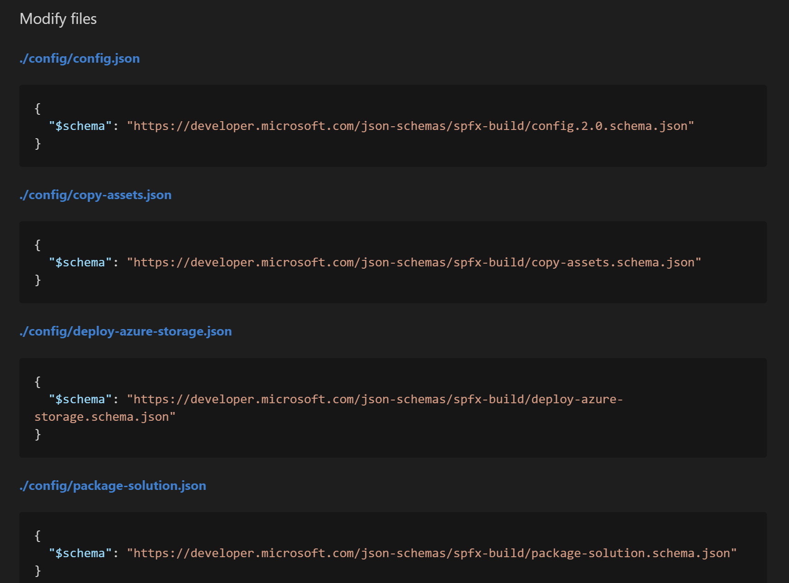

## Introduction

A week ago, Microsoft officially released the [SharePoint Framework Package v1.5](https://github.com/SharePoint/sp-dev-docs/wiki/Release-Notes-for-SharePoint-Framework-Package-v1.5), introducing new awesome features like the Developer Preview of [Dynamic Data](https://aka.ms/spfx15-dd) and the ability to create solutions with beta features by adding `–plusbeta` to the Yeoman command — among other features.

While it isn’t necessary to update your existing SPFx solutions, you may need to do so (let’s say, because you have an existing solution that needs a feature only available in SPFx 1.5, for example).

Unfortunately, the solution upgrade process between versions of SPFx is often painful.

Thankfully, there is an easy way to do this now!

This article explain a (mostly) pain-free to upgrade your SPFx solution. Waldek explains [this process in details](https://blog.mastykarz.nl/upgrade-sharepoint-framework-project-office-365-cli/), but this is a summary of how to do it.

## Office 365 CLI

Office 365 CLI is a cross-platform command-line interface (at least, that’s what I think CLI means… I hate acronyms) that allows you to do a lot of things with your Office 365 subscription, on pretty-much any operating system you want to do. (Find out more about [Office 365 CLI](https://aka.ms/o365cli)).

The Office 365 CLI version 1.4.0-beta version introduced a new **spfx project upgrade** function; It can be used to upgrade an SPFx project.

If you don’t have Office 365 CLI version 1.4.0-beta or above, you’ll need to install it first.  To do so, run the following command:

```sh
npm i -g @pnp/office365-cli@next
```


## Analyzing your project

The **spfx project upgrade** function does _not_ change your project — you’ll need to do this yourself; it analyzes your project and gives you a report telling you exactly what you need to do.


Sample upgrade report

To use it, follow these steps:

- From your command-line, change your current directory to the root of your SPFx project.
- Type the following command:

    ```sh
    o365 spfx project upgrade --output md > report.md
    ```


Once analysis is completed, open the **report.md** file that was created in your SPFx project folder.

## Upgrading your project

If you really want to all the required changes that the analysis found, you can read the report, but if you’re in a hurry, follow these steps:

- Back-up your project (do I really need to say this?)
- Scroll to the (almost) end of the **report.md** file and look for the **Summary** section.
- Copy the code block under the **Execute script** header and paste it into your console.

    

    The Summary Execute script section

- Next, find every file in the **Modify files** section and make the highlighted changes. **Pro tip:** the report provides a hyperlink to each file that you need to change. Just use **CTRL-Click** to open the file.

    

    The Modify files section

Note that you may have multiple updates to make to the same file, but the report will list each update as a separate entry.  The report also pretends that there is nothing else in the file than what it shows in the report. So, for example, if your `.yo-rc.json` file looks like this before the upgrade:

```json
{
    "@microsoft/generator-sharepoint": {
        "version": "1.4.1",
        "libraryName": "react-calendar-feed",
        "libraryId": "dd42aa00-b07d-48a2-8896-cc2f8c0d3fae",
        "environment": "spo"
     }
}
```

and the upgrade report tells you to update `.yo-rc.json` as follows:

```json
{
    "@microsoft/generator-sharepoint": {
        "version": "1.5.0"
    }
}
```

You’re really supposed to update the `.yo-rc.json` as follows (change highlighted in **bold**):

```json
{
    "@microsoft/generator-sharepoint": {
        "version": "1.5.0",
        "libraryName": "react-calendar-feed",
        "libraryId": "dd42aa00-b07d-48a2-8896-cc2f8c0d3fae",
        "environment": "spo"
     }
}
```

But the next sections in the report will include more changes to the .yo-rc.json file, which — when you’ve made all the changes — will look like this:

```json
{
    "@microsoft/generator-sharepoint": {
        "version": "1.5.0",
        "libraryName": "react-calendar-feed",
        "libraryId": "dd42aa00-b07d-48a2-8896-cc2f8c0d3fae",
        "environment": "spo",
        "isCreatingSolution": true,
        "packageManager": "npm",
        "componentType": "webpart"
     }
}
```

Once you’ve made all your changes, test your solution and (hopefully) it will work with SPFx 1.5!

# Conclusion

You shouldn’t need to upgrade your solution every single time Microsoft releases a new version of SPFx.

If you have to upgrade your solution, however, the Office 365 CLI **spfx upgrade project** command can save you a lot of time.

# For more information

This article is mostly a note to myself on how to upgrade an SPFx project. For the real deal, I encourage you to read Waldek’s [detailed article](https://blog.mastykarz.nl/upgrade-sharepoint-framework-project-office-365-cli/), from where I learned about the spfx project upgrade command. (Thanks Waldek for being awesome!)

To learn more about Office 365 CLI, go to [https://aka.ms/o365cli](https://aka.ms/o365cli)

To learn more about the cool new features available in SPFx 1.5, go to the [Release Notes for SharePoint Framework Package 1.5](https://github.com/SharePoint/sp-dev-docs/wiki/Release-Notes-for-SharePoint-Framework-Package-v1.5).

The solution I used in this article is my [React Calendar Feed](https://github.com/pnp/sp-dev-fx-webparts/tree/master/samples/react-calendar-feed) sample web part, available on the [SharePoint Framework Client-Side Web Part Samples & Tutorial Materials](https://github.com/pnp/sp-dev-fx-webparts).
