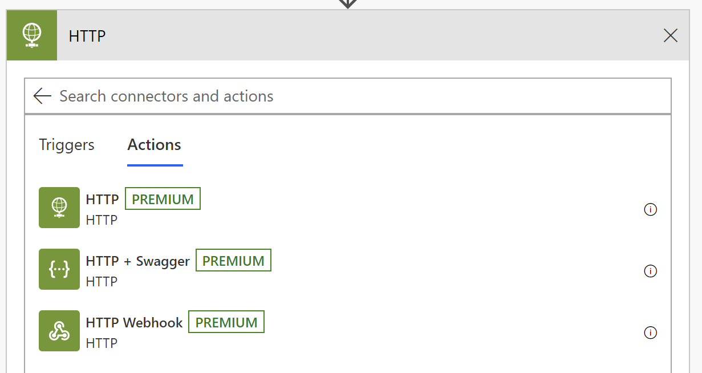
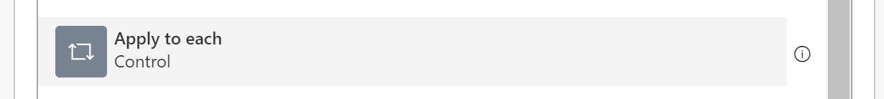
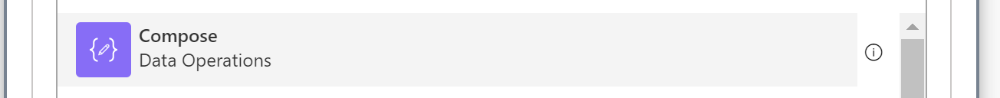
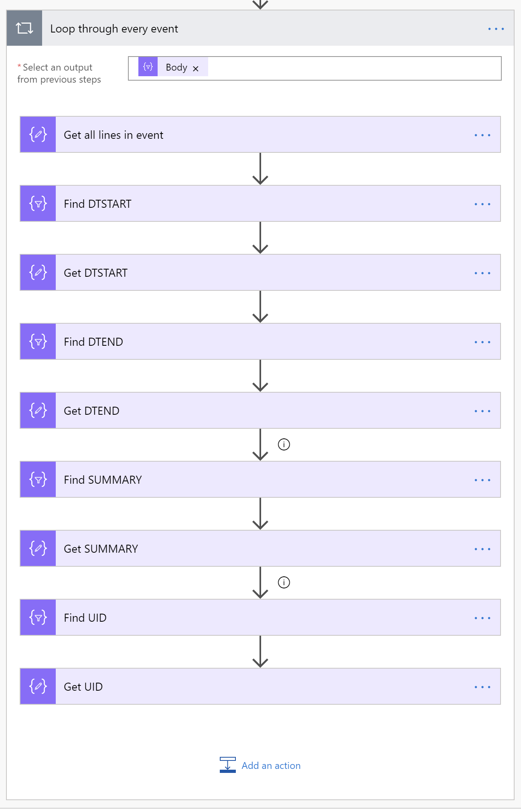

## Introduction

Let’s say you have public iCal feed and you want to access the events from within SharePoint Online.

You _could_ use the [sample web part](https://github.com/pnp/sp-dev-fx-webparts/tree/master/samples/react-calendar-feed) I created many months ago which allows you to display external event feeds from RSS, WordPress, Exchange, SharePoint and iCal. You’d get something that _looks_ like it exists in SharePoint.

But what if you wanted to use the events from that iCal feed within SharePoint as a lookup for another list. Or what if that iCal feed contained statutory holidays and you wanted to [skip scheduled Flows on those days](/2019/07/06/configuring-scheduled-flows-to-skip-holidays/)?

In such situations, you need to actually import the data into SharePoint so that you can use it. My web part sample won’t do!

Today, we’ll explain how to use Flow to import events daily from an iCal feed into a SharePoint list.

The idea for this post came from [an issue](https://github.com/pnp/sp-dev-fx-webparts/issues/909) that [Tejas](https://github.com/tejasthite) kindly submitted. Thanks for the inspiration!

## The problem with repetitive tasks

At first, I was very tempted to tweak my [React Calendar Feed](https://github.com/pnp/sp-dev-fx-webparts/tree/master/samples/react-calendar-feed) web part sample to display events _and_ automatically add events to a SharePoint event list. After all, I was already parsing the iCal feeds in my code, so couldn’t I just add the events that were not already in the list?

The problem with this idea is that it would require someone with sufficient permissions to add events to that event list to load that web part once a day — or at least regularly enough to make sure the iCal events and the list were in sync.

Bad idea.

Any time you require someone to do a manual step regularly to keep a system going is not sustainable. It’s like that countdown timer in the TV show **Lost** that required someone to enter a sequence of numbers or the world would end.


The countdown clock from Lost — I don’t need that kind of responsibility!

It’s what we called on a project I worked on "Death by a thousand cuts". It may not seem like a big deal to ask someone to do something every _x_ days to keep a system going, but those little temporary solutions you take on eventually accumulate to a point where you need a person whose job is just to do those little things. It isn’t a job that’s very fulfilling for anyone.

Might as well use Homer Simpson’s "stupid bird" to push a button every once in a while.


Homer’s stupid bird

So, the lazy approach wouldn’t work for me this time.

What could I use? A timer job on a server? Nah, I want a server-less solution.

How about a scheduled Azure web job? No, I want a no-code solution. Or at least _low-code_.

If only there was a way to schedule workflows to run regularly that wouldn’t require any code…

## Scheduled flows to the rescue

Thankfully, Microsoft Flow allows you to create scheduled flows. We already discussed using schedule flows in a [previous post](/2019/07/06/configuring-scheduled-flows-to-skip-holidays/), so I know with certainty that it will work.


I configured my flow to run every day. That’s probably an overkill depending on how often your iCal feed gets updated, so feel free to adjust accordingly:


Now here’s the problem: Flow does not have a way to parse iCal feeds. I looked everywhere for a ready-to-use "import iCal" connector, but couldn’t find any. As it turns out, [I’m not the only one who wants this](https://powerusers.microsoft.com/t5/Flow-Ideas/Automatically-create-appointment-in-calendar-from-an-attachment/idi-p/57078).

> **Note to Microsoft:** if you accept open source contributions for connectors, let me know and I’ll gladly submit an iCal connector.

But iCal feeds are really just text files with a [very specific structure](https://www.kanzaki.com/docs/ical/). Could we not just use the Flow **HTTP** connector and retrieve the feed as a simple string of text and parse it?



> **Note:** Unfortunately, HTTP is a Premium connector in Flow… but [you get so much more with Flow Premium](https://canada.flow.microsoft.com/en-us/connectors/?filter=&category=premium) that it is worth it! Trust me!

This is how I configured my HTTP connector to retrieve my iCal feed:


## Parsing the results to get a list of events

I configured an HTTP connector to do an HTTP **GET** with a public iCal feed. I used [CalendarLabs.com](https://www.calendarlabs.com/ical-calendar)‘s [Canadian Holidays](https://www.calendarlabs.com/ical-calendar/ics/39/Canada_Holidays.ics) sample, but they have many other great sample calendar feeds.

And it worked. The response wasn’t pretty, but it worked!

Here is an example of what I got. The full list is a lot longer, but you get the idea.

```
BEGIN:VCALENDAR
PRODID:fd29_Array_canada_country_holidays@calendarlabs.com
VERSION:2.0
CALSCALE:GREGORIAN
METHOD:PUBLISH
X-WR-CALNAME:Canada Holidays
X-WR-TIMEZONE:America/New_York
BEGIN:VEVENT
DTSTART;VALUE=DATE:20180101
DTEND;VALUE=DATE:20180102
DTSTAMP:20111213T124028Z
UID:5c60f18d0973d@calendarlabs.com
CREATED:20111213T123901Z
DESCRIPTION:Visit https://calendarlabs.com/holidays/us/new-years-day.php to know more about New Year's Day. 
 Like us on Facebook: http://fb.com/calendarlabs to get updates.
LAST-MODIFIED:20111213T123901Z
LOCATION:Canada
SEQUENCE:0
STATUS:CONFIRMED
SUMMARY:New Year's Day
TRANSP:TRANSPARENT
END:VEVENT
BEGIN:VEVENT
DTSTART;VALUE=DATE:20180212
DTEND;VALUE=DATE:20180213
DTSTAMP:20111213T124028Z
UID:5c60f18d09784@calendarlabs.com
CREATED:20111213T123901Z
DESCRIPTION:Visit https://calendarlabs.com/holidays/canada/family-day.php to know more about Family Day (BC). 
 Like us on Facebook: http://fb.com/calendarlabs to get updates.
LAST-MODIFIED:20111213T123901Z
LOCATION:Canada
SEQUENCE:0
STATUS:CONFIRMED
SUMMARY:Family Day (BC)
TRANSP:TRANSPARENT
END:VEVENT
```

As you can see, iCal feeds use lines as a delimiter for each field. Every new event start with `BEGIN:VEVENT` on a new line.

So I used the **Initialize variable** to create an array variable which would contain every event in the feed. I called the variable **Events**.


For the initial value of the variable, I used the `split()` function, and I specified that it should create a new array element every time it found a `BEGIN:VEVENT`.

Some iCal feeds that I tested also had extra newline characters, so I took the opportunity to remove those while I was parsing the feed, by using the `replace()` function to replace all `\\n` with nothing (`''`) as follows:

```
split(replace(body('Get_events_from_iCal'), '\\n', ''), 'BEGIN:VEVENT')
```


The problem is that the `split()` function just blindly creates array elements wherever it finds the delimiter you specify. It doesn’t care what comes before or after the delimiter.

For example, my sample feed contains 8 lines before the first event, meaning that this text:

```
BEGIN:VCALENDAR
PRODID:fd29_Array_canada_country_holidays@calendarlabs.com
VERSION:2.0
CALSCALE:GREGORIAN
METHOD:PUBLISH
X-WR-CALNAME:Canada Holidays
X-WR-TIMEZONE:America/New_York
BEGIN:VEVENT
DTSTART;VALUE=DATE:20180101
DTEND;VALUE=DATE:20180102
DTSTAMP:20111213T124028Z
UID:5c60f18d0973d@calendarlabs.com
CREATED:20111213T123901Z
DESCRIPTION:Visit https://calendarlabs.com/holidays/us/new-years-day.php to know more about New Year's Day. 
 Like us on Facebook: http://fb.com/calendarlabs to get updates.
LAST-MODIFIED:20111213T123901Z
LOCATION:Canada
SEQUENCE:0
STATUS:CONFIRMED
SUMMARY:New Year's Day
TRANSP:TRANSPARENT
END:VEVENT
BEGIN:VEVENT
DTSTART;VALUE=DATE:20180212
DTEND;VALUE=DATE:20180213
DTSTAMP:20111213T124028Z
UID:5c60f18d09784@calendarlabs.com
CREATED:20111213T123901Z
DESCRIPTION:Visit https://calendarlabs.com/holidays/canada/family-day.php to know more about Family Day (BC). 
 Like us on Facebook: http://fb.com/calendarlabs to get updates.
LAST-MODIFIED:20111213T123901Z
LOCATION:Canada
SEQUENCE:0
STATUS:CONFIRMED
SUMMARY:Family Day (BC)
TRANSP:TRANSPARENT
END:VEVENT
```

When the text is split where `BEGIN:VEVENT` is found, I get the following array:

```
[ "BEGIN:VCALENDAR\nPRODID:fd29_Array_canada_country_holidays@calendarlabs.com\nVERSION:2.0\nCALSCALE:GREGORIAN\nMETHOD:PUBLISH\nX-WR-CALNAME:Canada Holidays\nX-WR-TIMEZONE:America/New_York\n",

"\nDTSTART;VALUE=DATE:20180101\nDTEND;VALUE=DATE:20180102\nDTSTAMP:20111213T124028Z\nUID:5c60f18d0973d@calendarlabs.com\nCREATED:20111213T123901Z\nDESCRIPTION:Visit https://calendarlabs.com/holidays/us/new-years-day.php to know more about New Year's Day. \n Like us on Facebook: http://fb.com/calendarlabs to get updates.\nLAST-MODIFIED:20111213T123901Z\nLOCATION:Canada\nSEQUENCE:0\nSTATUS:CONFIRMED\nSUMMARY:New Year's Day\nTRANSP:TRANSPARENT\nEND:VEVENT\n",

"\nDTSTART;VALUE=DATE:20180212\nDTEND;VALUE=DATE:20180213\nDTSTAMP:20111213T124028Z\nUID:5c60f18d09784@calendarlabs.com\nCREATED:20111213T123901Z\nDESCRIPTION:Visit https://calendarlabs.com/holidays/canada/family-day.php to know more about Family Day (BC). \n Like us on Facebook: http://fb.com/calendarlabs to get updates.\nLAST-MODIFIED:20111213T123901Z\nLOCATION:Canada\nSEQUENCE:0\nSTATUS:CONFIRMED\nSUMMARY:Family Day (BC)\nTRANSP:TRANSPARENT\nEND:VEVENT\n",
...
]
```

Notice that the first array element is different than the others. It contains information about the calendar feed, which we don’t care about for our needs.

To remove anything that isn’t an event, I simply used the **Filter** action and kept only array elements that do not start with `BEGIN`:


(I could have filtered for events that start with `DTSTART`, but I didn’t want to have to deal with the funny `\n` character at the start of every element)

This is the array the filter action returned:

```
[
"\nDTSTART;VALUE=DATE:20180101\nDTEND;VALUE=DATE:20180102\nDTSTAMP:20111213T124028Z\nUID:5c60f18d0973d@calendarlabs.com\nCREATED:20111213T123901Z\nDESCRIPTION:Visit https://calendarlabs.com/holidays/us/new-years-day.php to know more about New Year's Day. \n Like us on Facebook: http://fb.com/calendarlabs to get updates.\nLAST-MODIFIED:20111213T123901Z\nLOCATION:Canada\nSEQUENCE:0\nSTATUS:CONFIRMED\nSUMMARY:New Year's Day\nTRANSP:TRANSPARENT\nEND:VEVENT\n",

"\nDTSTART;VALUE=DATE:20180212\nDTEND;VALUE=DATE:20180213\nDTSTAMP:20111213T124028Z\nUID:5c60f18d09784@calendarlabs.com\nCREATED:20111213T123901Z\nDESCRIPTION:Visit https://calendarlabs.com/holidays/canada/family-day.php to know more about Family Day (BC). \n Like us on Facebook: http://fb.com/calendarlabs to get updates.\nLAST-MODIFIED:20111213T123901Z\nLOCATION:Canada\nSEQUENCE:0\nSTATUS:CONFIRMED\nSUMMARY:Family Day (BC)\nTRANSP:TRANSPARENT\nEND:VEVENT\n",

"\nDTSTART;VALUE=DATE:20180214\nDTEND;VALUE=DATE:20180215\nDTSTAMP:20111213T124028Z\nUID:5c60f18d097c3@calendarlabs.com\nCREATED:20111213T123901Z\nDESCRIPTION:Visit https://calendarlabs.com/holidays/us/valentines-day.php to know more about Valentine's Day. \n Like us on Facebook: http://fb.com/calendarlabs to get updates.\nLAST-MODIFIED:20111213T123901Z\nLOCATION:Canada\nSEQUENCE:0\nSTATUS:CONFIRMED\nSUMMARY:Valentine's Day\nTRANSP:TRANSPARENT\nEND:VEVENT\n",
...
]
```

Now all I needed to do was to loop through every event and parse the values…

## Processing each event

So far, I have a scheduled flow which retrieves an iCal feed, splits the text into an array of events, and filters out things that aren’t events.

To process every item in the array of events, I just used the **Apply for each** action:



When it asked me what I wanted to loop through, I specified the **Body** of the **filter** action from before.  


Now that I have the flow looping through every event, I need to split the event into individual lines, using the `split()` function, like before.

Except that this time, instead of storing the array of lines in a variable, I use the **Compose** action to temporarily build my array.



The only problem is, I found it very difficult to write a `split()` function to divide by the newline character. Luckily, someone who is way smarter than I am (**tre4B**) came up with [a solution](https://powerusers.microsoft.com/t5/Building-Flows/How-can-you-enter-a-Newline-into-a-string/td-p/102447).

tre4B’s solution is to temporarily define a JSON object which defines the newline character as a JSON element, and use that JSON element, as follows:

```
json('{"NL":"\n"}')?['NL']
```

I must admit, it’s almost like voodoo to me, but it works.

So, to split every event into individual lines, I used:

```
json('{"NL":"\n"}')?['NL']
```

If your feed uses both a newline and a carriage return, you would use this instead:

```
split(item(), json('{"NL":"\r\n"}')?['NL'])
```


Now, every event returns an array of lines that look like this:

```
[
  "",
  "DTSTART;VALUE=DATE:20180101",
  "DTEND;VALUE=DATE:20180102",
  "DTSTAMP:20111213T124028Z",
  "UID:5c60f18d0973d@calendarlabs.com",
  "CREATED:20111213T123901Z",
  "DESCRIPTION:Visit https://calendarlabs.com/holidays/us/new-years-day.php to know more about New Year's Day. ",
  " Like us on Facebook: http://fb.com/calendarlabs to get updates.",
  "LAST-MODIFIED:20111213T123901Z",
  "LOCATION:Canada",
  "SEQUENCE:0",
  "STATUS:CONFIRMED",
  "SUMMARY:New Year's Day",
  "TRANSP:TRANSPARENT",
  "END:VEVENT",
  ""
]
```

Once I have every line as an array element, I can just use the same `filter()` technique I used before to find each line for the **Start Date**, **End Date**, **Summary** and anything else I need.

For example, to find the **Start Date**, I find the line which starts with `DTSTART`:


And to get the date value, I use the `replace()` function to remove everything before the date, which looks like this:

```
replace(first(body('Find_DTSTART')), 'DTSTART;VALUE=DATE:', '')
```

All that’s left is a string that represents the date. I won’t bother converting the string to a date because SharePoint will expect a very specific date format later anyway.

I just repeat the same thing with `DTEND` for the **End Date** and `SUMMARY` for the event title.

Also, I’ll retrieve every event’s `UID` which is a unique identifier that I’ll be able to use later to verify if the event has already been created in SharePoint.

Once completed, my event parsing looks like this:



It looks like it’s a lot of work, but thanks to Flow’s new **clipboard** functionality, it was able to copy and paste the **Find DTSTART** and **Get DTSTART** actions for the `DTEND`, `SUMMARY` and `UID`.

Easy!

## To be continued

Sorry if this post was long (and probably boring). We had a lot of stuff to cover, and we’re not finished yet!

So far, we have created a scheduled workflow which reads an iCal feed and parses each event to retrieve their individual attributes.

I should point out that my approach isn’t the only way to do this, I’m sure. This is the way _I_ did it. For example, instead of using `replace()`, I could have used the `substring()` function to extract the parts of the strings I wanted, but I prefer `replace()` because it makes it easier to read what the function is doing. Feel free to use whichever approach you like.

Tomorrow, we’ll use the same technique [we used before](/2019/07/06/configuring-scheduled-flows-to-skip-holidays/) to see if every event exists in a SharePoint list. If it doesn’t, we’ll create it.

I’ll also share the [step by step instructions](/2019/08/22/using-flow-to-synchronize-an-ical-feed-to-a-sharepoint-event-list-part-ii/) tomorrow.

I hope you’ll come back tomorrow for [the second part](/2019/08/22/using-flow-to-synchronize-an-ical-feed-to-a-sharepoint-event-list-part-ii/)!

## Photo credit

Image by [Karolina Grabowska](https://pixabay.com/users/kaboompics-1013994/?utm_source=link-attribution&utm_medium=referral&utm_campaign=image&utm_content=791939) from [Pixabay](https://pixabay.com/?utm_source=link-attribution&utm_medium=referral&utm_campaign=image&utm_content=791939)
