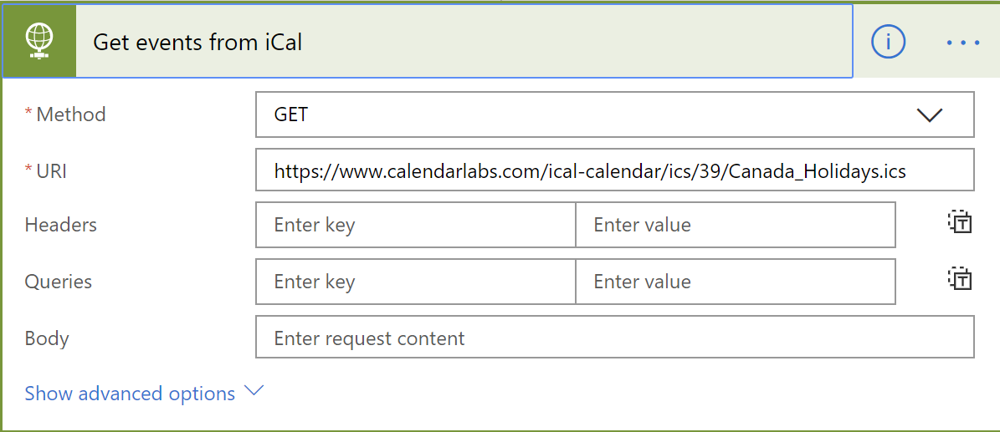
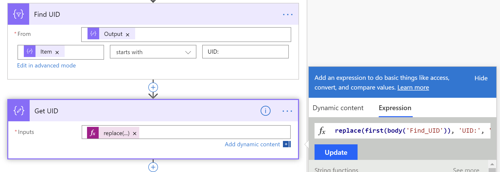

## Introduction

In my [previous post](/2019/08/21/using-flow-to-synchronize-an-ical-feed-to-a-sharepoint-event-list-part-i/) I showed how you can use Flow to trigger a scheduled flow and retrieve an iCal feed over HTTP.

I also spent a bit of time explaining how to parse the text returned from the iCal feed into individual events and extract the information required to be able to import and synchronize the events in a SharePoint list. I mostly covered at a high-level and didn’t give you detailed steps — which is a good thing, because the article was already pretty long!

In today’s post, we’ll set up a SharePoint list and walk you through how to implement the flow, step-by-step.

Let’s get going!

## Setting up a SharePoint list

To synchronize an iCal feed to SharePoint, we need two things:

- A feed
- A SharePoint list

And we’ll need a flow to combine the two.

For the feed, I’ll use one of [CalendarLabs.com](https://www.calendarlabs.com/ical-calendar)‘s iCal feeds. Being Canadian, I’ll use the [Canadian Holidays feed](https://www.calendarlabs.com/ical-calendar/ics/39/Canada_Holidays.ics), but feel free to use the [US Holidays](https://www.calendarlabs.com/ical-calendar/ics/76/US_Holidays.ics) or [any other that suits you](https://www.calendarlabs.com/ical-calendar/popular/). (Make sure that you get the URL from the **Download** button). I have to admit that I only learned about CalendarLabs.com when I was researching this post, but I’ll definitely be recommending it to everyone!

There are all sorts of useful iCal feeds out there. For example, if your company uses [People HR](https://www.peoplehr.com/) to for your HR software, you can get an iCal feed of employee vacations directly from People HR and synchronize with a list called **Staff Calendar**.

Let’s assume you have found an iCal feed you want to sync and you tested it to make sure it returns something.

For the SharePoint list, we’ll create one. Since the iCal feed I’m using is a list of Statutory Holidays, I’ll call my new list **Statutory Holidays** (I know, right? How do I come up with this stuff?!)

To create the list, follow these steps:

1. From a SharePoint site of your choice, go to **Settings** then **Site contents**
2. From the **Site contents** page, select **\+ New** and pick **App**. We use **App** instead of **List** because we want to create an events list, not a regular list.
3. From the **Site contents > Your Apps** page, pick **Calendar**
4. From the **Adding calendar** dialog, in the **Name** field, enter **Statutory Holidays** (or whichever name you picked for your event list, I’m flexible!) then select **Create**.

Your list should automatically get created. Now we need to add one more field called **UID** to keep track of the unique identifiers for each event. The UIDs are provided by the iCal feed.

To add the column, follow these steps:

1. From the list you just created, go to **List settings**
2. In the **Settings** page, in the **Columns** section, select **Create column**.
3. In the **Settings > Create column** page, type **UID** for the **Column name**.
4. Un-check **Add to default view**, but leave everything else. We just want a simple text column to store the unique identifier, no need to get fancy.
5. Select **Ok** to create the column.
6. If you want, you can remove the columns that you won’t use, but for the sake of brevity, I’ll leave the existing fields as it.

## To set up the Flow

Yesterday, I briefly touched how I build the flow to extract the data. Today, we’ll do it step-by-step, starting with these steps:

1. Log-in to **[https://flow.microsoft.com](https://flow.microsoft.com/)**
2. From the left navigation, select **\+ Create**
3. From the **Start from blank** section, select **Scheduled flow**
4. In the **Build a scheduled flow** dialog, pick a **Flow name** — something like **Sync Statutory Holidays from iCal Feed**
5. Under **Run this flow**, pick a **Starting** time that suits you, and select how often you want to repeat the flow. I picked **1** **day** under **Repeat every**.
6. Select **Create**.  
    

## To retrieve the iCal feed

Once your flow is created, follow these steps:

1. Select the **\+ New step** from the flow editor and type **HTTP** in the **Choose an action** window
2. From the list of **Actions**, select **HTTP**
3. Rename the new action you added to **Get events from iCal**
4. In the HTTP action’s details, set the **Method** to **GET**, and put your iCal feed’s URL in the **URI** field.
5. Leave everything else as is.  
    

Try your flow by using the **Test** button in the upper right corner. Your **Get events from iCal** should return events. If it doesn’t, check the URL.

## To get the list of events

1. Select the **\+ New step** and type **Initialize** in the **Choose an action** window.
2. From the list of **Actions**, select **Initialize variable**
3. Rename your new action to **Get list of events**
4. In the initialize action’s details, set the **Name** to **Events**, the **Type** to **Array** and the **Value** to:

    ```powerfx
    split(replace(body('Get_events_from_iCal'), '\\n', ''), 'BEGIN:VEVENT')
    ```

    

This will split the iCal feed into an array of events where `BEGIN:VEVENT` can be found.

## To filter array elements that aren’t events

1. Select the **\+ New step** and type **Filter** in the **Choose an action** window
2. From the list of **Actions**, select **Filter array**
3. Rename the new action to **Remove rows that are not events**
4. In the **From** field, select the **Events** variable using the **Dynamic content**
5. Below the **From** field, select **Edit in advanced mode** and type:

    ```
    @not(startsWith(item(), 'BEGIN'))
    ```


This will keep only array items that don’t start with `BEGIN`, thus removing all the iCal header information and leaving you with only events.

## To create a loop to process all events

1. Select the **\+ New step** button and type **apply to each** in the **Choose an action** window.
2. From the list of **Actions**, select **Apply to each**
3. Rename your action **Loop through every event**
4. In the **Select an output from previous steps** field, select the **Body** of **Remove rows that are not events** in the **Dynamic content** picker.

This will create a loop for every event in the array.


## To split every event into lines

1. Within the **Loop through every event** loop, select **Add an action**
2. In the **Choose an action** window, type **compose**
3. From the list of **Actions**, select **Compose**
4. Rename your new action **Get all lines in event**
5. In the **Input** field, you’ll want to use:

    ```
    split(item(), json('{"NL":"\n"}')?['NL'])
    ```


Now, all we need to do is extract the data from every relevant line

## To get the Start Date

1. Still within the loop, select **Add an action** and type **Filter** in the **Choose an action** window
2. From the list of **Actions**, select **Filter**
3. Rename the new action **Find DTSTART**
4. In the **Inputs** field’s **Expression** tab, type:

    ```
    @startsWith(item(), 'DTSTART')
    ```

5. Add another action using **Add an action** and type **Compose**
6. From the list of actions, select **Compose**
7. Rename the action to **Get DTSTART**
8. In the **Inputs** field, type the following expression:

    ```
    replace(first(body('Find_DTSTART')), 'DTSTART;VALUE=DATE:', '')
    ```


## To get the End Date

Repeat the same steps as above except that you should call the **Filter** action **Find DTEND** and use the following expression:

```
@startsWith(item(), 'DTEND;VALUE=')
```

And in the **Compose** action, call it **Get DTEND** and use the following expression

```
replace(first(body('Find_DTEND')), 'DTEND;VALUE=DATE:', '')
```


## To get the Summary

You guessed it, repeat same as above, but name the **Filter** action **Find SUMMARY** and use the following expression:

```
@startsWith(item(), 'SUMMARY:')
```

And set your **Compose** action to **Get SUMMARY** and use this expression:

```
replace(first(body('Find_SUMMARY')), 'SUMMARY:', '')
```


## To get the Unique Identifier

One last time! Repeat same as above, but name the **Filter** action **Find UID** and use the following expression:

```
@startsWith(item(), 'UID:')
```

And set your **Compose** action to **Get UID** and use this expression:

```
replace(first(body('Find_UID')), 'UID:', '')
```



Now you have all the properties we need. You should test your flow to make sure everything works.


Note that if your iCal feed has different fields that you need, you may need to adjust your actions above. For example, some feeds will return `DATE-TIME` and `DATE` events, so you may want to add a little condition up there to deal with such events. To keep things simple, we won’t do that here.

## To verify if the event is already in SharePoint

1. Still within the loop, select **Add an action** and type **SharePoint** in the **Choose an action** window
2. From the list of **Actions**, select **Get items**
3. In the **Site Address** field, type your site’s URL
4. From the **List Name** pick **Statutory Holidays**.
5. Under **Filter Query** type `UID eq '` then select the **Output** from **Get UID** in the **Dynamic content** window.
6. Add `'` to close the filter query
7. Under **Top Count**, enter **1**. We only care if there is already an event with a matching UID, so returning only **1** will do for us.


If you test your flow now, every **Get Items** action should return the following:

```
{
[]
}
```

Because there are no events to retrieve. Let’s fix that.

## To create a list item if there are no matches found

1. Still within the loop, select **Add an action** and type **Condition** in the **Choose an action** window

2. From the list of **Actions**, select **Condition**

3. Rename the condition **Any existing events found**

4. In the expression below type:

    ```powerfx
    length(body('Get_items')?['value'])
    ```

5. Select by **is greater than** in the next field

6. In the next field, type **0**

7. This will cause the condition to go to **If yes** when there is an existing event, and **If no** if there isn’t an existing event. We’ll only worry about **If no** for now, but you could always update the existing item in the **If yes** side if you wanted to. Just no today, ok?

8. In the **If no** site, select **Add an action**

9. In the **Choose an action** field, type **Create item**

10. In the **Actions** list, select **Create item** from **SharePoint**

11. In the **Create item** dialog, type your **Site Address** and pick **Statutory Holidays** from the **List Name**

12. In the **Title** field, bind to the **Output** from **Get SUMMARY**

13. We’ll skip the **Start Time** and **End Time** for now. In the **UID** field, set it to the **Output** of the **Get UID** action.

14. For the **Start Time**, we’ll need to do some surgery because SharePoint expects the value to be formatted as `yyyy-MM-ddThh:mm:ss`. To do this, we’ll use `substring()` to extract the year, month, and day from the event’s date but using the following expression:

    ```
    concat(substring(outputs('Get_DTSTART'),0,4),'-',substring(outputs('Get_DTSTART'),4,2),'-',substring(body('Get_DTSTART'),6,2),'T00:00:00-00:00')
    ```

    Which essentially combines the first 4 characters of the **Start Date** with a `-`, followed by the next 2 characters of **Start Date**, followed by another `-`, and the last two characters of **Start Date**, followed by `T00:00:00` to set the time to midnight. If your iCal returns `DATE-TIME` values, you’ll also want to parse the time element instead of setting it to `00:00:00`.  
    The last part `-00:00` is for the timezone. If you find that your events are coming in at the wrong time, you can adjust the time zone accordingly (e.g.: `+01:00` or `-01:00`).

15. Repeat the same formula for **End Time**, except that you should use `GET_DTEND` instead of `GET_DTSTART`.


Test your workflow, and you should have a whole bunch of new events! Then try again, and you should not get more events until the iCal feed adds a new event.

## Conclusion

(Sigh of relief!) That was a long post!

This post showed you how to get an iCal feed in Flow and import events from that feed into a SharePoint list.

You can use a similar approach for other types of feeds.

There are a few more opportunities to improve the resiliency of this flow, and to deal with all-day events that span over two days when they should really last one day… but that’ll have to be for another post.

I hope this helped?

## Photo credit

Image by [Free-Photos](https://pixabay.com/users/Free-Photos-242387/?utm_source=link-attribution&utm_medium=referral&utm_campaign=image&utm_content=828611) from [Pixabay](https://pixabay.com/?utm_source=link-attribution&utm_medium=referral&utm_campaign=image&utm_content=828611)
