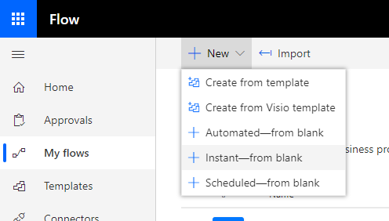
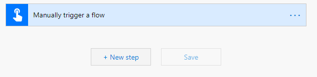
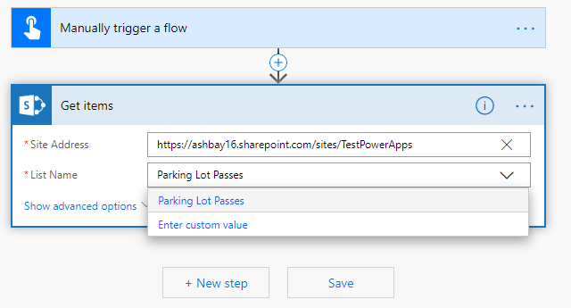
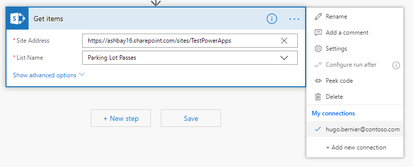
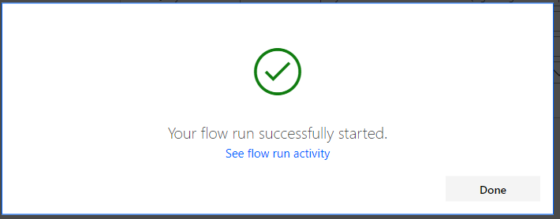
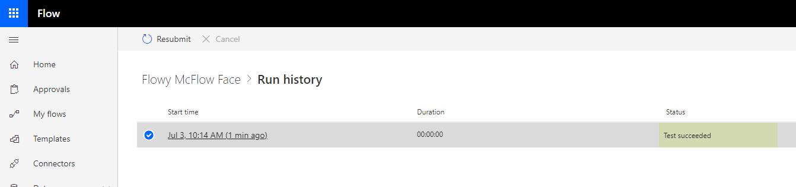
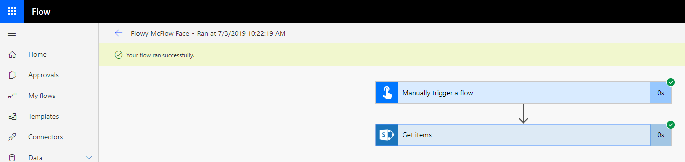
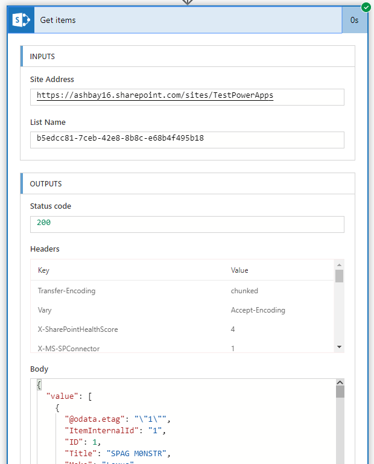
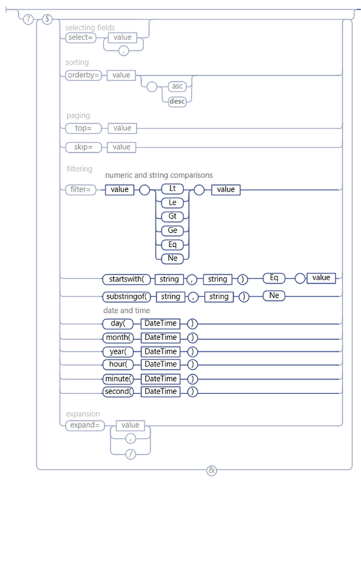

## Introduction

I love Flow (and Logic Apps)!

Favourite thing to do with Flow is doing demos and workshops!

When I meet a new customer who tells me they have a business problem, I love to put together a quick proof of concept how to solve their business problem using a no-code solution, involving SharePoint, PowerApps, and Flow — right there, in front of them, while projecting. No safety nets, PowerPoint or scripted demos.

The [SharePoint connector](https://docs.microsoft.com/en-us/connectors/sharepointonline) is by far my most frequently-used connector, because it allows me to quickly query, create, and update content in SharePoint as part of my solutions.

Even if I have used this connector many times, I sometimes get _demo blindness_ and I forget how to use it when I’m in the middle of a demo.

This article explains how to use the SharePoint connector and the [GetItems action](https://docs.microsoft.com/en-us/connectors/sharepointonline/#get-items) to retrieve items from a SharePoint list.

Hopefully, next time I forget how to use it in the middle of a demo, this article will show up in the search results.

> **NOTE:** This article focuses on Microsoft Flow, but you can use the connector in Logic Apps in (almost) the same way, and PowerApps with [these instructions](https://powerapps.microsoft.com/tutorials/connection-sharepoint-online/).

## Creating a Test Flow

For this article, we’ll assume you want to connect to SharePoint to get one or more items in a list from within an existing Flow.

If you already have an existing flow you can use to follow along, go ahead and skip to the next section.

If you don’t have an existing flow, let’s create a Flow that you can manually trigger by following these steps:

1. From [https://flow.microsoft.com](https://flow.microsoft.com/), navigate to **My Flows**.
2. Select **New** then **Instant — from blank** to create a flow that we’ll be able to trigger at any time to test. Feel free to use any other type of flow here.  
    
3. In the **Build an instant flow** dialog, enter a **Flow name** and select **From Microsoft Flow** when prompted **Choose how to trigger this flow** and select **Create**.  
    

Your new flow will be created. Note that you need to insert at least one step before you can save or test it.

Good thing that’s what we’re doing next!

## Adding a SharePoint connection

Before we can access SharePoint items, we need to add a connection to SharePoint by following these steps:

1. From within your flow editor, select **+New step** at the bottom of the flow. You can also click on the **+** button that appears between two existing flow steps.  
    
2. In the **Choose an action** prompt, type **Get items** in the **Search connectors and actions**. Search is case insensitive.  
    
3. Select the **Get items** action with a SharePoint logo from the list of **Actions** that appears. If the search query returns too many actions and you can’t find the SharePoint **Get items**, you can filter out all other connectors by clicking on **SharePoint** just below the search bar.
4. As soon as you select **Get items**, the **Choose an action** box will transform into the **Get items** box.
5. If you haven’t created a connection to SharePoint yet, you’ll be prompted to **Sign in to create a connection to SharePoint**. Click **Sign in** to sign in with the account that you wish to use to access SharePoint. If your instance of SharePoint is on-prem, you can check **Connect via on-premises data gateway** — but that’s for another post.  
    

    > The account you use here specifies who will access SharePoint. Make sure that you use an account that can see the site and the list where you want to get items from. It is a good idea to use a _service account_ that isn’t using your own credentials to connect.

6. Once connected, enter URL to the site that contains your list under **Site address**. If you experience problems typing or pasting the URL, try selecting **Enter a custom value** from the drop-down; it will turn the drop-down box into a text box.  
    
7. If the site URL you entered is valid and the credentials you supplied are correct, you should be able to pick the list you want to use from the **List Name** drop down. In my example, I only have one list called **Parking Lot Passes**.  
    

    > If you get a GUID in your **List Name** instead of a friendly name, make sure that the connection you’re using has permissions to access the list. You can change the connection by selecting the elipsis (\*\*\*) at the top of the **Get items** box and using the **My connections** section to change or add a new connection.  
    > 

Let’s test it!

1. Select **Test** from the top toolbar. If it is disabled, you may need to **Save** it first.  
    
2. From the **Test Flow** pane, select **I’ll perform the trigger action** and select **Save & Test**.  
    
3. The **Run Flow** dialog will prompt you to confirm the conneciton information. Make sure everything is correct and select **Continue**  
    
4. Once you confirmed the connection, you’ll get prompted _again_. It usually only happens the first time you create or change a connection. Select **Run flow**.  
    
5. If everything went well, you should see **Your flow run successfully started**. Select **See flow run activity** to see if everything went well.  
    .
6. You’ll get a **Run history** for your flow, usually sorted by newest at the top. Select the top (and most likely only) one by clicking on the start time.  
    
7. From your flow history page, you should see green checkmarks next to every step in your workflow. If you get a red **x**, check your connection information.  
    
8. Click on the **Get items** action to see what SharePoint returned. You want to see a **200** **Status code**, and a **Body** that returns `value` items.  
    

You now have a connection to your SharePoint list. Now let’s add a filter to get only the items you _want_ from the list.

## Building an ODATA filter

For this article, I’ll use a list I had created for a Park Pass request application. It has a **Text** column called **Make**, a **Person** column called **RequestedBy**, and **Date and Time** columns called **From** and **To**. You can use whatever list you want in your workflow.

> **Pro Tip:** when creating a column that has a space (or any other funny characters) in the name, create the column without the space first, then rename it with a space. That way, you’ll avoid funny column names like **Requested**x20**By**. In my example the **Requested By**, was created as **RequestedBy** (no spaces) first, then renamed it to **Requested By**.

The Get Items action allows you to specify an ODATA filter query to filter returned items from a list. To specify a filter, select **Show advanced options** from the **Get items** action.

If you aren’t familiar with ODATA filters, you can read the article about [using ODATA query operations in SharePoint REST requests](https://docs.microsoft.com/en-us/sharepoint/dev/sp-add-ins/use-odata-query-operations-in-sharepoint-rest-requests), or read below to find how I build my ODATA filters.

In most cases, you can write your query as `[columnname] [operator] [value]`. Where `[operator]` is one of the following keywords:

* `Lt`: Less than
* `Le`: Less than or equal to
* `Gt`: Greater than
* `Ge`: Greater than or equal to
* `Eq`: Equal to
* `Ne`: Not equal to

For example, to retrieve all cars where the **Make** is **Canyon Arrow**, you would write:

    Make eq 'Canyon Arrow`

If you wanted to retrieve any **Make** _but_ the **Canyon Arrow**, you would write:

    Make ne 'Canyon Arrow`

If you can’t figure out why your ODATA filter doesn’t work, here is a mostly foolproof way to build your ODATA filter:

1. Using your browser, navigate to: `[https://[yourtenant].sharepoint.com/sites/%5Byoursite%5D/_api/lists/getbytitle('%5BYour](https://yourtenant/sites/%5Byoursite%5D/_api/lists/getbytitle('%5BYour) list title'])`. For example, my if my tenant is **ashbay16**, my site is **TestPowerApps** and my list is titled **Parking Lot Passes**, my URL would be:  
    [https://\*\*ashbay16\*\*.sharepoint.com/sites/\*\*TestPowerApps\*\*/\_api/lists/getbytitle(‘\*\*Parking%20Lot%20Passes](https://**ashbay16**.sharepoint.com/sites/**TestPowerApps**/_api/lists/getbytitle('**Parking%20Lot%20Passes)\*\*’).
2. If you entered the right URL, you should see information about the list in XML format.
3. Add `/fields` at the end of the URL you created in step 1 to get all the fields names in your list. For example, my URL is now [https://ashbay16.sharepoint.com/sites/TestPowerApps/\_api/lists/getbytitle(‘Parking%20Lot%20Passes’)/fields](https://ashbay16.sharepoint.com/sites/TestPowerApps/_api/lists/getbytitle('Parking%20Lot%20Passes')/fields)
4. You may want to use an XML editor (like Visual Studio Code) to view the XML results from the previous step. Find the field you want to filter on by searching the XML file for the field title.
5. While you’re looking at the XML definition for the field, take a look at the **d:Filterable** node to see if it is filterable (it should be `true`). Also, take a look at the **d:TypeAsString** node to see what type of field you’re dealing with. Finally, look at **d:EntityPropertyName** — that’ll be how you refer to that field in your filter. For example, to filter by **Approval Status**, you would use **OData\_\_ModerationStatus**. Note that the column names are case sensitive.
6. Look at the ODATA query syntax chart below to see what possible filter you can use to build your filter. I’ve grayed out the parts that don’t apply below:  
    
7. Depending on your field’s **d:TypeAsString**, you can use the following queries:
    * **Text**: `lt`, `le`, `gt`, `ge`, `eq` and `ne`, plus `startswith()` and `substringof()`. For example, `substringof('S', Model)` will return all entries where the **Model** column contains the letter **S**. Note that the field name is the second parameter with `substringof` and `startswith`.
    * **Number**: `lt`, `le`, `gt`, `ge`, `eq` or `ne`
    * **DateTime**: `day()`, `month()`, `year()`, `hour()`, `minute()`, `second()`. You can also use `datetime` to compare a date. For example `SubmittedDate gt datetime'2019-06-14T00:00:00'` to get items where the **SubmittedDate** column is greater than June 14, 2019.
    * **User**: Use `lt`, `le`, `gt`, `ge`, `eq` and `ne`, plus `startswith()` and `substringof()` to evaluate against the user’s display name, or specify the user’s attribute. For example: `RequestedBy/EMail eq 'hugo.bernier@contoso.com'` to find items where the email address of the **RequestedBy** user is **<hugo.bernier@contoso.com>**.
8. Test your filter in your browser by replacing `/fields` with `/items?$filter=[yourfilter]`. For example, if my filter is `Make eq 'Canyon Arrow'`, my URL would be `[https://ashbay16.sharepoint.com/sites/TestPowerApps/_api/lists/getbytitle('Parking%20Lot%20Passes&#039](https://ashbay16.sharepoint.com/sites/TestPowerApps/_api/lists/getbytitle('Parking%20Lot%20Passes&#039);)/items?$filter=Make%20eq%20%27Canyon Arrow%27`. Notice that when I type spaces and single quotes, the browser will url encode the values for me — meaning `Canyon Arrow` becomes `Canyon%20Arrow`.

Once you have built your ODATA filter, add the filter to your Get Items action.

## Specifying the ODATA filter

Now that you have your ODATA filter, go back to your flow and:

1. Select **Show advanced options** on your **Get items** action.
2. In the **Filter Query** enter your ODATA filter. For example, I entered `Make eq 'Canyon Arrow'`  
    
3. Save and test again.

Your results should now be filtered!

## Specifying a dynamic ODATA filter

Flow allows you to enter dynamic values pretty much anywhere. Let’s say we wanted to filter items that were previously submitted by the user who triggered the workflow.

1. In your **Get items** action, make sure that the advanced options are showing. If not, select **Show advanced options**.
2. In the **Filter Query** field, enter `SubmittedBy/EMail eq ''`
3. Position your cursor between the two single quotes and select **Add dynamic content** to show the list of possible dynamic values you can use.
4. From the list of dynamic content, find **User Email** from the **Manually trigger a flow** category  
    .
5. Save and test your workflow.

> Note, you could also have simply used `SubmittedBy eq '[User name]'` from the dynamic content list, but I specifically wanted to compare by email in this example.

Your results should contain only items that were submitted by you (since you triggered the workflow).

## Dealing with results from Get Items

The SharePoint Get Items action always returns an array of items — whether it found 1 record, zero records, or a whole bunch of records.

If you insert a new action that uses the results from Get Items, Flow will automatically wrap the action in a loop, iterating through each record that was returns from Get Items.

For example, let’s pretend we wanted to email the person who submitted every SharePoint list item where the **To** column contains a date that is earlier than today (or `utcNow()` in Flow). You would first set your query as follows:

1. In the **Get items** action, enter `To lt datetime''` in the **Filter Query** field.
2. Place your cursor between the two single quotes. This time, instead of using **Dynamic content**, select the **Expression** tab.
3. In the list of possible expressions, select **utcNow()** from the **Date and time** category. Between the parentheses, type `'yyyy-MM-ddTHH:mm:ssZ'`. Your final expression should be `utcNow('yyyy-MM-ddTHH:mm:ssZ')`. Click **Update** to insert your expression.  
    
4. Immediately below the **Get items** action, select **+New step** and insert a **Send an email** action from the **Office 365 Outlook** group.  
    
5. In the newly inserted **Send an email** action, select the **To** field and use **Add dynamic content** to select **Requested by Email** (or whatever field you want) from your **Get items** action.
6. You’ll notice that as soon as you select dynamic content from the **Get items** action, Flow converts your **Send an email** into an **Apply to each** loop.  
    .
7. Finish writing your test email and test your workflow. (Be careful that you don’t send emails to a whole bunch of people, they might not appreciate it!).

## Caution: Throttling

When using the SharePoint Get items action, your Flow may get throttled (i.e.: slowed down) if you exceed more than 600 calls within 60 seconds. You may want to keep that in mind when designing your flow.

## Conclusion

In this long post (too long!), I explained how to use the SharePoint Get items action within Flow.

There is still a lot to cover (for example, how to detect if any items were returned, how to reduce chances of throttling by specifying the columns to return and the number of items to return, etc.), but I hope that you’ll be able to get started using Get Items.

Have fun!
